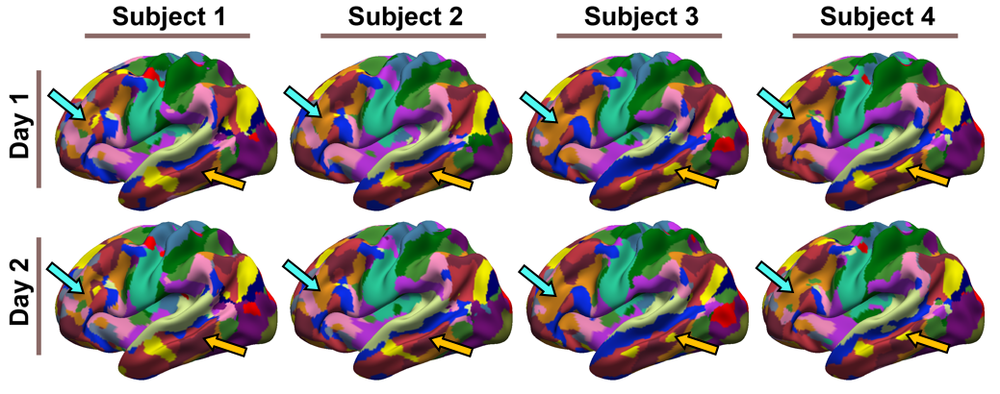

# Multi-session hierarchical Bayesian model (MS-HBM)

References
==========
+ Kong R, Li J, Orban C, et al. [Spatial Topography of Individual-Specific Cortical Networks Predicts Human Cognition, Personality, and Emotion](https://academic.oup.com/cercor/advance-article/doi/10.1093/cercor/bhy123/5033556?guestAccessKey=2fa23bc8-59c7-4ff1-9360-1846d472c6dd). Cerebral Cortex. 2018.

----

Background
====

We proposed a Multi-session hierarchical Bayesian model (MS-HBM) for estimating idividual-specific cortical networks. The multiple layers of the MS-HBM explicitly differentiate intra-subject (within-subject) from inter-subject (between-subject) network variability. By ignoring intra-subject variability, previous network mappings might confuse intra-subject
variability for inter-subject differences.



Code Release
====

The code utilized in this study include three steps:

**Step 1: generate functional connectivity profiles and estimate initialization parameters**

- `$CBIG_CODE_DIR/stable_projects/brain_parcellation/Kong2019_MSHBM/step1_generate_profiles_and_ini_params/CBIG_MSHBM_generate_profiles.m`
- `$CBIG_CODE_DIR/stable_projects/brain_parcellation/Kong2019_MSHBM/step1_generate_profiles_and_ini_params/CBIG_MSHBM_avg_profiles.m`
- `$CBIG_CODE_DIR/stable_projects/brain_parcellation/Kong2019_MSHBM/step1_generate_profiles_and_ini_params/CBIG_MSHBM_generate_ini_params.m`

**Step 2: estimating group priors**
   
- `$CBIG_CODE_DIR/stable_projects/brain_parcellation/Kong2019_MSHBM/step2_estimate_priors/CBIG_MSHBM_estimate_group_priors.m`
   
**Step 3: generate individual-level parcellations** 

- `$CBIG_CODE_DIR/stable_projects/brain_parcellation/Kong2019_MSHBM/step3_generate_ind_parcellations/CBIG_MSHBM_parameters_validation.m`
- `$CBIG_CODE_DIR/stable_projects/brain_parcellation/Kong2019_MSHBM/step3_generate_ind_parcellations/CBIG_MSHBM_generate_individual_parcellation.m`

**Examples**

We provide detailed examples on how to generate functional connectivity profiles, estimate group priors and generate individual parcellations in **`examples`** folder. **We highly recommended the users to go through the example tutorial first**.

**Group priors**

We provide group priors estimated by 37 GSP subjects (`fsaverage5` surface space) and 40 HCP subjects (`fs_LR_32k` surface space). The priors can be found in `lib/group_priors` folder. The ordering of the 17 networks can also be found in this folder.

**Individual parcellations**

The individual 17-network parcellations of HCP data are not included in the current repository. Contact us if you want us to send you the parcellations.


**Download**

To download the version of the code that is last tested, you can either

- visit this link: [https://github.com/ThomasYeoLab/CBIG/releases/tag/v0.9.2-Kong2019_MSHBM](https://github.com/ThomasYeoLab/CBIG/releases/tag/v0.9.2-Kong2019_MSHBM)

or

- run the following command, if you have Git installed

```
git checkout -b Kong2019_MSHBM v0.9.2-Kong2019_MSHBM
```

----

Usage
====

Our code will work for fMRI surface data on `fsaverage5` surface space (nifti format), or on `fs_LR_32k` surface space (cifti format, .dtseries.nii file with 64k vertices). The code should also be applicable for data in `fsaverage4/6/7`, contact us if there is any bug.

### Step 1: Generating profiles and initialization parameters
----

To generate the functional connectivity profiles, we assume the input fMRI lists and censor lists are already generated.

The fMRI lists for each subject and each session, each line is the full path to the nifti/cifti file which corresponds to each run.

- **`<output_dir>/data_list/fMRI_list`**
	+ `<output_dir>/data_list/fMRI_list/lh_sub?_sess?.txt`
	+ `<output_dir>/data_list/fMRI_list/rh_sub?_sess?.txt`
	
	for data in `fsaverage5`  or

	+ `<output_dir>/data_list/fMRI_list/sub?_sess?.txt`
	
    for data in `fs_LR_32k`.
  
The censor lists for each subject and each session, each line is the full path to the censor file which corresponds to each run. The censor file should be a text file contains a single binary number column with the length equals to the number of time points, the outliers are indicated by 0s. The outliers will be ignored in generating profiles. If the user doesn't want to ignore the outliers just leave the `censor_list` folder empty.

- **`<output_dir>/data_list/censor_list`**
	+ `<output_dir>/data_list/censor_list/sub?_sess?.txt`

In the terminal:
```
cd $CBIG_CODE_DIR/stable_projects/brain_parcellation/Kong2019_MSHBM/step1_generate_profiles_and_ini_params
```

Start Matlab, in Matlab command window, the user need to specify the following inputs:

**Input: (string)**
+ `seed_mesh`: the resolution of the ROI mesh. `fsaverage3` if `targ_mesh` is `fsaverage5` or `fs_LR_900` if `targ_mesh` is `fs_LRE_32k`.
+ `targ_mesh`: the surface mesh of input fMRI data. `fsaverage5` or `fs_LR_32k`.
+ `output_dir`: output directory.
+ `sub`: subject ID
+ `sess`: session ID
+ `split_flag`: set `split_flag` to be `'1'` if the user want to split the session into two sub-sessions to create profile for each sub-session. This flag should be turned on if the user want to apply MSHBM on single session fMRI data. 

run the following commands:

```
CBIG_MSHBM_generate_profiles(seed_mesh,targ_mesh,output_dir,sub,sess,split_flag);
```

**Output**

+ `<output_dir>/profiles/sub?/sess?/?h.sub?_sess?_fsaverage5_roifsaverage3.surf2surf_profile.nii.gz`

  for data in `fsaverage5`  or
  
+ `<output_dir>/profiles/sub?/sess?/sub?_sess?_fs_LR_32k_roifs_LR_900.surf2surf_profile.nii.gz`

  for data in `fs_LR_32k`.

If the `split_flag = '1'`, the profiles of two sub-sessions will be saved as:

+ `<output_dir>/profiles/sub?/sess?/?h.sub?_sess?_fsaverage5_roifsaverage3.surf2surf_profile_1.nii.gz`
+ `<output_dir>/profiles/sub?/sess?/?h.sub?_sess?_fsaverage5_roifsaverage3.surf2surf_profile_2.nii.gz`


  for data in `fsaverage5`  or
  
+ `<output_dir>/profiles/sub?/sess?/sub?_sess?_fs_LR_32k_roifs_LR_900.surf2surf_profile_1.nii.gz`
+ `<output_dir>/profiles/sub?/sess?/sub?_sess?_fs_LR_32k_roifs_LR_900.surf2surf_profile_2.nii.gz`

  for data in `fs_LR_32k`.

----

To generate the initialization parameters, we will apply Yeo2011 clustering algorithm on group averaged profiles. To obtain the group averaged profiles, we will average the profiles across all the subjects and sessions under `profiles` folder.

In the terminal:
```
cd $CBIG_CODE_DIR/stable_projects/brain_parcellation/Kong2019_MSHBM/step1_generate_profiles_and_ini_params
```

Start Matlab, in Matlab command window, the user need to specify the following inputs:

**Input: (string)**
+ `seed_mesh`: the resolution of the ROI mesh. `fsaverage3` if `targ_mesh` is `fsaverage5` or `fs_LR_900` if `targ_mesh` is `fs_LRE_32k`.
+ `targ_mesh`: the surface mesh of input fMRI data. `fsaverage5` or `fs_LR_32k`.
+ `output_dir`: output directory.
+ `num_sub`: number of subjects. 
+ `num_sess`: the maximum number of sessions. If the subjects have different number of sessions, please set `num_sess` to be the maximum number. 

run the following commands:

```
CBIG_MSHBM_avg_profiles(seed_mesh,targ_mesh,output_dir,num_sub,num_sess);
```

**Output**

+ `<output_dir>/profiles/avg_profile/?h_fsaverage5_roifsaverage3_avg_profile.nii.gz`

  for data in `fsaverage5`  or
  
+ `<output_dir>/profiles/avg_profile/fs_LR_32k_roifs_LR_900_avg_profile.nii.gz`

  for data in `fs_LR_32k`.

----

To run Yeo2011 clustering algorithm:

In the terminal:
```
cd $CBIG_CODE_DIR/stable_projects/brain_parcellation/Kong2019_MSHBM/step1_generate_profiles_and_ini_params
```

Start Matlab, in Matlab command window, the user need to specify the following inputs:

**Input: (string)**
+ `seed_mesh`: the resolution of the ROI mesh. `fsaverage3` if `targ_mesh` is `fsaverage5` or `fs_LR_900` if `targ_mesh` is `fs_LRE_32k`.
+ `targ_mesh`: the surface mesh of input fMRI data. `fsaverage5` or `fs_LR_32k`.
+ `num_clusters`: the number of networks, e.g. `17`.
+ `num_initialization`: the number of random initialization, e.g. `1000`.
+ `output_dir`: output directory. 

run the following commands:

```
CBIG_MSHBM_generate_ini_params(seed_mesh,targ_mesh,num_clusters,num_initialization, output_dir)
```

**Output**

+ `<output_dir>/group/group.mat`


### Step 2: Group priors estimation
----

To generate the individual parcellation, MSHBM need to estimate group priors first. We provide two sets of group priors for data in `fsaverage5` space and `fs_LR_32k` space, which were generated by:

- `lib/group_priors/GSP_37/Params_Final.mat`: 37 GSP subjects with 2 sessions, preprocessed by CBIG group. The preprocessing pipeline can be found in `$CBIG_CODE_DIR/stable_projects/preprocessing/CBIG_fMRI_Preproc2016`
- `lib/group_priors/HCP_40/Params_Final.mat`: 40 HCP subjects with 4 sessions, we use the MSMAll ICA-FIX data on `fs_LR_32k` surface space with additional Global Signal Regression. 

If the user want to use our estimated group priors, please skip this step and move to **Individual-level parcellations generation** section.

In this step, we assume the following files are already generated:

- **`<output_dir>/group/group.mat`**  

contains the initialization parameters from group-level 17-network clustering generated by Yeo et al., 2011.

- `<output_dir>/profile_list/training_set` 
    + `<output_dir>/profile_list/training_set/lh_sess?.txt`
    + `<output_dir>/profile_list/training_set/rh_sess?.txt`
    
    for data in `fsaverage5`  or
    
    + `<output_dir>/profile_list/training_set/sess?.txt`

	for data in `fs_LR_32k`.
    
contain functional connectivity profiles.

In the terminal:
```
cd $CBIG_CODE_DIR/stable_projects/brain_parcellation/Kong2019_MSHBM/step2_estimate_priors
```

Start Matlab, in Matlab command window, the user need to specify the following inputs:

**Input: (string)**
+ `output_dir`: output directory.
+ `mesh`: data surface space. `'fsaverage5'` or `'fs_LR_32k'`.
+ `num_sub`: number of subjects the user want to use to estimate the priors.
+ `num_sessions`: number of sessions the user want to use to estimate the priors.
+ `num_clusters`: number of networks.

run the following commands:

```
Params = CBIG_MSHBM_estimate_group_priors(output_dir, mesh, num_sub, num_sessions, num_clusters);
```

The results will be saved into **`priors`** folder, the results of each iteration will be saved as `Params_iteration?.mat`, the final estimated group priors will be saved as `Params_Final.mat`, each file contains a struct variable `Params`.

**Output**
+ `<output_dir>/estimate_group_priors/priors/Params_Final.mat`

The estimated group priors include:
1) Inter-subject functional connectivity variability -- `Params.epsil`
2) Group-level connectivity profiles for each network -- `Params.mu`
3) Intra-subject functional connectivity variability -- `Params.sigma`
4) Spatial prior which denotes the probability of each network occurring at each location -- `Params.theta`


### Step 3: Individual-level parcellations generation
----

#### Validation set

The user can select `w` and `c` using validation set, the script will use the group priors under

- `<output_dir>/priors/Params_Final.mat`

Assuming each validation subject has `T` sessions, the individual parcellation will be generated by functional connectivity profiles of `T1` sessions of validation subjects, we assume the following files are already generated:

- `<output_dir>/profile_list/validation_set` 
    + `<output_dir>/profile_list/validation_set/lh_sess?.txt`
    + `<output_dir>/profile_list/validation_set/rh_sess?.txt`
    
    for data in `fsaverage5`  or
    
    + `<output_dir>/estimate_group_priors/profile_list/test_set/sess?.txt`

	for data in `fs_LR_32k`.
    
We will use the remaining `T-T1` sessions to compute the homogeneity metric, the fMRI files of the remaining sessions should be saved in:

- `<output_dir>/data_list/validation_fMRI_list`
	+ `<output_dir>/data_list/validation_fMRI_list/lh_sub?.txt`
	+ `<output_dir>/data_list/validation_fMRI_list/rh_sub?.txt`

	for data in `fsaverage5`  or
    
    + `<output_dir>/data_list/validation_fMRI_list/sub?.txt`
	
    for data in `fs_LR_32k`.


In the terminal:
```
cd $CBIG_CODE_DIR/stable_projects/brain_parcellation/Kong2019_MSHBM/step3_generate_ind_parcellations
```

Start Matlab, in Matlab command window, the user need to specify the following inputs:

**Input: (string)**
+ `output_dir`: output directory.
+ `mesh`: data surface space. `'fsaverage5'` or `'fs_LR_32k'`.
+ `num_sessions`: number of sessions the user want to use to estimate the priors.
+ `num_clusters`: number of networks.
+ `subid`: The validation subject number, for example, `'4'` indicates the 4th subject in the validation set profile list.
+ `w`: The weight of group spatial prior `Params.theta`. For example, `'100'`. A large `w` indicates strong weight of `Params.theta`. The estimated individual-level parcellation will be very similar to the group-level parcellation with very large `w`.
+ `c`: The weight of MRF smoothness prior. For example, `'50'`. A large `c` indicates more penalty for neighboring vertices being assigned to different networks.


**Output:**

The homogeneity value for each pair of parameters will be saved under:
+ `<output_dir>/ind_parcellation`

run the following command:

```
w_set = <a set of parameters for w> % e.g. w_set = [60 80 100 120];
c_set = <a set of parameters for c> % e.g. c_set = [30 40 50 60];
for i = 1:length(w_set)
    for j = 1:length(c_set)
        for sub = 1:num_validation_subjects
		    homo_with_weight(sub,:) = CBIG_MSHBM_parameters_validation(output_dir,mesh,num_sess,num_clusters,num2str(sub), num2str(w_set(i)),num2str(c_set(j)));
        end
        homo(i,j) = mean(mean(homo_with_weight));
    end
end
 
```
The user should select the pair of `w` and `c` with the highest `homo` to be the parameters for test set.

#### Test set

In this step, the script will use the group priors under

- `<output_dir>/priors/Params_Final.mat`

The individual parcellation will be generated by functional connectivity profiles of test subjects, we assume the following files are already generated:

- `<output_dir>/profile_list/test_set` 
    + `<output_dir>/profile_list/test_set/lh_sess?.txt`
    + `<output_dir>/profile_list/test_set/rh_sess?.txt`
    
    for data in `fsaverage5`  or
    
    + `<output_dir>/profile_list/test_set/sess?.txt`

	for data in `fs_LR_32k`.
    
In the terminal:
```
cd $CBIG_CODE_DIR/stable_projects/brain_parcellation/Kong2019_MSHBM/step3_generate_ind_parcellations
```

Start Matlab, in Matlab command window, the user need to specify the following inputs:

**Input: (string)**
+ `output_dir`: output directory.
+ `mesh`: data surface space. `'fsaverage5'` or `'fs_LR_32k'`.
+ `num_sessions`: number of sessions the user want to use to estimate the priors.
+ `num_clusters`: number of networks.
+ `subid`: The test subject number, for example, `'4'` indicates the 4th subject in the test set profile list.
+ `w`: The weight of group spatial prior `Params.theta`. For example, `'100'`. A large `w` indicates strong weight of `Params.theta`. The estimated individual-level parcellation will be very similar to the group-level parcellation with very large `w`.
+ `c`: The weight of MRF smoothness prior. For example, `'50'`. A large `c` indicates more penalty for neighboring vertices being assigned to different networks.

run the following command:

```
for subid = 1:num_test_sub
	CBIG_MSHBM_generate_individual_parcellation(output_dir, mesh, num_sess, num_clusters, num2str(subid), w, c);
end
```

**Output:**

The generated individual parcellations will be saved under:
+ `<output_dir>/ind_parcellation`


----

Updates
=======

- Release v0.6.0 (8/6/2018): initial release of Kong2019_MSHBM

- Release v0.6.1 (10/6/2018): Release code of Kong2019_MSHBM

- Release v0.9.2 (19/3/2019): Add validation scripts

Bugs and Questions
====
Please contact Ru(by) Kong at roo.cone@gmail.com.
