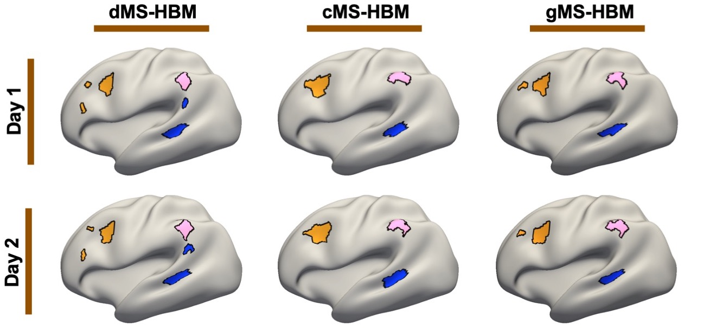

# Areal-level multi-session hierarchical Bayesian model (Areal MS-HBM)

References
==========
+ Kong R, Yang Q, Gordon E, et al. [Individual-Specific Areal-Level Parcellations Improve Functional Connectivity Prediction of Behavior](https://doi.org/10.1093/cercor/bhab101). Cerebral Cortex. In press.

----

Background
====

We have previously developed a multi-session hierarchical Bayesian model (MS-HBM) for estimating high-quality individual-specific network-level parcellations. Here, we extend the model to estimate individual-specific areal-level parcellations. While network-level parcellations comprise spatially distributed networks spanning the cortex, the consensus is that areal-level parcels should be spatially localized, i.e., should not span multiple lobes. There is disagreement about whether areal-level parcels should be strictly contiguous or comprise multiple non-contiguous components, therefore we considered three areal-level MS-HBM variants spanning these range of possibilities: distributed MS-HBM (dMSHBM), contiguous MS-HBM (cMSHBM) and gradient-infused MS-HBM (gMSHBM). 



Code Release
====

The code utilized in this study include four steps:

**Step 0: generate diffusion embedding matrices for gradients [Optional, for gMSHBM only]**

- `$CBIG_CODE_DIR/stable_projects/brain_parcellation/Kong2022_ArealMSHBM/step0_generate_gradient_prior/CBIG_ArealMSHBM_generate_gradient.m`

**Step 1: generating profiles, initialization parameters and spatial mask**

Generating profiles:
- `$CBIG_CODE_DIR/stable_projects/brain_parcellation/Kong2022_ArealMSHBM/step1_generate_profiles_and_ini_params/CBIG_ArealMSHBM_generate_profiles.m`
- `$CBIG_CODE_DIR/stable_projects/brain_parcellation/Kong2022_ArealMSHBM/step1_generate_profiles_and_ini_params/CBIG_ArealMSHBM_avg_profiles.m`

Generating initialization parameters:
- `$CBIG_CODE_DIR/stable_projects/brain_parcellation/Kong2022_ArealMSHBM/step1_generate_profiles_and_ini_params/CBIG_ArealMSHBM_generate_ini_params.m`

Generating spatial mask:
- `$CBIG_CODE_DIR/stable_projects/brain_parcellation/Kong2022_ArealMSHBM/step1_generate_profiles_and_ini_params/CBIG_ArealMSHBM_generate_radius_mask.m`

**Step 2: estimating group priors**

dMSHBM:
- `$CBIG_CODE_DIR/stable_projects/brain_parcellation/Kong2022_ArealMSHBM/step2_estimate_priors/CBIG_ArealMSHBM_dMSHBM_estimate_group_priors_parent.m`

- `$CBIG_CODE_DIR/stable_projects/brain_parcellation/Kong2022_ArealMSHBM/step2_estimate_priors/CBIG_ArealMSHBM_dMSHBM_estimate_group_priors_child.m`

cMSHBM:
- `$CBIG_CODE_DIR/stable_projects/brain_parcellation/Kong2022_ArealMSHBM/step2_estimate_priors/CBIG_ArealMSHBM_cMSHBM_estimate_group_priors_parent.m`

- `$CBIG_CODE_DIR/stable_projects/brain_parcellation/Kong2022_ArealMSHBM/step2_estimate_priors/CBIG_ArealMSHBM_cMSHBM_estimate_group_priors_child.m`


gMSHBM:
- `$CBIG_CODE_DIR/stable_projects/brain_parcellation/Kong2022_ArealMSHBM/step2_estimate_priors/CBIG_ArealMSHBM_gMSHBM_estimate_group_priors_parent.m`

- `$CBIG_CODE_DIR/stable_projects/brain_parcellation/Kong2022_ArealMSHBM/step2_estimate_priors/CBIG_ArealMSHBM_gMSHBM_estimate_group_priors_child.m`


**Step 3: generate individual-level parcellations** 

dMSHBM:
- `$CBIG_CODE_DIR/stable_projects/brain_parcellation/Kong2022_ArealMSHBM/step3_generate_ind_parcellations/CBIG_ArealMSHBM_dMSHBM_generate_individual_parcellation.m`

cMSHBM:
- `$CBIG_CODE_DIR/stable_projects/brain_parcellation/Kong2022_ArealMSHBM/step3_generate_ind_parcellations/CBIG_ArealMSHBM_cMSHBM_generate_individual_parcellation.m`

gMSHBM:
- `$CBIG_CODE_DIR/stable_projects/brain_parcellation/Kong2022_ArealMSHBM/step3_generate_ind_parcellations/CBIG_ArealMSHBM_gMSHBM_generate_individual_parcellation.m`

Validation script:
- `$CBIG_CODE_DIR/stable_projects/brain_parcellation/Kong2022_ArealMSHBM/step3_generate_ind_parcellations/CBIG_ArealMSHBM_parameters_validation.m`


**Examples**

We provide detailed examples of above four steps in **`examples`** folder. **We highly recommended the users to go through the example tutorial first**.

**Group priors**

We provide pre-computed group priors of dMSHBM/cMSHBM/gMSHBM initializated by 100 to 1000-parcel Schaefer group-level parcellation. These priors were estimated by 40 HCP subjects (`fs_LR_32k` and `fsaverage6` surface space). The priors can be found in `lib/group_priors` folder.

**Individual parcellations and RSFC matrices**

The individual-specific areal-level parcellations and relevant 400x400 RSFC matrices of HCP data are not included in the current repository. We have uploaded then in BALSA: LINK_TO_BE_ADD.


**Download**

To download the version of the code that is last tested, you can either

- visit this link: [https://github.com/ThomasYeoLab/CBIG/releases/tag/v0.20.0-Kong2022_ArealMSHBM](https://github.com/ThomasYeoLab/CBIG/releases/tag/v0.20.0-Kong2022_ArealMSHBM)

or

- run the following command, if you have Git installed

```
git checkout -b Kong2022_ArealMSHBM v0.20.0-Kong2022_ArealMSHBM
```

----

Usage
====

Our code will work for fMRI surface data on `fsaverage6` surface space (nifti format), or on `fs_LR_32k` surface space (cifti format, .dtseries.nii file with 64k vertices). The code should also be applicable for data in `fsaverage4/5/7`, contact us if there is any bug.

### Step 0: generate diffusion embedding matrices for gradients [Optional, for gMSHBM only]
----

This step is only needed for gMSHBM. To generate the diffusion embedding matrices of gradients, we assume the input fMRI lists and censor lists are already generated.

The fMRI lists for each subject and each session, each line is the full path to the nifti/cifti file which corresponds to each run.

- **`<output_dir>/data_list/fMRI_list`**
	+ `<output_dir>/data_list/fMRI_list/lh_sub?_sess?.txt`
	+ `<output_dir>/data_list/fMRI_list/rh_sub?_sess?.txt`
	
	for data in `fsaverage6`  or

	+ `<output_dir>/data_list/fMRI_list/sub?_sess?.txt`
	
    for data in `fs_LR_32k`.
  
The censor lists for each subject and each session, each line is the full path to the censor file which corresponds to each run. The censor file should be a text file contains a single binary number column with the length equals to the number of time points, the outliers are indicated by 0s. The outliers will be ignored in generating profiles. If the user doesn't want to ignore the outliers just leave the `censor_list` folder empty.

- **`<output_dir>/data_list/censor_list`**
	+ `<output_dir>/data_list/censor_list/sub?_sess?.txt`

In the terminal:
```
cd $CBIG_CODE_DIR/stable_projects/brain_parcellation/Kong2022_ArealMSHBM/step0_generate_gradient_prior
```

Start Matlab, in Matlab command window, the user need to specify the following inputs:

**Input: (string)**
+ `mesh`: the surface space of fMRI data, e.g. 'fsaverage5' or 'fs_LR_32k'.
+ `output_dir`: the project directory. Check the script description for details.
+ `sub`: the subject ID, e.g. '1','2'.
+ `num_sess`: the total number of sessions, e.g. '4'.

```
CBIG_ArealMSHBM_generate_gradient(mesh, output_dir, sub, num_sess);
```

**Output**

+ `<output_dir>/gradients/sub?/lh_emb_100_distance_matrix.mat`
+ `<output_dir>/gradients/sub?/rh_emb_100_distance_matrix.mat`


### Step 1: generating profiles, initialization parameters and spatial mask
----

To generate the functional connectivity profiles, we assume the input fMRI lists and censor lists are already generated.

The fMRI lists for each subject and each session, each line is the full path to the nifti/cifti file which corresponds to each run.

- **`<output_dir>/data_list/fMRI_list`**
	+ `<output_dir>/data_list/fMRI_list/lh_sub?_sess?.txt`
	+ `<output_dir>/data_list/fMRI_list/rh_sub?_sess?.txt`
	
	for data in `fsaverage6`  or

	+ `<output_dir>/data_list/fMRI_list/sub?_sess?.txt`
	
    for data in `fs_LR_32k`.
  
The censor lists for each subject and each session, each line is the full path to the censor file which corresponds to each run. The censor file should be a text file contains a single binary number column with the length equals to the number of time points, the outliers are indicated by 0s. The outliers will be ignored in generating profiles. If the user doesn't want to ignore the outliers just leave the `censor_list` folder empty.

- **`<output_dir>/data_list/censor_list`**
	+ `<output_dir>/data_list/censor_list/sub?_sess?.txt`

In the terminal:
```
cd $CBIG_CODE_DIR/stable_projects/brain_parcellation/Kong2022_ArealMSHBM/step1_generate_profiles_and_ini_params
```

Start Matlab, in Matlab command window, the user need to specify the following inputs:

**Input: (string)**
+ `seed_mesh`: the resolution of the ROI mesh. For example, `'fsaverage3'` if `targ_mesh` is `'fsaverage6'` or `'fs_LR_900'` if `targ_mesh` is `'fs_LRE_32k'`.
+ `targ_mesh`: the surface mesh of input fMRI data. For example, `'fsaverage6'` or `'fs_LR_32k'`.
+ `output_dir`: output directory.
+ `sub`: subject ID
+ `sess`: session ID
+ `split_flag`: set `split_flag` to be `'1'` if the user want to split the session into two sub-sessions to create profile for each sub-session. This flag should be turned on if the user want to apply MSHBM on single session fMRI data. 

run the following commands:

```
CBIG_ArealMSHBM_generate_profiles(seed_mesh,targ_mesh,output_dir,sub,sess,split_flag);
```

**Output**

+ `<output_dir>/profiles/sub?/sess?/?h.sub?_sess?_fsaverage6_roifsaverage3.surf2surf_profile.nii.gz`

  for data in `fsaverage6`  or
  
+ `<output_dir>/profiles/sub?/sess?/sub?_sess?_fs_LR_32k_roifs_LR_900.surf2surf_profile.nii.gz`

  for data in `fs_LR_32k`.

If the `split_flag = '1'`, the profiles of two sub-sessions will be saved as:

+ `<output_dir>/profiles/sub?/sess?/?h.sub?_sess?_fsaverage6_roifsaverage3.surf2surf_profile_1.nii.gz`
+ `<output_dir>/profiles/sub?/sess?/?h.sub?_sess?_fsaverage6_roifsaverage3.surf2surf_profile_2.nii.gz`


  for data in `fsaverage6`  or
  
+ `<output_dir>/profiles/sub?/sess?/sub?_sess?_fs_LR_32k_roifs_LR_900.surf2surf_profile_1.nii.gz`
+ `<output_dir>/profiles/sub?/sess?/sub?_sess?_fs_LR_32k_roifs_LR_900.surf2surf_profile_2.nii.gz`

  for data in `fs_LR_32k`.

----

To generate the initialization parameters, we will apply group-level parcellation on group averaged profiles. In our case, we normally use Schaefer2018 group-level parcellations. To obtain the group averaged profiles, we will average the profiles across all the subjects and sessions under `profiles` folder.

In the terminal:
```
cd $CBIG_CODE_DIR/stable_projects/brain_parcellation/Kong2022_ArealMSHBM/step1_generate_profiles_and_ini_params
```

Start Matlab, in Matlab command window, the user need to specify the following inputs:

**Input: (string)**
+ `seed_mesh`: the resolution of the ROI mesh. For exammple, `'fsaverage3'` if `targ_mesh` is `'fsaverage6'` or `'fs_LR_900'` if `targ_mesh` is `'fs_LRE_32k'`.
+ `targ_mesh`: the surface mesh of input fMRI data. For exammple, `'fsaverage6'` or `'fs_LR_32k'`.
+ `output_dir`: output directory.
+ `num_sub`: number of subjects. 
+ `num_sess`: the maximum number of sessions. If the subjects have different number of sessions, please set `num_sess` to be the maximum number. 

run the following commands:

```
CBIG_ArealMSHBM_avg_profiles(seed_mesh,targ_mesh,output_dir,num_sub,num_sess);
```

**Output**

+ `<output_dir>/profiles/avg_profile/?h_fsaverage6_roifsaverage3_avg_profile.nii.gz`

  for data in `fsaverage6`  or
  
+ `<output_dir>/profiles/avg_profile/fs_LR_32k_roifs_LR_900_avg_profile.nii.gz`

  for data in `fs_LR_32k`.

----

To apply group-level parcellation on the averaged profiles:

In the terminal:
```
cd $CBIG_CODE_DIR/stable_projects/brain_parcellation/Kong2022_ArealMSHBM/step1_generate_profiles_and_ini_params
```

Start Matlab, in Matlab command window, the user need to specify the following inputs:

**Input: (string)**
+ `seed_mesh`: the resolution of the ROI mesh. For exammple, `'fsaverage3'` if `targ_mesh` is `'fsaverage6'` or `'fs_LR_900'` if `targ_mesh` is `'fs_LR_32k'`.
+ `targ_mesh`: the surface mesh of input fMRI data. For exammple, `'fsaverage6'` or `'fs_LR_32k'`.
+ `lh_labels`, `rh_labels`: the group-level parcellation.
+ `output_dir`: output directory. 

run the following commands:

```
CBIG_ArealMSHBM_generate_ini_params(seed_mesh, targ_mesh, lh_labels, rh_labels, output_dir)
```

We also provide a script for user who would like to use Schaefer2018 group-level parcellations:

**Input: (string)**
+ `seed_mesh`: the resolution of the ROI mesh. For exammple, `'fsaverage3'` if `targ_mesh` is `'fsaverage6'` or `'fs_LR_900'` if `targ_mesh` is `'fs_LR_32k'`.
+ `targ_mesh`: the surface mesh of input fMRI data. For exammple, `'fsaverage6'` or `'fs_LR_32k'`.
+ `resolution`: the number of parcels of Schaefer2018 group-level parcellation, e.g. '400'.
+ `output_dir`: output directory. 

```
CBIG_ArealMSHBM_generate_ini_params_Schaefer(seed_mesh, targ_mesh, resolution, output_dir)
```

**Output**

+ `<output_dir>/group/group.mat`

----

For MSHBMs, we apply spatial radius masks to each parcel so that each individual parcel should within a radius mask of the corresponding group-level parcel. To generate the spatial radius mask:

In the terminal:
```
cd $CBIG_CODE_DIR/stable_projects/brain_parcellation/Kong2022_ArealMSHBM/step1_generate_profiles_and_ini_params
```

Start Matlab, in Matlab command window, the user need to specify the following inputs:

**Input: (string)**
+ `lh_labels`, `rh_labels`: the group-level parcellation.
+ `mesh`: the surface mesh of input fMRI data. For exammple, `'fsaverage6'` or `'fs_LR_32k'`.
+ `radius`: the size (in mm) of the radius mask, e.g. '30'.
+ `output_dir`: output directory. 

run the following commands:

```
CBIG_ArealMSHBM_generate_radius_mask(lh_labels, rh_labels, mesh, radius, output_dir)
```

We also provide a script for user who would like to use Schaefer2018 group-level parcellations:

**Input: (string)**
+ `resolution`: the number of parcels of Schaefer2018 group-level parcellation, e.g. '400'.
+ `targ_mesh`: the surface mesh of input fMRI data. For exammple, `'fsaverage6'` or `'fs_LR_32k'`.
+ `output_dir`: output directory. 

```
CBIG_ArealMSHBM_generate_radius_mask_Schaefer(resolution, mesh, output_dir)
```

**Output**

+ `<output_dir>/spatial_mask/spatial_mask_<mesh>.mat`


### Step 2: Group priors estimation
----

To generate the individual parcellation, MSHBMs need to estimate group priors first. We provide two sets of group priors for data in `fsaverage6` space and `fs_LR_32k` space, which were generated by 40 HCP subjects:

- `lib/group_priors`

If the user want to use our estimated group priors, please skip this step and move to [**Individual-level parcellations generation**](#Step-3:-Individual-level-parcellations-generation) section.

Please note that due to the high computational cost, we need to use multiple CPUs for estimating group priors. If there are `S` training subjects, the user needs to run `1` parent job and `S` children jobs in parallel.

In this step, we assume the following files are already generated:

- **`<output_dir>/group/group.mat`**  

contains the initialization parameters from group-level parcellation.

- **`<output_dir>/spatial_mask/spatial_mask_<mesh>.mat`**

contains the spatial radius mask for the group-level parcellation.

- **`<output_dir>/profile_list/training_set`** 
    + `<output_dir>/profile_list/training_set/lh_sess?.txt`
    + `<output_dir>/profile_list/training_set/rh_sess?.txt`
    
    for data in `fsaverage6`  or
    
    + `<output_dir>/profile_list/training_set/sess?.txt`

	for data in `fs_LR_32k`.
    
contain functional connectivity profiles.

- **`<output_dir>/gradient_list/training_set` [only needed for gMSHBM]**
    + `<output_dir>/gradient_list/training_set/gradient_list_lh.txt`
    + `<output_dir>/gradient_list/training_set/gradient_list_rh.txt`

contain diffusion embedding matrices of RSFC gradients. 

In the terminal:
```
cd $CBIG_CODE_DIR/stable_projects/brain_parcellation/Kong2022_ArealMSHBM/step2_estimate_priors
```

Start Matlab, in Matlab command window, the user need to specify the following inputs:

**Input: (string)**
+ `output_dir`: output directory.
+ `mesh`: data surface space. For exammple, `'fsaverage6'` or `'fs_LR_32k'`.
+ `num_sub`: number of subjects the user want to use to estimate the priors.
+ `num_sessions`: number of sessions the user want to use to estimate the priors.
+ `num_clusters`: number of parcels.
+ `beta`[only needed for cMSHBM and gMSHBM]: weight for gradient-infused prior or xyz coordinates prior.
+ `tmp_dir`: temporary directory to save intermediate results.
+ `s`: subject ID.

Run the following commands for parent job:

```
%% dMSHBM
Params = CBIG_ArealMSHBM_dMSHBM_estimate_group_priors_parent(output_dir, mesh, num_sub, num_sessions, num_clusters, tmp_dir);

%% cMSHBM
Params = CBIG_ArealMSHBM_cMSHBM_estimate_group_priors_parent(output_dir, mesh, num_sub, num_sessions, num_clusters, beta, tmp_dir);

%% gMSHBM
Params = CBIG_ArealMSHBM_gMSHBM_estimate_group_priors_parent(output_dir, mesh, num_sub, num_sessions, num_clusters, beta, tmp_dir);
```

Run the following commands for children jobs:
```
%% dMSHBM
CBIG_ArealMSHBM_dMSHBM_estimate_group_priors_child(s, mesh, tmp_dir);

%% cMSHBM
CBIG_ArealMSHBM_cMSHBM_estimate_group_priors_child(s, mesh, tmp_dir);

%% gMSHBM
CBIG_ArealMSHBM_gMSHBM_estimate_group_priors_child(s, mesh, tmp_dir);
```

If you have `S` training subjects. You need to run parent job `CBIG_ArealMSHBM_?MSHBM_estimate_group_priors_parent` and `S` children jobs `CBIG_ArealMSHBM_?MSHBM_estimate_group_priors_child` in parallel.

The results will be saved into **`priors`** folder, the results of each iteration will be saved as `Params_iteration?.mat`, the final estimated group priors will be saved as `Params_Final.mat`, each file contains a struct variable `Params`.

**Output**
+ `<output_dir>/priors/?MSHBM/beta?/Params_Final.mat` or `<output_dir>/priors/dMSHBM/Params_Final.mat`
The estimated group priors include:
1) Inter-subject functional connectivity variability -- `Params.epsil`
2) Group-level connectivity profiles for each parcel -- `Params.mu`
3) Intra-subject functional connectivity variability -- `Params.sigma`
4) Spatial prior which denotes the probability of each parcel occurring at each location -- `Params.theta`


### Step 3: Individual-level parcellations generation
----

#### Validation set

The user can select `w`,`c`, and `beta` using validation set. Note `beta` is only applicable if the user use cMSHBM or gMSHBM. The script will use the group priors under

- **`<output_dir>/priors/?MSHBM/beta?/Params_Final.mat` or `<output_dir>/priors/dMSHBM/Params_Final.mat`**

Assuming each validation subject has `T` sessions, the individual parcellation will be generated by functional connectivity profiles of `T1` sessions of validation subjects, we assume the following files are already generated:

- **`<output_dir>/profile_list/validation_set`** 
    + `<output_dir>/profile_list/validation_set/lh_sess?.txt`
    + `<output_dir>/profile_list/validation_set/rh_sess?.txt`
    
    for data in `fsaverage6`  or
    
    + `<output_dir>/profile_list/validation_set/sess?.txt`

	for data in `fs_LR_32k`.
    
We will use the remaining `T-T1` sessions to compute the homogeneity metric, the fMRI files of the remaining sessions should be saved in:

- **`<output_dir>/data_list/validation_set/fMRI_list`**
	+ `<output_dir>/data_list/validation_set/fMRI_list/lh_sub?.txt`
	+ `<output_dir>/data_list/validation_set/fMRI_list/rh_sub?.txt`

	for data in `fsaverage6`  or
    
    + `<output_dir>/data_list/validation_set/fMRI_list/sub?.txt`
	
    for data in `fs_LR_32k`.

- **`<output_dir>/gradient_list/validation_set` [only needed for gMSHBM]**
    + `<output_dir>/gradient_list/validation_set/gradient_list_lh.txt`
    + `<output_dir>/gradient_list/validation_set/gradient_list_rh.txt`

contain diffusion embedding matrices of RSFC gradients. 

In the terminal:
```
cd $CBIG_CODE_DIR/stable_projects/brain_parcellation/Kong2022_ArealMSHBM/step3_generate_ind_parcellations
```

Start Matlab, in Matlab command window, the user need to specify the following inputs:

**Input: (string)**
+ `output_dir`: output directory.
+ `mesh`: data surface space. For exammple, `'fsaverage6'` or `'fs_LR_32k'`.
+ `num_sess`: number of sessions the user want to use to estimate the priors.
+ `num_clusters`: number of networks.
+ `subid`: the validation subject number, for example, `'4'` indicates the 4th subject in the validation set profile list.
+ `w`: the weight of group spatial prior `Params.theta`. For example, `'100'`. A large `w` indicates strong weight of `Params.theta`. The estimated individual-level parcellation will be very similar to the group-level parcellation with very large `w`.
+ `c`: the weight of MRF smoothness prior. For example, `'50'`. A large `c` indicates more penalty for neighboring vertices being assigned to different networks.
+ `beta`[only needed for cMSHBM and gMSHBM]: the weight for gradient-infused prior or xyz coordinates prior. For example, `'50'`.
+ `method`: the model name. `'dMSHBM'`, `'cMSHBM'`, or `'gMSHBM'`.

run the following command:

```
beta = <a value> % e.g. beta = 50;
w_set = <a set of parameters for w> % e.g. w_set = [30 40 50 60];
c_set = <a set of parameters for c> % e.g. c_set = [30 40 50 60];
for i = 1:length(w_set)
    for j = 1:length(c_set)
        for sub = 1:num_validation_subjects
            homo_with_weight(sub,:) = CBIG_ArealMSHBM_parameters_validation(output_dir,mesh,num_sess,num_clusters,num2str(sub), num2str(w_set(i)),num2str(c_set(j)),num2str(beta),method);
        end
        homo(i,j) = mean(mean(homo_with_weight));
    end
end
 
```
The user should select the pair of `w` and `c` with the highest `homo` for a specific `beta`. Then select the `beta` with the highest `homo` to be the parameters for test set.

**Output:**

The homogeneity values for each pair of parameters will be saved under:
+ `<output_dir>/homogeneity_?MSHBM/validation_set`

The parcellations for each pair of parameters will be saved under: 
+ `<output_dir>/ind_parcellation_?MSHBM/validation_set`

#### Test set

In this step, the script will use the group priors under

- **`<output_dir>/priors/?MSHBM/beta?/Params_Final.mat` or `<output_dir>/priors/dMSHBM/Params_Final.mat`**

The individual parcellation will be generated by functional connectivity profiles of test subjects, we assume the following files are already generated:

- **`<output_dir>/profile_list/test_set`** 
    + `<output_dir>/profile_list/test_set/lh_sess?.txt`
    + `<output_dir>/profile_list/test_set/rh_sess?.txt`
    
    for data in `fsaverage6`  or
    
    + `<output_dir>/profile_list/test_set/sess?.txt`

    for data in `fs_LR_32k`.

- **`<output_dir>/gradient_list/test_set` [only needed for gMSHBM]**
    + `<output_dir>/gradient_list/test_set/gradient_list_lh.txt`
    + `<output_dir>/gradient_list/test_set/gradient_list_rh.txt`

contain diffusion embedding matrices of RSFC gradients. 
    
In the terminal:
```
cd $CBIG_CODE_DIR/stable_projects/brain_parcellation/Kong2022_ArealMSHBM/step3_generate_ind_parcellationstions
```

Start Matlab, in Matlab command window, the user need to specify the following inputs:

**Input: (string)**
+ `output_dir`: output directory.
+ `mesh`: data surface space. For exammple, `'fsaverage6'` or `'fs_LR_32k'`.
+ `num_sessions`: number of sessions the user want to use to estimate the priors.
+ `num_clusters`: number of networks.
+ `subid`: The test subject number, for example, `'4'` indicates the 4th subject in the test set profile list.
+ `w`: The weight of group spatial prior `Params.theta`. For example, `'100'`. A large `w` indicates strong weight of `Params.theta`. The estimated individual-level parcellation will be very similar to the group-level parcellation with very large `w`.
+ `c`: The weight of MRF smoothness prior. For example, `'50'`. A large `c` indicates more penalty for neighboring vertices being assigned to different networks.
+ `beta`[only needed for cMSHBM and gMSHBM]: the weight for gradient-infused prior or xyz coordinates prior. For example, `'50'`.
+ `subject_set`: `'validation_set'` or `'test_set'`.

run the following command:

```
CBIG_ArealMSHBM_gMSHBM_generate_individual_parcellation(output_dir, mesh, num_sessions, num_clusters, subid, w, c, beta, subject_set)
```

**Output:**

The generated individual parcellations will be saved under:
+ `<output_dir>/ind_parcellation_?MSHBM/test_set`


----

Updates
=======

- Release v0.20.0 (31/5/2021)
 
    1. Initial release of Kong2022_ArealMSHBM.
    
    2. Update Schaefer parcellations with new orderring based on Kong2022 17 networks.
    
    3. A new function to visualize correlation matrix is created.

Bugs and Questions
====
Please contact Ru(by) Kong at roo.cone@gmail.com.
