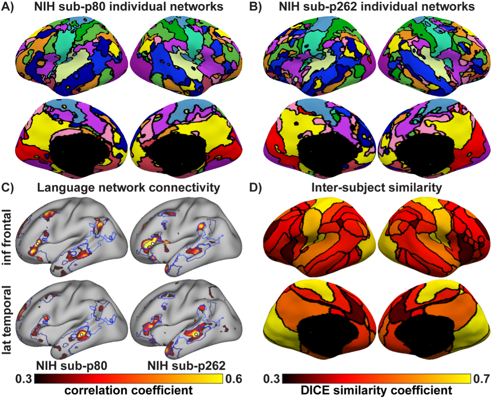
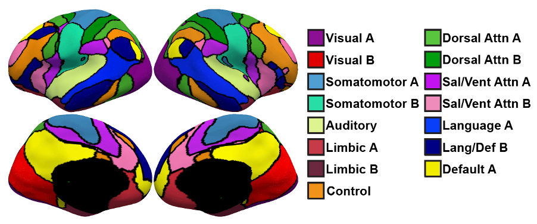
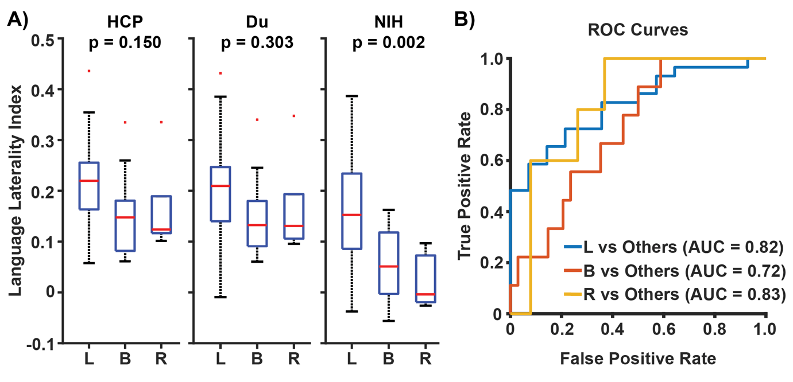

# Individual-specific resting-state networks predict language dominance in drug-resistant epilepsy

## Reference

Lim MJR et al. Individual-specific resting-state networks predict language dominance in drug-resistant epilepsy. *Epilepsia*. 2026;00:1–13. https://doi.org/10.1002/epi.70323

---

## Overview

Accurate identification of language lateralization is a critical step in presurgical
planning for drug-resistant epilepsy. Standard group-average cortical parcellations
assign the same network boundaries to every patient, which are inadequate in epilepsy where pathology alters normal network organization.

This release provides the **NIH 34-subject epilepsy multi-session
hierarchical Bayesian model (MS-HBM) model** trained on resting-state fMRI from 34 patients
with drug-resistant epilepsy at the NIH. Given approximately 10 minutes of
resting-state fMRI data from a new patient, the model generates a 15-network
individual-specific cortical parcellation that captures that patient's unique cortical
resting-state network organization and computes the language laterality index from the language networks.



In our paper, we showed that:

1. **Individual-specific networks are higher quality.** Parcellations derived using
   the epilepsy-trained MS-HBM show significantly higher functional connectivity (FC)
   homogeneity than group-average parcellations and MS-HBM models trained on healthy
   participants.

2. **The model generalises to an independent dataset.** Individual-specific networks
   replicate in a separate cohort of patients undergoing presurgical evaluation
   with electrical stimulation fMRI (es-fMRI).

3. **Individual-specific rs-fMRI language networks predict task-fMRI language lateralization.** The language
   laterality index (LI) derived from individual-specific parcellations can predict task-fMRI language lateralization.

---

## Model

The **NIH 34-subject MS-HBM epilepsy model** comprises 15 cortical networks and was trained on patients with drug-resistant epilepsy from the NIH. We also provide the group-average networks derived from the NIH 34-subjects, as well as a combined group-average networks derived from 57 NIH subjects and 16 esfmri subjects with at least one valid rs-fMRI run. 



Key files
are in `MSHBM_Epilepsy/`:

| File | Description |
|---|---|
| `Params_Final.mat` | MS-HBM group prior trained on the NIH 34-subject drug-resistant epilepsy dataset, used for estimating individual-specific networks |
| `NIH_34_group` | Group-average networks of the NIH 34-subjects  |
| `combined_group` | Group-average networks of the NIH and esfmri subjects combined |

### Language Laterality Index


The language laterality index (LI) is computed from the individual-specific language networks estimated by our MS-HBM model (labels 8 and 11):

```
LI = (LH vertices − RH vertices) / (LH vertices + RH vertices)
```




---

## Dependencies

The following CBIG release must be present under `$CBIG_CODE_DIR`:

| Dependency | Path |
|---|---|
| `Kong2019_MSHBM` | `stable_projects/brain_parcellation/Kong2019_MSHBM/` |

`Kong2019_MSHBM` provides the MS-HBM individual parcellation scripts called by
`CBIG_MSHBM_Epilepsy_LI.m`. Ensure `$CBIG_CODE_DIR` is set and that the
`Kong2019_MSHBM` folder is present before running any scripts in this release.

---

## Quick Start

**Run on your own patient:**

```matlab
params.project_dir  = '/myproject/patient01';  % unique output dir per patient
params.lh_fMRI_list = {'/mydata/lh.sess1.nii.gz', '/mydata/lh.sess2.nii.gz'};
params.rh_fMRI_list = {'/mydata/rh.sess1.nii.gz', '/mydata/rh.sess2.nii.gz'};
params.censor_list  = {'/mydata/censor1.txt', '/mydata/censor2.txt'};

addpath('/path/to/Lim2026_MSHBM_epilepsy');
[lh_labels, rh_labels, LI_lang] = CBIG_MSHBM_Epilepsy_LI(params);
rmpath('/path/to/Lim2026_MSHBM_epilepsy');
```

`CBIG_MSHBM_Epilepsy_LI` saves the following outputs to `params.project_dir`:

| Output | Description |
|---|---|
| `ind_parcellation/test_set/Ind_parcellation_MSHBM_sub1_w80_MRF10.mat` | Individual parcellation labels |
| `LI.mat` | Language laterality index (`LI_lang`) |

**Run on the provided example data:**

```matlab
addpath('/path/to/Lim2026_MSHBM_epilepsy/examples');
CBIG_MSHBM_Epilepsy_wrapper();
rmpath('/path/to/Lim2026_MSHBM_epilepsy/examples');
```

The wrapper additionally saves a surface visualisation (`epilepsy_w80c10.png`) to
`examples/out_dir/`. See `examples/README.md` for full parameter documentation.

---

## Replication

Scripts to replicate all published figures and statistics are in `replication/`.
See [`replication/README.md`](replication/README.md) for the run order, folder structure, and environment setup.

> **Note:** Replication scripts require access to the patient fMRI data, which is not
> included in this release. Input data may be obtained upon reasonable request to the authors.

---

## Code Release

### Download whole repository

To download the version of the code that was last tested, you can either

- visit this link:
[https://github.com/ThomasYeoLab/CBIG/releases/tag/v0.40.0-Lim2026_MSHBM_epilepsy](https://github.com/ThomasYeoLab/CBIG/releases/tag/v0.40.0-Lim2026_MSHBM_epilepsy)

or

- run the following command, if you have Git installed

```
git checkout -b Lim2026_MSHBM_epilepsy v0.40.0-Lim2026_MSHBM_epilepsy
```

---

## Updates

- Release v0.40.0 (31/08/2026): Initial release of Lim2026 MSHBM_epilepsy

---

## Bugs and Questions

Please contact Mervyn Lim Jun Rui at [mervynlim@u.nus.edu](mailto:mervynlim@u.nus.edu).
