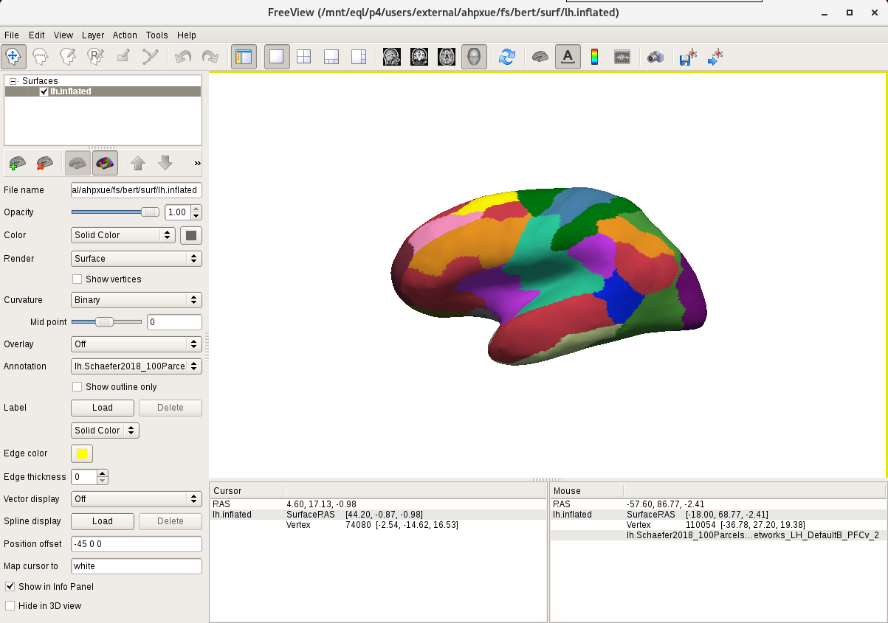
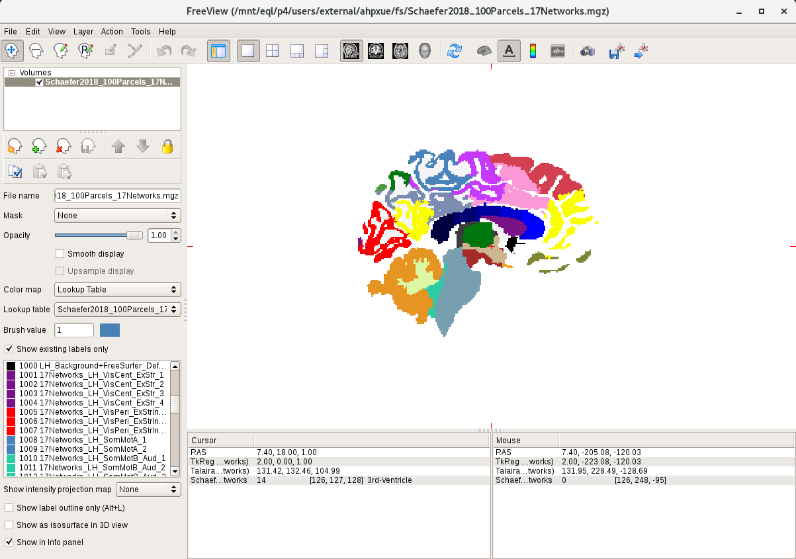

# Project Schaefer2018 parcellation to individual space

We provide 100 to 1000 parcels parcellations. The annot files of different resolution versions can be found under 

`$CBIG_CODE_DIR/stable_projects/brain_parcellation/Schaefer2018_LocalGlobal/Parcellations/FreeSurfer5.3/<fsaverage?>`

----
# Usage

Here we provide the procedure of generating:
1. Schaefer2018 parcellation in individual **surface** space
2. Schaefer2018 parcellation in individual **volume** space

### 1: Schaefer2018 parcellation in individual surface space

There are two ways to generate the individual parcellation. You can choose either using `mri_surf2surf` or `mris_ca_label`.

1. Using `mri_surf2surf` to project Schaefer2018 parcellation to individual space:

```
mri_surf2surf --hemi lh \
  --srcsubject <fsaverage?> \
  --trgsubject <subject_name> \
  --sval-annot $CBIG_CODE_DIR/stable_projects/brain_parcellation/Schaefer2018_LocalGlobal/Parcellations/FreeSurfer5.3/<fsaverage?>/label/lh.Schaefer2018_<N>Parcels_<7/17>Networks_order.annot \
  --tval $SUBJECTS_DIR/<subject_name>/label/lh.Schaefer2018_<N>Parcels_<7/17>Networks_order.annot

mri_surf2surf --hemi rh \
  --srcsubject <fsaverage?> \
  --trgsubject <subject_name> \
  --sval-annot $CBIG_CODE_DIR/stable_projects/brain_parcellation/Schaefer2018_LocalGlobal/Parcellations/FreeSurfer5.3/<fsaverage?>/label/rh.Schaefer2018_<N>Parcels_<7/17>Networks_order.annot \
  --tval $SUBJECTS_DIR/<subject_name>/label/rh.Schaefer2018_<N>Parcels_<7/17>Networks_order.annot
```

2. Using `mris_ca_label` to generate individual parcellation using gcs files:

```
mris_ca_label -l $SUBJECTS_DIR/<subject_name>/label/lh.cortex.label \
  <subject_name> lh $SUBJECTS_DIR/<subject_name>/surf/lh.sphere.reg \
  <gcs_file_dir>/lh.Schaefer2018_<N>Parcels_<7/17>Networks.gcs \
  $SUBJECTS_DIR/<subject_name>/label/lh.Schaefer2018_<N>Parcels_<7/17>Networks_order.annot

mris_ca_label -l $SUBJECTS_DIR/<subject_name>/label/rh.cortex.label \
  <subject_name> rh $SUBJECTS_DIR/<subject_name>/surf/rh.sphere.reg \
  <gcs_file_dir>/rh.Schaefer2018_<N>Parcels_<7/17>Networks.gcs \
  $SUBJECTS_DIR/<subject_name>/label/rh.Schaefer2018_<N>Parcels_<7/17>Networks_order.annot
```

The gcs files for Schaefer2018 parcellation can be downloaded [here](https://www.dropbox.com/s/1vk6zjus5nogd0z/gcs_Schaefer2018_update20190916.zip?dl=0). If you have trouble downloading the files, please contact Xue Aihuiping at xueaihuiping@gmail.com.

### 2: Schaefer2018 parcellation in individual volume space

To generate Schaefer2018 parcellation in volume space, please first project the Schaefer2018 parcellation to individual surface using the commands in [**1: Schaefer2018 parcellation in individual surface space**](#1-schaefer2018-parcellation-in-individual-surface-space)

```
mri_aparc2aseg --s <subject_name> --o <output>.mgz --annot Schaefer2018_<N>Parcels_<7/17>Networks_order
```

Note that in the `output.mgz` file of `mri_aparc2aseg` includes subcortical ROIs, labeled from 0 to 999. For cortical regions, the network labels of the left hemisphere start from 1001 and the network labels of the right hemisphere start from 2001. Part of the medial wall in the surface parcellation may not be projected into subcortical ROIs, the remaining medial wall area in the volume space will be labeled as 1000 for the left hemisphere and 2000 for the right hemisphere. 

### Visualize

- **Surface:**

You can visualize the .annot file in freeview using the following command:

```
freeview -f $SUBJECTS_DIR/<subject_name>/surf/<?h>.inflated:annot=$SUBJECTS_DIR/<subject_name>/label/<?h>.Schaefer2018_<N>Parcels_<7/17>Networks_order.annot
```



- **Volume:**

You can visualize the .mgz file in freeview using the following command:

```
freeview -v <output>.mgz:colormap=lut:lut=<lookup_table>
```



The lookup table can be found in: 

`$CBIG_CODE_DIR/stable_projects/brain_parcellation/Schaefer2018_LocalGlobal/Parcellations/project_to_individual/Schaefer2018_<N>Parcels_<7/17>Networks_order_LUT.txt`


