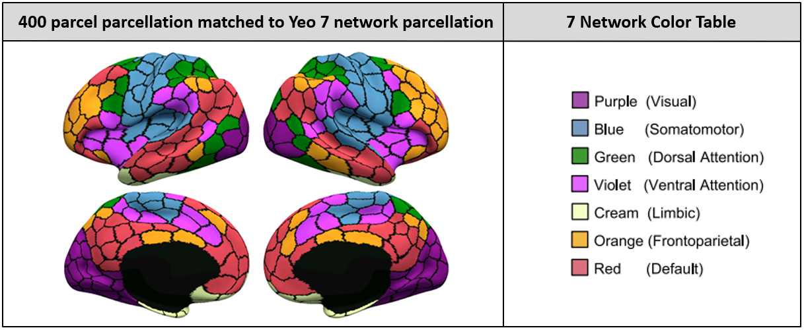
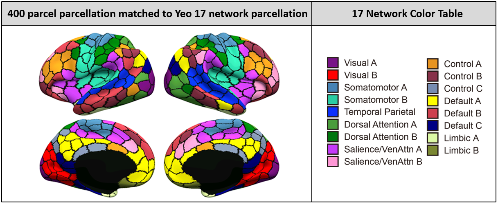

References
==========
+ Schaefer A, Kong R, Gordon EM, Laumann TO, Zuo XN, Holmes AJ, Eickhoff SB, Yeo BTT. [**Local-Global parcellation of the human cerebral cortex from intrinsic functional connectivity MRI**](http://people.csail.mit.edu/ythomas/publications/2018LocalGlobal-CerebCor.pdf). Cerebral Cortex, 29:3095-3114, 2018

----

Background
==========
Resting state fMRI data from 1489 subjects were registered using surface-based alignment. A gradient weighted markov random field approach was employed to identify cortical parcels ranging from 100 to 1000 parcels.
More details can be found in Schaefer et al. 2018.

---

Parcellations Release
=====================

The parcellations are available at multiple resolution (100 parcels to 1000 parcels), and can be found under the ```Parcellations``` folder. 

Specifically, there are three subfolders corresponding to three different spaces ```Freesurfer5.3```, ```MNI``` and ```HCP```. 

The parcellations were first computed in Freesurfer ```fsaverage6``` space and sampled to ```fsaverage5``` and ```fsaverage``` space. The parcellations were also projected to HCP ```fslr32k``` and FSL ```MNI``` space. 


There are three different Schaefer parcellations versions where the ROIs were named and orderred differently:

* VERSION 1. `Schaefer2018_<#ROIs>Parcels_7Networks_order`
* VERSION 2. `Schaefer2018_<#ROIs>Parcels_17Networks_order`
* VERSION 3. `Schaefer2018_<#ROIs>Parcels_Kong2022_17Networks_order`

Note that these three different versions have the same ROIs just with different ROI name and different ROI orderrings.

### VERSION 1&2. `Schaefer2018_<#ROIs>Parcels_7/17Networks_order`

For these two versions, each parcel is matched to a corresponding network in the 7 and 17 network parcellation by [Yeo et al. 2011](http://www.ncbi.nlm.nih.gov/pubmed/21653723). 

+ Parcel names were obtained by matching with the components in [Yeo2011 split components](https://github.com/ThomasYeoLab/CBIG/tree/master/stable_projects/brain_parcellation/Yeo2011_fcMRI_clustering/1000subjects_reference/Yeo_JNeurophysiol11_SplitLabels). The abbreviations of parcel names can be found here: [7 networks](https://github.com/ThomasYeoLab/CBIG/blob/master/stable_projects/brain_parcellation/Yeo2011_fcMRI_clustering/1000subjects_reference/Yeo_JNeurophysiol11_SplitLabels/Yeo2011_7networks_N1000.split_components.glossary.csv), [17 networks](https://github.com/ThomasYeoLab/CBIG/blob/master/stable_projects/brain_parcellation/Yeo2011_fcMRI_clustering/1000subjects_reference/Yeo_JNeurophysiol11_SplitLabels/Yeo2011_17networks_N1000.split_components.glossary.csv).

+ **Important note**: the color legends of networks ```Limbic A (TempPole)``` and ```Limbic B (OFC)``` for the 17 network figure was mistakenly switched when this figure was first created (it has been corrected since 23/03/2021). This error should not affect any downstream analysis using our parcellation, since the network names are only wrongly labelled in the figure below but are **correctly** labeled in our released parcellation files (i.e. cifti files, MNI nii.gz files and annot files). If you come across mislabeled figures in any papers, please kindly write to us, and we will help them double check if any of the downstream analysis was affected.

+ Here we provide a visualization of the 400 parcel parcellation in ```fslr32k``` space, parcels were colored to match Yeo 7/17 network parcellation:

<p align="center">


<p align="center">

</p>

### VERSION 3. `Schaefer2018_<#ROIs>Parcels_Kong2022_17Networks_order`

In this version, the Schaefer ROIs were matched with individual-specific 17-network parcellations from HCP subjects. After obatining the network assignment for each HCP subject, we summed the network assignment matrices across all subjects and assigned each ROI to the network with most subjects. The ROI names were manually named. This version of Schaefer parcellations were from [Kong et al. 2021](https://doi.org/10.1093/cercor/bhab101). 

+ This version is named as Kong2022 instead of Kong2021 is because the paper was published earlier than we expected.

+ Here we provide a visualization of the 400 parcel parcellation in ```fslr32k``` space, parcels were colored to match Kong2022 17-network parcellation:

<p align="center">

</p>

### ROI name

The ROI names can be found in several places. For simplicity, the users can check the fsleyes lookup table:

+ `Schaefer2018_LocalGlobal/Parcellations/MNI/fsleyes_lut`

We use abbreviations in the ROI name, please check this table for full name:

+ `Schaefer2018_LocalGlobal/Parcellations/README.md`


### RAS centroid coordinates

We also provide RAS centroid coordinates of the Yeo 7/17 parcellations in MNI 1mm and 2mm space. If you are interested, please check the csv files in: `Parcellations/MNI/Centroid_coordinates`

### Schaefer parcellations in individual space

If you want to project the Schaefer2018 parcellation to individual space, the relevant files and instructions are located here: [project to individual](https://github.com/ThomasYeoLab/CBIG/tree/master/stable_projects/brain_parcellation/Schaefer2018_LocalGlobal/Parcellations/project_to_individual)

---

Code Release
============
The code utilized in this study is under `Code` folder. Specifically, the `Code` folder includes:

* **CBIG_gwMRF_build_data_and_perform_clustering.m** -- The wrapper function that generates input data format from fMRI data and perform clustering. 

* **lib** folder -- This folder contains all other functions that will be called by the wrapper function.

* **README.md** -- You can check this file to find out more about our clustering code.

### Examples
We provide example code for you run as well as example results for you to compare under `examples` folder. Please refer to `examples/README.md` for more information.

### Download whole repository
Except for this project, if you want to use the code for other stable projects from out lab as well, you need to download the whole repository.

To download the version of the code that is last tested, you can either

- visit this link: [https://github.com/ThomasYeoLab/CBIG/releases/tag/v0.33.1-Schaefer2018_add_centroids](https://github.com/ThomasYeoLab/CBIG/releases/tag/v0.33.1-Schaefer2018_add_centroids)

or

- run the following command, if you have Git installed

```
git checkout -b Schaefer2018_add_centroids v0.33.1-Schaefer2018_add_centroids
```

---

Updates
=======
- Release v0.33.1 (21/2/2025): Add centroid coordinates for Kong2022 network order.

- Release v0.27.2 (21/3/2023): Rename `CBIG_gwMRF_index_trans_btwn2versions.m` to `CBIG_ReorderParcelIndex.m` and move to `$CBIG_CODE_DIR/utilities/matlab/FC` folder.

- Release v0.21.3 (17/1/2022)
 
    1. Reorganize folder structure for Schaefer parcellation with Kong2022 17-network order.
    
    2. Modify path pointing to Schaefer parcellation with Kong2022 17-network order.

    3. Add full name table for ROI name abbreviations.

- Release v0.20.0 (31/5/2021)
 
    1. Initial release of Kong2022_ArealMSHBM.
    
    2. Update Schaefer parcellations with new orderring based on Kong2022 17 networks.

    3. A new function to visualize correlation matrix is created.

- Release v0.19.2 (23/03/2021): Fix the mistakenly switched figure legend (Limbic A and Limbic B) in the 17 Network Color Table.

- Release v0.18.1 (20/01/2021):

    1. Update unit test to accommodate to the new HPC.

    2. Fix a minor bug in `CBIG_gwMRF_set_prams.m`

- Release v0.17.1 (06/05/2020): The medial wall area of Schaefer2018 parcellations in cifti format is different from the medial wall defined by HCP. The recent workbench toolbox release (v1.4.2) cannot handle this. The label of HCP medial wall vertices are now defined as 0 to be compatible with the latest workbench toolbox.

- Release v0.17.0 (19/02/2020): Avoid using absolute paths. Add new environment variables to avoid possible problems caused by hard-coded absolute paths.

- Release v0.15.3 (16/10/2019): Update reference

- Release v0.14.3 (16/09/2019):

    1. Develop a matching algorithm to rename parcel names. For details, please refer to this readme: [Update_20190916_README.md](https://github.com/ThomasYeoLab/CBIG/tree/master/stable_projects/brain_parcellation/Schaefer2018_LocalGlobal/Parcellations/Updates/Update_20190916_README.md)

    2. Add a function to map parcellation ordering between versions. Please see the update readme above for usage.

    3. Update unit test with the new parcel names.

- Release v0.10.2 (23/05/2019):

    1. Release Schaefer2018 700 parcels and 900 parcels parcellation.

    2. Release RAS centroid coordinates of Schaefer2018 700 parcels and 900 parcels parcellations in MNI 1mm and 2mm space.

    3. Add instruction and lookup tables for projecting Schaefer2018 parcellation to individual subjects under `Parcellations/project_to_individual`.

    4. Fix label name for rh medial wall in parcellation annot files.

    5. Update unit test.

- Release v0.8.1 (01/02/2019):

    1. Release RAS centroid coordinates of Schaefer2018 parcellations in MNI 1mm and 2mm space. The coordinate csv files can be found under `Parcellations/MNI/Centroid_coordinates`.

- Release v0.6.5 (17/08/2018):

    1. Move `examples` folder from `$CBIG_CODE_DIR/stable_projects/brain_parcellation/Schaefer2018_LocalGlobal/Code/examples` to `$CBIG_CODE_DIR/stable_projects/brain_parcellation/Schaefer2018_LocalGlobal/examples`.

    2. Update publication details in README files.


- Release v0.6.3 (17/07/2018):

    1. Release Schaefer2018 300 parcels and 500 parcels parcellation.

    2. Add unit test scripts to `unit_tests` folder.

    3. Update README.md, add links for people to directly download the Parcellations.

- Release v0.4.12 (09/04/2018): 

    1. Move example subjects from `$CBIG_CODE_DIR/data/example_data/${subj_ID}` to `$CBIG_CODE_DIR/data/example_data/Corr_HNU/${subj_ID}`. 
    
    2. The example subjects are re-processed by a newer version of our preprocessing pipeline ([v0.4.9](https://github.com/ThomasYeoLab/CBIG/releases/tag/v0.4.9-CBIG_fMRI_Preprocessing)). Hence results in `./Code/examples` are updated.
    
    3. Update some README.md files.

- Release v0.4.8 (30/01/2018): release clustering code

- Release v0.3.2 (14/09/2017): fix a labeling bug in cifti files

- Release v0.3.1 (07/09/2017): update utilities code

- Release v0.3.0 (21/07/2017): release the parcellations in MNI, fsLR and fsaverage space

---

Bugs and Questions
==================
Please contact Alexander Schaefer at alexschaefer83@gmail.com and Thomas Yeo at yeoyeo02@gmail.com.

