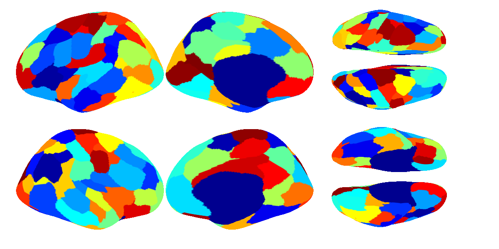

Here we provide an example for you to run so that you can have a brief sense about how our clustering code works.

----

References
==========
+ Schaefer A, Kong R, Gordon EM, Laumann TO, Zuo XN, Holmes AJ, Eickhoff SB, Yeo BTT. [**Local-Global parcellation of the human cerebral cortex from intrinsic functional connectivity MRI**](http://people.csail.mit.edu/ythomas/publications/2018LocalGlobal-CerebCor.pdf), *Cerebral Cortex*, 29:3095-3114, 2018

----

Install
=======
**Set up your enviroment**

The configuration scripts `CBIG_gwMRF_tested_config.sh` and `CBIG_gwMRF_tested_startup.m` can be found under `<your-cbig-repo-directory>/stable_projects/brain_parcellation/Schaefer2018_LocalGlobal/config` folder. 

Please follow the instructions in `<your-cbig-repo-directory>/setup/README.md` to have your local environment compatible with CBIG repository. 

----

Example data
============
We use two subjects from the preprocessed CoRR_HNU dataset as example data. The example data can be found here: `<your-cbig-repo-directory>/data/example_data/CoRR_HNU`. 
For more information on the CoRR_HNU dataset, you may refer to this paper by Xi-Nian Zuo et al.: [An open science resource for establishing reliability and reproducibility in functional connectomics](https://www.nature.com/articles/sdata201449.pdf).

----

Run example code
================
1) In terminal, run following command:

```
sh ${CBIG_CODE_DIR}/stable_projects/brain_parcellation/Schaefer2018_LocalGlobal/examples/example_input/CBIG_gwMRF_create_example_input_fullpaths.sh <your_output_folder>
```
This will generate a file `example_input_fullpaths.csv` needed for the next step. The file will be stored in `<your_output_folder>`.


2) In MATLAB, `cd` to the `Code` folder containing the wrapper function

Run the following command: 

```
CBIG_gwMRF_build_data_and_perform_clustering('<your_output_folder>/example_input_fullpaths.csv','<your_output_folder>',1,2,50,50,5000,2,1,50000000,15);
```
This will call the wrapper function to create a solution with 50 left and 50 right hemisphere clusters in your output folder. 

There will be some warnings from the optimizer: "Warning: Neighbours array should be upper-triangular; entries below the diagnonal will be ignored." You can ignore them.

It may up to 2 hours with 1 CPU for the example code to finish running. 

----

Example results
===============
After you finish running the code, there should be 1 `.mat` files in `<your_output_folder>/clustering` with name `*_seed_1.mat`.

These are the final clustering output files. You can compare your results with our results to see whether the codes work properly. Our results are provided in `./example_results`.

We have written a function for you to check if your results are correct. A few vertices can be different due to different Matlab versions or environments. This script allows for 0.05% vertices to be different. You can run the following commands in MATLAB command window to check seed 1:

```
cd(fullfile(getenv('CBIG_CODE_DIR'),'stable_projects','brain_parcellation','Schaefer2018_LocalGlobal','examples','scripts'));
[if_both_hemi_match] = CBIG_gwMRF_check_example_results(<your_output_folder>, 1);
```

If your results are exactly the same as ours, the message printed in the MATLAB command window should be:

```
Overlap = 37476, total_voxels 37476
Left hemisphere labels are the same.
Overlap = 37471, total_voxels 37471
Right hemisphere labels are the same.
Hurray! Example results for both hemispheres match.
```
You would receive warnings if vertices of either hemisphere are not exactly the same as the reference, but fall within the 0.05% threshold.

You can also compare your figure of seed 1 with the following one:



Please note that the example clustering results may not look good, since only the data of 2 subjects is used. The convergence criteria is also rather loose in this example parcellation. The reason is that we don't want this example to take ages to run, which may not be to the user's liking.

In our paper we use 1489 subjects' resting state fMRI data from the GSP data set. Please refer to the paper and [supplementary material](https://academic.oup.com/cercor/advance-article/doi/10.1093/cercor/bhx179/3978804?searchresult=1) for more information about the data and parameters we use.

----

Bugs and Questions
==================
Please contact Alexander Schaefer at alexschaefer83@gmail.com and Thomas Yeo at yeoyeo02@gmail.com.
