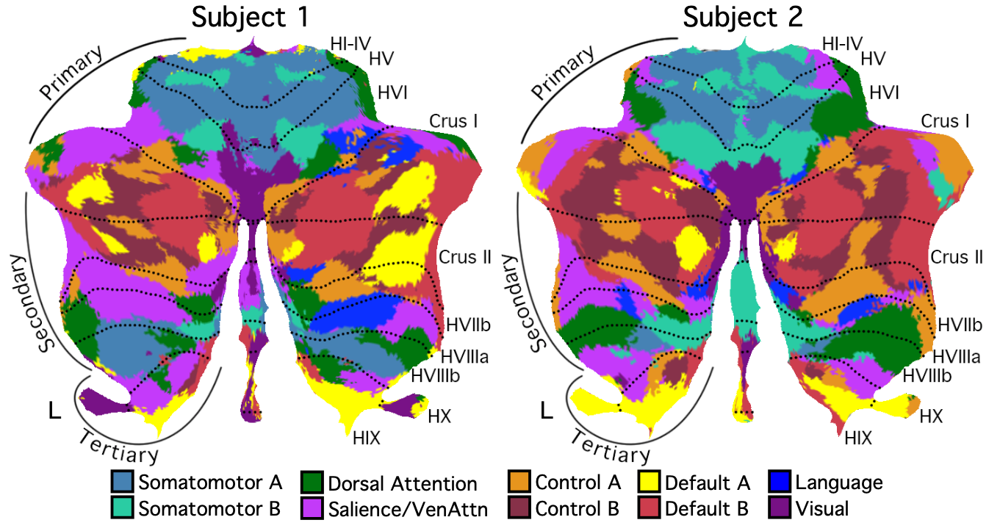

References
==========
- Xue A, Kong R, Yang Q, et al. The Detailed Organization of the Human Cerebellum Estimated by Intrinsic Functional Connectivity Within the Individual. Journal of Neurophysiology, 2021

----

Background
====

While cerebellar organization has been examined in group-averaged data, study of individuals provides an opportunity to discover features that emerge at a higher spatial resolution. This study examines the cerebellum of two intensively-sampled individuals based on functional connectivity MRI. We use the [MS-HBM model](https://github.com/ThomasYeoLab/CBIG/tree/master/stable_projects/brain_parcellation/Kong2019_MSHBM) to estimate the individual-specific cerebral cortical parcellations and use a winner-take-all algorithm to estimate individual-specific cerebellar parcellations. 



Code Release
====

### Parcellation

Parcellation of the 2 individuals are available on BALSA: [https://balsa.wustl.edu/study/show/7q3ZP](https://balsa.wustl.edu/study/show/7q3ZP).

### Example

We provide an example to show how to generate individual-specific parcellations from a group-level parcellation: [Examples of Individual Cerebellar Parcellation](https://github.com/ThomasYeoLab/CBIG/tree/master/stable_projects/brain_parcellation/Xue2021_IndCerebellum/examples)

### Download

To download the version of the code that is last tested, you can either

- visit this link: [https://github.com/ThomasYeoLab/CBIG/releases/tag/v0.18.0-Xue2021_IndCerebellum](https://github.com/ThomasYeoLab/CBIG/releases/tag/v0.18.0-Xue2021_IndCerebellum)

or

- run the following command, if you have Git installed

```
git checkout -b Xue2021_IndCerebellum v0.18.0-Xue2021_IndCerebellum
```

----

Usage
====


## Step 1: Individual-specific cerebral cortical parcellation

To generate individual-specific cerebellar parcellations, you need to have individual-specific cerebral cortical parcellations first.

There are a few options. 
- Apply full [MS-HBM model](https://github.com/ThomasYeoLab/CBIG/tree/master/stable_projects/brain_parcellation/Kong2019_MSHBM) to estimate the individual-specific cerebral cortical parcellations.
- Start with a group-level cerebral cortical parcellation and use the [MS-HBM model](https://github.com/ThomasYeoLab/CBIG/tree/master/stable_projects/brain_parcellation/Kong2019_MSHBM) to estimate the individual-specific cerebral cortical parcellations.
- Use your own method to generate individual-specific cerebral cortical parcellations.

No matter which option you choose, you should save the individual-specific cerebral cortical parcellations as .mat files, and you should have one file for each subject. 
- The cortical labels for each subject should be saved as 2 column vectors `lh_labels` (Nx1) and `rh_labels` (Nx1). 
- Vertices are labeled as 1~K.
- Medial wall vertices should be labeled as 0.
- Support `fsaverage5`, `fsaverage6`, `fsaverage`, `fs_LR_32k`, `fs_LR_164k` and any mesh defined by users. 

If you want to specify the colors of the parcellation, the .mat file should also include a `colors` matrix. The dimension should be Kx3 or (K+1)x3 for K-network parcellation. Each row indicates the RGB values of each label. 
- If `colors` have K rows, then label value k will be `colors(k, :)`. 
- If `colors` have K+1 rows, then the first row will be considered as color of medial wall and ignored. Label value k will be `colors(k+1, :)`. 
If the colors are not specified, the final parcellation will be in random color. 

Please see `./examples/group_surf/fsaverage5_10networks.mat` as a 10-network example on `fsaverage5`. 

### Apply full MS-HBM model

Please see [Kong2019_MSHBM](https://github.com/ThomasYeoLab/CBIG/tree/master/stable_projects/brain_parcellation/Kong2019_MSHBM).
Use `<MSHBM_output_dir>/ind_parcellation/Ind_parcellation_MSHBM_sub?_w?_MRF?.mat` as your individual-specific cerebral cortical parcellations. 

### Start with a group-level cerebral cortical parcellation

Please follow the folder structure of the [Kong2019_MSHBM](https://github.com/ThomasYeoLab/CBIG/tree/master/stable_projects/brain_parcellation/Kong2019_MSHBM) and use `CBIG_IndCBM_generate_MSHBM_params.m` to create MS-HBM parameters based on the group-level cerebral cortical parcellation and average profile of your own dataset. 

```
clustered = CBIG_IndCBM_generate_MSHBM_params(lh_profile, rh_profile, lh_labels, rh_labels);
save('MSHBM_dir/all/group/group.mat', 'lh_labels', 'rh_labels', 'clustered'); 
```

Save the new parameters `clusters` along with the parcellation labels `lh_labels` and `rh_labels` as `<MSHBM_output_dir>/group/group.mat` and continue. 

In our study we extract parcellations after estimating priors. If you also want to stop at this step, please use `CBIG_IndCBM_extract_MSHBM_result.m`.

```
CBIG_IndCBM_extract_MSHBM_result(MSHBM_dir)
```

Extracted individual cerebral cortical parcellations will be saved under `MSHBM_dir/ind_parcellation` as `Ind_parcellation_MSHBM_sub?.mat`.

We provide a 10-network group-level parcellation on `fsaverage5`, `fsaverage6`, `fsaverage`, `fs_LR_32k`, `fs_LR_164k` as examples. Please see `./examples/group_surf`.

### Use your own method

You can use your own method. Just save your parcellations as .mat files following the rules mentioned above. 

## Step 2: Individual-specific cerebellar parcellation

- Prepare cerebellar masks
- Create cifti template
- Compute functional connectivity
- Apply winner-take-all

### Prepare cerebellar masks

First you need to prepare cerebellar masks for all subjects in the volume to extract the time courses from your fMRI data in volume. All subjects can share the same mask or they can have different individual-specific masks. 

Cerebellar voxels should be marked as 1 and else should be 0.

### Create cifti template

In our procedure, the cerebral cortical parcellation and cerebellar parcellation will be saved in a .dlabel file. So we need to create a cifti template file first. Use `CBIG_IndCBM_create_template.sh` to create a cifti template based on your surface resolution and volume mask.

The surface mesh an be `fsaverage5`, `fsaverage6`, `fsaverage`, `fs_LR_32k`, `fs_LR_164k` or other customized mesh. Need to pass in optional input `-l` and `-r` when using customized mesh name. 

Example:

```
# Using fsaverage5 mesh
CBIG_IndCBM_create_template.sh fsaverage5 <binary_mask> <output_dir>

# Using an individual surface with 123456 vertices on the left hemisphere and 123457 vertices on the right hemisphere
CBIG_IndCBM_create_template.sh individual_surf <binary_mask> <output_dir> -l 123456 -r 123457
```

### Compute functional connectivity

Our cerebellar parcellation is based on the functioncal connectivity between the cerebellum and the cerebral cortex. Use `CBIG_IndCBM_compute_vol2surf_fc.m` to compute the functional connectivity. 

For example:

```
vol2surf_fc = CBIG_IndCBM_compute_vol2surf_fc(lh_surf_file, rh_surf_file, vol_file, template_file)
```

- ?h_surf_file:

One single run: path of the ?h surface time series (on surface)

Example: `CBIG_CODE_DIR/data/example_data/CoRR_HNU/subj01/subj01_sess1/surf/?h.subj01_sess1_bld002_rest_skip4_stc_mc_residc_interp_FDRMS0.2_DVARS50_bp_0.009_0.08_fs6_sm6_fs5.nii.gz`

Multiple runs: text file including all runs. Each row is the file path of a run.

- vol_file:

One single run: path of the volume time series. 

Example: `CBIG_CODE_DIR/stable_projects/brain_parcellation/Xue2021_IndCerebellum/examples/input/vol/sub1/sub1_sess1_vol_4mm.nii.gz`

Multiple runs: text file including all runs. Each row is the file path of a run.

- template_file: 

Cifti template dscalar file created in the previous step.

### Apply winner-take-all

Use `CBIG_IndCBM_cerebellum_parcellation` to generate individual-specific cerebellar parcellations. 

For each cerebellar voxel, this function first identifies the X highest correlated surface vertices. Then, the most frequently assigned network among the X surface vertices is chosen as the "winner" network (each of these X surface vertices is already assigned to a network according to your individual-specific cerebral cortical parcellation). Lastly, we assign the "winner" network to the cerebellar voxel.

Confidence of the assigment of each voxel is measured by `1 - N_second_frequent_network/N_most_frequent_network`.

For example:

```
CBIG_IndCBM_cerebellum_parcellation(surf_label_file, vol2surf_fc, template_file, output_dir);
```

If you want to specify the number of the most correlated surface vertices, please use optional input `'topX'`.

For example:

```
CBIG_IndCBM_cerebellum_parcellation(surf_label_file, vol2surf_fc, template_file, output_dir, 'topX', '400');
```


Results will be saves at <output_dir>:
- dlabel file: Parcellation.
- dscalar file: Confidence of the parcellation. 

If you want a nifti file, please use optional input `mask_file` and pass in the binary mask file:

```
CBIG_IndCBM_cerebellum_parcellation(surf_label_file, vol2surf_fc, template_file, output_dir, 'mask_file', mask_file);
```

This will also create a .nii.gz file and a freesurfer lookup table text file under your `<output_dir>`. 

## Visualization

For visualization purpose, this study projects the volume parcellations to flatmaps using SUIT toolbox. Details can be found here: [Flatmap](https://www.diedrichsenlab.org/imaging/suit_flatmap.htm)

To project the volume parcellation to flatmap, use the following Matlab command:

```
flat = suit_map2surf(<parcellation_file>.nii,'space','SUIT/FSL/SPM','stats',@mode);
```

Note that the input volume file should be unzipped first. 

To visualize the flatmap in matlab, use the following command:

```
suit_plotflatmap(flat, 'type', 'label', 'cmap', 'colormap.txt');
```

The colormap should be a text file. Each line shoule be `<Network_name> <R> <G> <B>`.

----

Updates
=======

- Release v0.18.0 (13/01/2021): initial release of Xue2021_IndCerebellum

Bugs and Questions
====
Please contact XUE Aihuiping at xueaihuiping@gmail.com.

