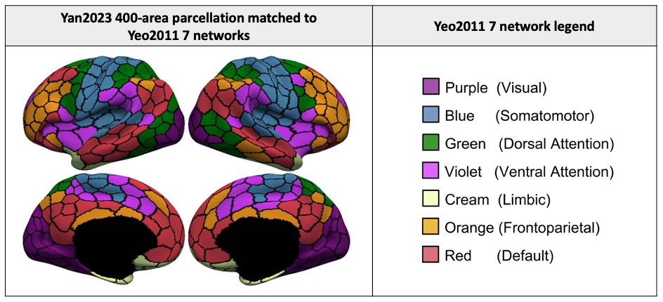
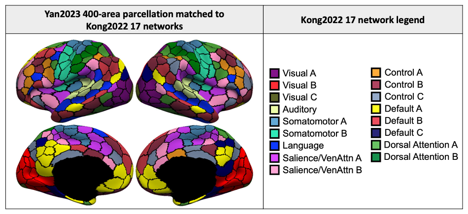

References 
=====================
+ Yan, Xiaoxuan, Ru Kong, Aihuiping Xue, Qing Yang, Csaba Orban, Lijun An, Avram J. Holmes et al. [**Homotopic local-global parcellation of the human cerebral cortex from resting-state functional connectivity**](https://doi.org/10.1016/j.neuroimage.2023.120010) NeuroImage (2023): 120010.

Background
====================

Resting-state fMRI is commonly used to derive brain parcellations, which are widely used for dimensionality reduction and interpreting human neuroscience studies. We previously developed a model that integrates local and global approaches for estimating areal-level cortical parcellations [Schaefer2018](https://academic.oup.com/cercor/article/28/9/3095/3978804). However, the lack of homotopic correspondence between left and right Schaefer parcels has limited their use for brain lateralization studies. Here, we extend our previous model to derive homotopic areal-level parcellations and have made it available in multiple resolutions.

Parcellations Release
=====================

The parcellations are available at multiple resolution (100 parcels to 1000 parcels), and can be found under the ```parcellations``` folder. We provide our parcellations in multiple different spaces: ```fsaverage5/fsaverage6/fsaverage```, ```MNI152``` and ```fs_LR_32k```. Specifically, we matched parcellations of each resolution to the [Yeo2011 7/17 networks](http://people.csail.mit.edu/ythomas/publications/2011CorticalOrganization-JNeurophysiol.pdf) and [Kong2022 17 networks](https://pubmed.ncbi.nlm.nih.gov/29878084/), visualized as follows:

<p align="center">



</p>

Check `./parcellations/README.md` for detailed information regarding the parcellation files.

To use the parcellations without the trouble of downloading our entire repository, you can just click on this link: [download Yan2023 Parcellations](https://minhaskamal.github.io/DownGit/#/home?url=https://github.com/ThomasYeoLab/CBIG/tree/master/stable_projects/brain_parcellation/Yan2023_homotopic/parcellations)


Code Release
=====================

We have released three multiple folders in relation to the code:
- For the user's reference:
    + `./code`: contains the code for parcellation generation. Refer to the enclosed `README.md` for details regarding how to run the code.
    + `./examples`: contains the code for the user to run a mini-example with our parcellation code. Refer to the enclosed `README.md` for details regarding how to run the code.
- For CBIG code maintanence purposes:
    + `./replication`: This is the folder containing the replication code, but can only run within the CBIG environment. Refer to the enclosed `README.md` for details regarding how to run the code.
    + `./unit_test`: This is the folder containing the unit test.

Download stand-alone repository
=====================

Since the whole Github repository is too big, we provide a stand-alone version of only this project and its dependencies. To download this stand-alone repository, visit this link: [https://github.com/ThomasYeoLab/Standalone_Yan2023_homotopic](https://github.com/ThomasYeoLab/Standalone_Yan2023_homotopic)

Updates
=======
- Release v0.29.5 (02/10/2023): Updated README. Included centroid coordinates for Yan2023 parcellations.

- Release v0.28.3 (27/04/2023): Fix the ordering of right-hemisphere parcels such that the left are right hemispheres parcels are homotopic (i.e., parcel 1 and 201 should be a homotopic pair in a 400-level parcellation). Previously, we ordered both the left and right hemisphere parcels by their respective network orders, which disrupted the homotopy across-hemisphere. Now, we first order the left hemisphere parcels by networks, and apply the same ordering to the right-hemisphere parcels. This ensures that the left and right hemispheres are homotopic, although the right-hemisphere parcels may not be ordered neatly by networks.

- Release v0.28.2 (20/04/2023): Included Yan2023 parcellation in the `CBIG_PlotCorrMatNetOrder` function (`/utilities/matlab/figure_utilities/PlotCorrMat/CBIG_PlotCorrMatNetOrder`).

- Release v0.28.1 (03/04/2023): Release of Yan2023 parcellation code.

- Release v0.27.0 (24/02/2023): Update README. Included parcellation visualizations.

- Release v0.26.0 (23/2/2023): Initial release of Yan2023 parcellations.
