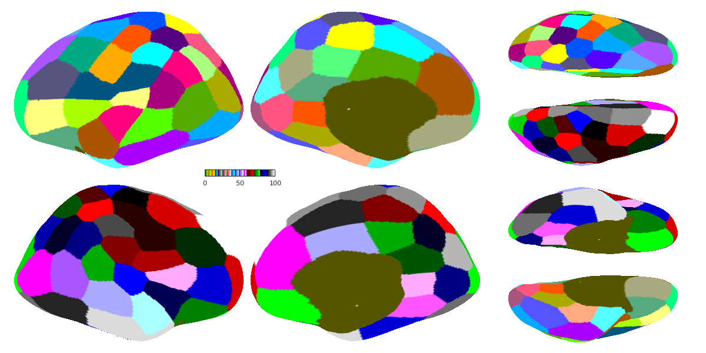

Overview
====

The user can run this mini example to get a sense of how the code works. If run smoothly, the total run time of this example should not exceed 2 hours. In short, this example gathers the fMRI data paths for 2 subjects, compute a premultiplied matrix and then run the parcellation algorithm with a few iterations.

Usage
====

Please `cd` to the example folder directory before performing the following steps.

**Step 1: Generate the results**

- Run `CBIG_hMRF_example_wrapper(your_output_dir)` in Matlab to generate the example results. The user can set breakpoints in the script in order to familarize oneself with the structure of the algorithm. In short, `CBIG_hMRF_example_wrapper` is divided into 3 consecutive steps. Each step is dependent on the previous step (if there is any). The procedure should be easy to follow. There are a few things to take note:
    + We use a fake censoring file serving as input to `step1`: `./input/fake_qc_file.txt`. Basically, this is a binary file indicating whether a frame passes our quality check. For convenience, we assume that all scans of the two subjects use this same censoring file.
    + In `step3`, note that we called `CBIG_hMRF_set_params` and `CBIG_hMRF_generate_parcellation_for_diff_rand_inits` directly instead of calling `CBIG_hMRF_wrapper_generate_homotopic_parcellation`. This is to show the user how to pass in additional hyperparameter that is not an argument to the `CBIG_hMRF_wrapper_generate_homotopic_parcellation` function, in this case, the `increase_tau` flag.
- After running through `CBIG_hMRF_example_wrapper`, your output directory should contain the following:

**Output**
+ `<output_dir>/<lh/rh>_GSP_subject_fullpath.csv` is the input fullpath for the left/right hemispheres, respectively. Each row corresponds to one subject and consists of all scans of a subject.
+ `<output_dir>/censor_full_path.csv` is the input fullpath for the censor files. Each row corresponds to one subject and consists of all scans of a subject.
+ `<output_dir>/time_mat` contains the left/right normalized concatenated time courses across all subjects.
+ `<output_dir>/mult_mat` contains the left/right premultipled matrix from the results under `<output_dir>/time_mat`.
+ `<output_dir>/premultiplied_matrix_single.mat` is the final input premultiplied concatenated fMRI time courses (of all subjects).
+ `<output_dir>/parcellation`
    - `<output_dir>/parcellation/print` contains the convergence information of the parcellation generation algorithm.
    - `<output_dir>/parcellation/results` contains the final reformatted parcellation results output.
    - `<output_dir>/parcellation/seed_835` contains all intermediate and final stages of the generated parcellation.

**Step 2: Check if the example results you generated match our results**

- Run `CBIG_hMRF_check_example_results(your_output_dir)` in Matlab in order to check your generated results against our reference results. Note that comparing just a few critical files (instead of all files) is sufficient for our purpose (that your results are not too different from ours). The files to be compared include the following:

**Reference Results**
+ `<ref_dir>/time_mat/<lh/rh>_time_matrix.mat` The left/right normalized concatenated time courses across all subjects.
+ `<ref_dir>/parcellation_seed_835/100parcels_C1.0e+02_K15_Wxyz1.5e+03_D10_A1_iterations_3_seed_835_after_increase_tau.mat` The final stage parcellation result.

You can also compare your figure generated at the final step of the example wrapper with the following one:

