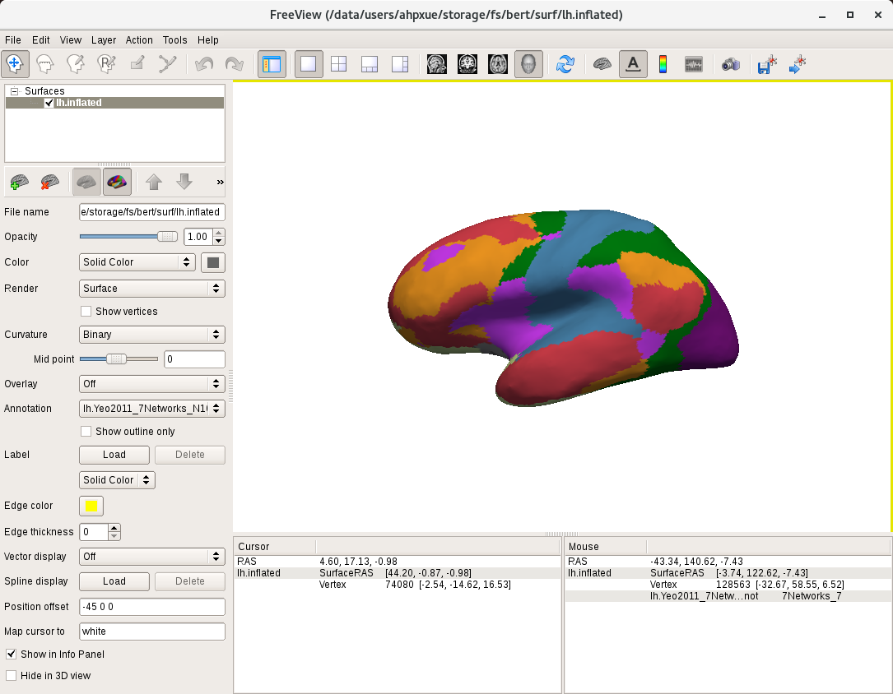
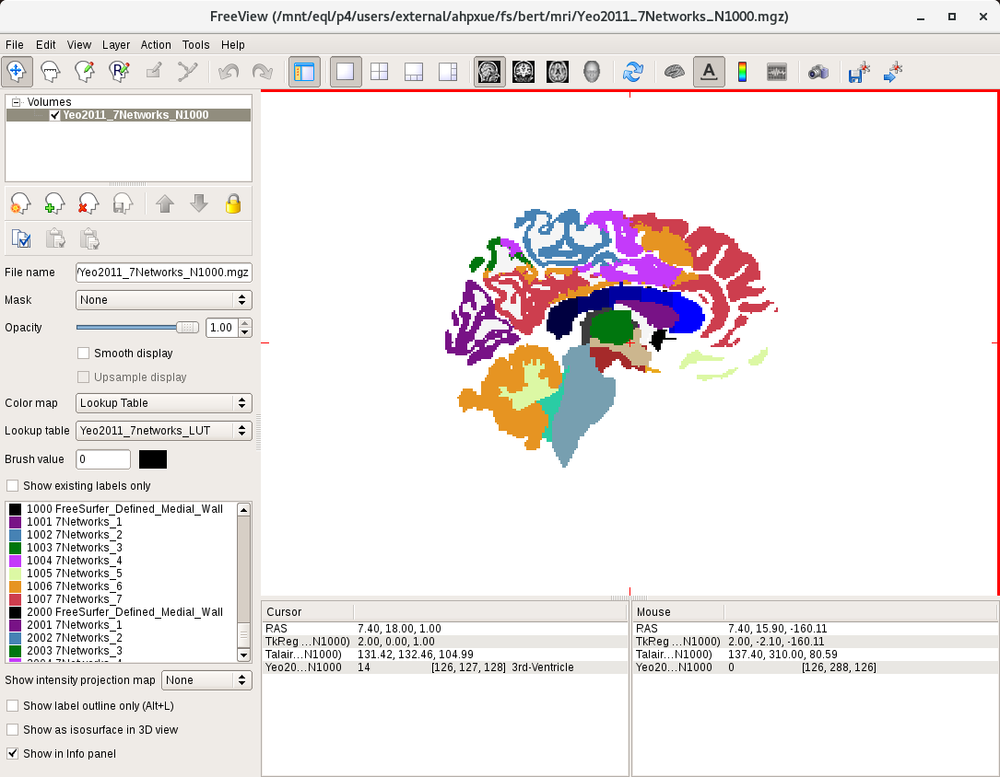

# Project Yeo2011 parcellation to individual space

We provide **two versions** of Yeo2011 parcellation annot files:

**Original version:**

`$CBIG_CODE_DIR/stable_projects/brain_parcellation/Yeo2011_fcMRI_clustering/1000subjects_reference/Yeo_JNeurophysiol11_SplitLabels/fsaverage5/label/<?h>.Yeo2011_<7/17>Networks_N1000.annot`

The original version contains 7/17 networks. There are 7/17 different labels in total.

**Split components version:**

`$CBIG_CODE_DIR/stable_projects/brain_parcellation/Yeo2011_fcMRI_clustering/1000subjects_reference/Yeo_JNeurophysiol11_SplitLabels/fsaverage5/label/<?h>.Yeo2011_<7/17>Networks_N1000.split_components.annot`

The Split components version contains 51 components for 7 networks and 114 components for 17 networks. There are 51/114 different labels in total.

----
# Usage

Here we provide the procedure of generating:
1. Yeo2011 parcellation in individual **surface** space
2. Yeo2011 parcellation in individual **volume** space

### 1: Yeo2011 parcellation in individual surface space

**Original version:**

For the original version, there are two ways to generate the individual parcellation. You can choose either using `mri_surf2surf` or `mris_ca_label`.

1. Using `mri_surf2surf` to project Schaefer2018 parcellation to individual space:

```
mri_surf2surf --hemi lh \
  --srcsubject fsaverage5 \
  --trgsubject <subject_name> \
  --sval-annot $CBIG_CODE_DIR/stable_projects/brain_parcellation/Yeo2011_fcMRI_clustering/1000subjects_reference/Yeo_JNeurophysiol11_SplitLabels/fsaverage5/label/lh.Yeo2011_<7/17>Networks_N1000.annot \
  --tval $SUBJECTS_DIR/<subject_name>/label/lh.Yeo2011_<7/17>Networks_N1000.annot

mri_surf2surf --hemi rh \
  --srcsubject fsaverage5 \
  --trgsubject <subject_name> \
  --sval-annot $CBIG_CODE_DIR/stable_projects/brain_parcellation/Yeo2011_fcMRI_clustering/1000subjects_reference/Yeo_JNeurophysiol11_SplitLabels/fsaverage5/label/rh.Yeo2011_<7/17>Networks_N1000.annot \
  --tval $SUBJECTS_DIR/<subject_name>/label/rh.Yeo2011_<7/17>Networks_N1000.annot
```

2. Using `mris_ca_label` to generate individual parcellation using gcs files:

```
mris_ca_label -l $SUBJECTS_DIR/<subject_name>/label/lh.cortex.label \
  <subject_name> lh $SUBJECTS_DIR/<subject_name>/surf/lh.sphere.reg \
  <gcs_file_dir>/lh.Yeo2011_<7/17>Networks.gcs \
  $SUBJECTS_DIR/<subject_name>/label/lh.Yeo2011_<7/17>Networks_N1000.annot

mris_ca_label -l $SUBJECTS_DIR/<subject_name>/label/rh.cortex.label \
  <subject_name> rh $SUBJECTS_DIR/<subject_name>/surf/rh.sphere.reg \
  <gcs_file_dir>/rh.Yeo2011_<7/17>Networks.gcs \
  $SUBJECTS_DIR/<subject_name>/label/rh.Yeo2011_<7/17>Networks_N1000.annot
```

The gcs files for Yeo2011 parcellation are not stored in this repository. If you need these files, please contact Xue Aihuiping at xueaihuiping@gmail.com.

**Split components version:**

For the split components version, the corresponding gcs files are not available so you can only use `mri_surf2surf`.

```
mri_surf2surf --hemi lh \
  --srcsubject fsaverage5 \
  --trgsubject <subject_name> \
  --sval-annot $CBIG_CODE_DIR/stable_projects/brain_parcellation/Yeo2011_fcMRI_clustering/1000subjects_reference/Yeo_JNeurophysiol11_SplitLabels/fsaverage5/label/lh.Yeo2011_<7/17>Networks_N1000.split_components.annot \
  --tval $SUBJECTS_DIR/<subject_name>/label/lh.Yeo2011_<7/17>Networks_N1000.split_components.annot

mri_surf2surf --hemi rh \
  --srcsubject fsaverage5 \
  --trgsubject <subject_name> \
  --sval-annot $CBIG_CODE_DIR/stable_projects/brain_parcellation/Yeo2011_fcMRI_clustering/1000subjects_reference/Yeo_JNeurophysiol11_SplitLabels/fsaverage5/label/rh.Yeo2011_<7/17>Networks_N1000.split_components.annot \
  --tval $SUBJECTS_DIR/<subject_name>/label/rh.Yeo2011_<7/17>Networks_N1000.split_components.annot
```

### 2: Yeo2011 parcellation in individual volume space

To generate Yeo2011 parcellation in volume space, please first project the Yeo2011 parcellation to individual surface using the commands in [**1: Yeo2011 parcellation in individual surface space**](#1-yeo2011-parcellation-in-individual-surface-space)

**Original version:**

```
mri_aparc2aseg --s <subject_name> --o <output>.mgz --annot Yeo2011_<7/17>Networks_N1000
```

**Split components version:**

```
mri_aparc2aseg --s <subject_name> --o <output>.mgz --annot Yeo2011_<7/17>Networks_N1000.split_components
```

Note that in the `output.mgz` file of `mri_aparc2aseg` includes subcortical ROIs, labeled from 0 to 999. For cortical regions, the network labels of the left hemisphere start from 1001 and the network labels of the right hemisphere start from 2001. Part of the medial wall in the surface parcellation may not be projected into subcortical ROIs, the remaining medial wall area in the volume space will be labeled as 1000 for the left hemisphere and 2000 for the right hemisphere. 

### Visualize

- **Surface:**

You can visualize the .annot file in freeview using the following command:

```
freeview -f $SUBJECTS_DIR/<subject_name>/surf/<?h>.inflated:annot=$SUBJECTS_DIR/<subject_name>/label/<?h>.Yeo2011_<7/17>Networks_N1000.<split_components.>annot
```



- **Volume:**

You can visualize the .mgz file in freeview using the following command:

```
freeview -v <output>.mgz:colormap=lut:lut=<lookup_table>
```



The lookup table can be found in: 

**Original version:**

`$CBIG_CODE_DIR/stable_projects/brain_parcellation/Yeo2011_fcMRI_clustering/1000subjects_reference/project_to_individual/Yeo2011_<7/17>networks_LUT.txt`

**Split components version:**

`$CBIG_CODE_DIR/stable_projects/brain_parcellation/Yeo2011_fcMRI_clustering/1000subjects_reference/project_to_individual/Yeo2011_<7/17>networks_Split_Components_LUT.txt`

