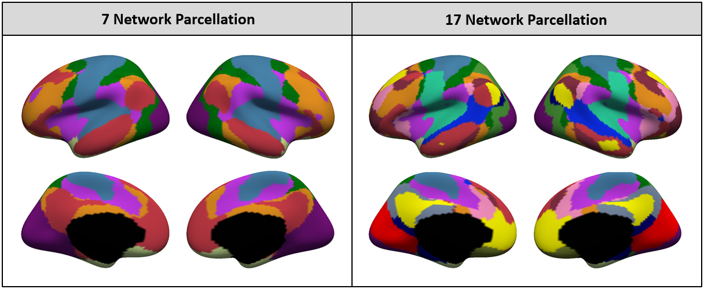
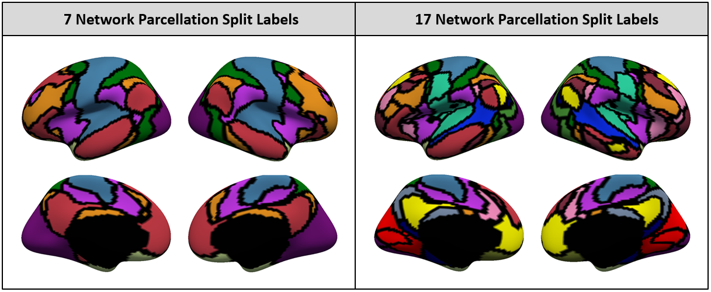

## Reference

Yeo BT, Krienen FM, Sepulcre J, Sabuncu MR, Lashkari D, Hollinshead M, Roffman JL, Smoller JW, Zollei L., Polimeni JR, Fischl B, Liu H, Buckner RL. [**The organization of the human cerebral cortex estimated by intrinsic functional connectivity**](http://www.ncbi.nlm.nih.gov/pubmed/21653723). Journal of Neurophysiology 106(3):1125-1165, 2011.

Krienen FM, Yeo BTT, Buckner RL. [**Reconfigurable state-dependent functional coupling modes cluster around a core functional architecture**](http://people.csail.mit.edu/ythomas/publications/2014TaskDependentCouplingModes-PTBS.pdf). Philosophical Transactions of the Royal Society B, 369:20130526, 2014.

Yeo BTT, Tandi J, Chee MWL. [**Functional connectivity during rested wakefulness predicts vulnerability to sleep deprivation**](http://people.csail.mit.edu/ythomas/publications/2015SleepDeprivation-NeuroImage.pdf). Neuroimage 111:147-158, 2015. 

----
## Background

Resting state fMRI data from 1000 subjects were registered using surface-based alignment. A clustering approach was employed to identify and replicate 7 and 17 networks of functionally coupled regions across the cerebral cortex. The results revealed local networks confined to sensory and motor cortices as well as distributed networks of association regions that form interdigitated circuits. Within the sensory and motor cortices, functional connectivity followed topographic representations across adjacent areas. In association cortex, the connectivity patterns often showed abrupt transitions between network boundaries, forming largely parallel circuits.

----

## Parcellation Release
The pacellations are released in `1000subjects_reference` folder. To use the parcellations without the trouble of downloading our entire repository, you can just click on this link: [download 1000subjects_reference](https://minhaskamal.github.io/DownGit/#/home?url=https://github.com/ThomasYeoLab/CBIG/tree/master/stable_projects/brain_parcellation/Yeo2011_fcMRI_clustering/1000subjects_reference)

Specifically, the parcellations include:

- **1000subjects_clusters007_ref.mat, 1000subjects_clusters017_ref.mat**
7/17 network brain parcellation using resting state fMRI data from 1000 subjects

    Below is a visualization of the 7/17 network parcellation in FreeSurfer fsaverage5 surface space:


    

- **Yeo_JNeurophysiol11_SplitLabels**
The original networks in 7/17 network brain parcellations were spatially distributed, so in this version we further splitted them into spatially connected components. For example, 51 components were obtained from the original 7 network parcellation and 114 components were obtained from the original 17 network parcellation. For more information, please check the `README.md` file under `Yeo_JNeurophysiol11_SplitLabels` folder.

    Below is a visualization of the 7/17 network parcellation splitted into 51/114 components.


    


    We also provide RAS centroid coordinates of the 7/17 network components in MNI 1mm and 2mm space. If you are interested, please check the csv files in:

    `1000subjects_reference/Yeo_JNeurophysiol11_SplitLabels/MNI152/Centroid_coordinates`

----

## Code Release
The code utilized in this study are released in `Yeo2011_fcMRI_clustering` folder. Specifically, the code include:
- **CBIG_Yeo2011_general_cluster_fcMRI_surf2surf_profiles.csh**
This function is the main function that calls other scripts in sequence. It assumes that the preprocessed surface data are located in `sub_dir/subject/surf/`. Try `./CBIG_Yeo2011_general_cluster_fcMRI_surf2surf_profiles.csh -help` for more information.

- **Examples**
There is a simple example in `examples` folder. Check how to run the example code and compare the results by reading `examples/README.md`.


Note that this project uses generic functions from other folders, which may be updated over time. To download the version of the code that was last tested, you can either

- visit this link: [https://github.com/ThomasYeoLab/CBIG/releases/tag/v0.9.7-Yeo2011_fcMRI_clustering](https://github.com/ThomasYeoLab/CBIG/releases/tag/v0.9.7-Yeo2011_fcMRI_clustering)

or

- run the following command, if you have Git installed
 
```
git checkout -b Yeo2011_fcMRI_clustering v0.8.2-Yeo2011_fcMRI_clustering
```

----

## Updates
- Release v0.4.3 (09/10/2017): Release Yeo2011 brain parcellation.
- Release v0.4.5 (01/12/2017):

	**Yeo2011_fcMRI_clustering**
	
	1. Add Yeo2011 parcellations with split labels.
	
- Release v0.4.10 (01/02/2018):

    1. Add project-specific prefix `Yeo2011` in all scripts names.
    
    2. Add `config`, `unit_tests`, and `examples` folders.
    
- Release v0.4.12 (09/04/2018): 

    1. Add project-specific prefix `Yeo2011` for two scripts of **Yeo2011_fcMRI_clustering**: `1000subjects_reference/Yeo_JNeurophysiol11_SplitLabels/scripts/CBIG_DownsampleMNI1mmParcellationTo2mm.csh` and `1000subjects_reference/Yeo_JNeurophysiol11_SplitLabels/scripts/CBIG_ProjectSplitLabels2MNI1mm.m`, which were missing in release v0.4.10.
    
    2. Move example subjects from `$CBIG_CODE_DIR/data/example_data/${subj_ID}` to `$CBIG_CODE_DIR/data/example_data/Corr_HNU/${subj_ID}`.
    
    3. The example subjects are re-processed by a newer version of our preprocessing pipeline ([v0.4.9](https://github.com/ThomasYeoLab/CBIG/releases/tag/v0.4.9-CBIG_fMRI_Preprocessing)). Hence results in `./examples` are updated.
    
    4. Update some README.md files.

- Release v0.8.2 (01/02/2019):

    1. Release RAS centroid coordinates of Yeo2011 parcellations in MNI 1mm and 2mm space. The coordinate csv files can be found under `1000subjects_reference/Yeo_JNeurophysiol11_SplitLabels/MNI152`. 

- Release v0.9.7 (16/04/2019):

    1. Update the annot files of the split components parcellation. The colortable of the previous annot file `1000subjects_reference/Yeo_JNeurophysiol11_SplitLabels/fsaverage5/label/<?h>.Yeo2011_<7/17>Networks_N1000.split_components.annot` included components from both hemisphere. Now the components of the other hemisphere in the colortable are removed.

    2. Add instruction and lookup tables for projecting Yeo2011 parcellation to individual subjects under `1000subjects_reference/Yeo_JNeurophysiol11_SplitLabels/project_to_individual`.

----

## Bugs and Questions

Please contact Thomas Yeo at yeoyeo02@gmail.com.

