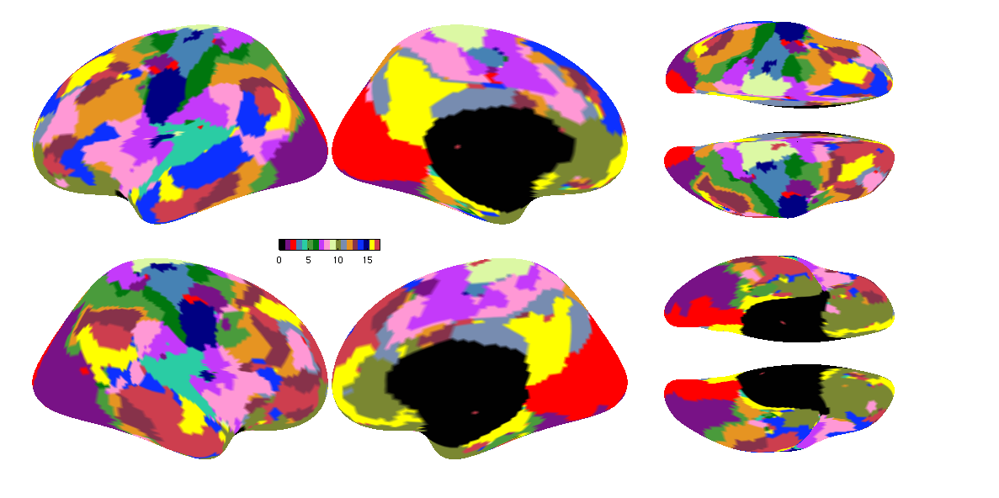

Sometimes we need to check whether any change to the repository has influence on the stable projects. Therefore, we provide the clustering results based on two subjects from Hangzhou Normal University (HNU) dataset. You can check the README about the example data: `<Your CBIG_CODE_DIR>/data/example_data/CoRR_HNU/README.md`. More information can be found in this paper by Zuo et al. [An open science resource for establishing reliability and reproducibility in functional connectomics](https://www.nature.com/articles/sdata201449.pdf). The purpose is to check whether the scripts can generate exactly the same results as you expected. This small example can also give you a brief sense about how to use the scripts. (The clustering results may not look good since it only uses two subjects.)

----

## Code

Run the following command with your own job-submitting script:

```
$CBIG_CODE_DIR/stable_projects/brain_parcellation/Yeo2011_fcMRI_clustering/examples/scripts/CBIG_Yeo2011_example.csh <your_own_output_dir>
```

We also provide a matlab wrapper `CBIG_Yeo2011_generate_example_results(output_dir)` which runs the above command. 

We do not offer the command to submit jobs to the job scheduler because it's specific to CBIG lab environment. The estimated runtime is ~ 10min with less than 2G memory and 1 CPU.

----

## Results

If you have run the command above, there should be a `.mat` file: `<your_own_output_dir>/clustering/HNU_example_clusters017_scrub.mat`. This is the final clustering output file.

To check your results, run the matlab function `CBIG_Yeo2011_check_example_results(output_dir)`. A few vertices can be different due to different Matlab versions or environments. This script allows for 0.05% vertices to be different.

To visualize your results, run the following commands in Matlab command window:

```
clustered = load('<Your clustering .mat file>');
ref_file = [<Your CBIG_CODE_DIR> '/stable_projects/brain_parcellation/Yeo2011_fcMRI_clustering/1000subjects_reference/1000subjects_clusters017_ref.mat'];
ref = load(ref_file);
CBIG_DrawSurfaceMaps(clustered.lh_labels, clustered.rh_labels, 'fsaverage5','inflated',0, 17, ref.colors)
```

Compare your figure with the following one:



Check whether they are exactly the same as you expected.
