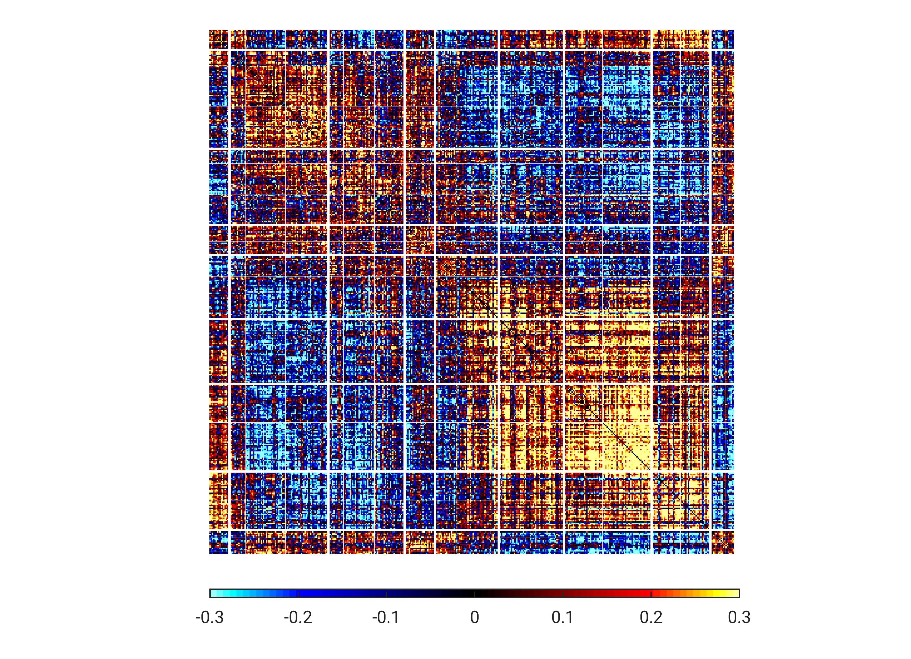

## Data

In this example, we compute Partial Least Squares (PLS) on whole-brain RSFC and behavioral data on a subsample (N=56) of the UCLA Consortium for Neuropsychiatric Phenomics dataset. 

The data are in the file `$CBIG_CODE_DIR/stable_projects/disorder_subtypes/Kebets2019_Transdiagnostic/examples/input/example_data_CNP.mat`.

----

## Code

The wrapper function is called 
```
CBIG_VK2019_example_wrapper.m
```

Results can be compared with results saved in 

```
$CBIG_CODE_DIR/stable_projects/disorder_subtypes/Kebets2019_Transdiagnostic/examples/correct_output
```


## Visualization

After running the example, you can find the RSFC loadings of the significant LC here:

```
$CBIG_CODE_DIR/stable_projects/disorder_subtypes/Kebets2019_TransdiagnosticComponents/examples/output/LC1_RSFC_loadings_minsc-0.30_maxsc0.30.jpg
```

which should be the same as the following image
* RSFC loadings of LC1

