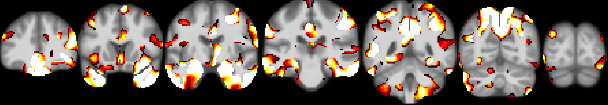
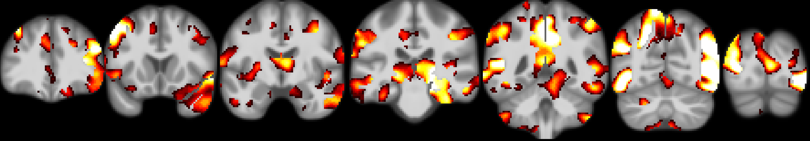
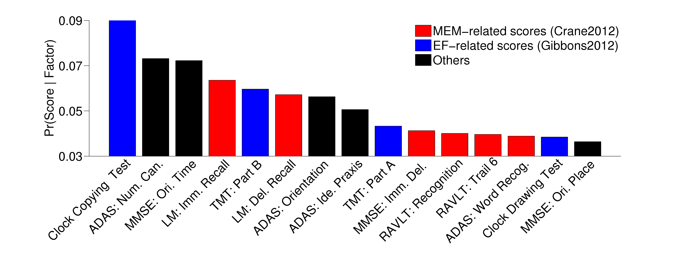
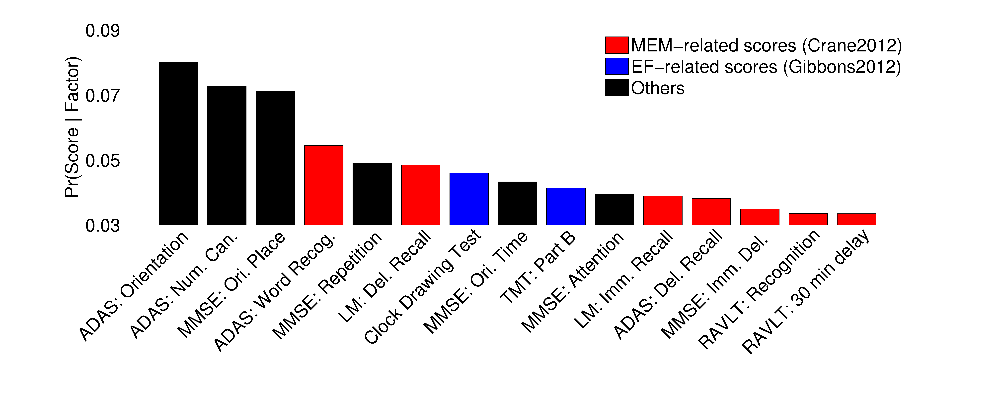

# Examples of Multi-modal latent Dirichlet allocation (MMLDA)

The examples of MMLDA contain four parts:
1. Estimate latent factors with different initializations
2. Choose the best initialization and visualize factors 
3. Infer factor compositions for new subjects based on estimated factors
4. Compare your output with reference output and check whether they are the same or not

----

## Data

In this example, we will perform the algorithms on the SPM VBM results and cognitive scroes of 2 subjects from ADNI. Since we don't have the right to share ADNI data, the VBM results and cognitive scores have already been converted to documents.

The documents are in the folder

```bash
$CBIG_CODE_DIR/stable_projects/disorder_subtypes/Sun2019_ADJointFactors/examples/input
```
We use two subjects to do estimation

```
ADNI2_bl_AD_meanCNstdALL_plus1_brain_2sub.dat
ADNI2_bl_AD_meanCNstdALL_plus1_behavior_2sub.dat
```

and one subject to do inference

```
ADNI2_bl_AD_meanCNstdALL_plus1_brain_1sub.dat
ADNI2_bl_AD_meanCNstdALL_plus1_behavior_1sub.dat
```

If you want to know how we convert VBM results and cognitive scores to documents, please check the following example

```bash
$CBIG_CODE_DIR/stable_projects/disorder_subtypes/Sun2019_ADJointFactors/replication/CBIG_MMLDA_brain_behavior_to_doc_wrapper.m
```

----

## Code

If you do not have a queue to submit job, you only need to specify output directory `out_dir` and run following in matlab (takes ~2h)

```matlab
CBIG_MMLDA_example_wrapper(out_dir)
```

If you have a queue (e.g. circ-spool), you need to specify output directory `out_dir` and queue `queue` and run following in matlab (takes ~40min)

```matlab
CBIG_MMLDA_example_wrapper(out_dir, queue)
```

The final results can be compared using

```
CBIG_MMLDA_check_example_results(out_dir)
```

## Visualization

After finishing the examples, you can find the atrophy patterns of 2 factors here:

```
$out_dir/visualizeFactors/ADNI2_bl_AD_meanCNstdALL_plus1_2sub/k2/r3/MNI/topic1_cor_concat.png
$out_dir/visualizeFactors/ADNI2_bl_AD_meanCNstdALL_plus1_2sub/k2/r3/MNI/topic2_cor_concat.png
```
which should be the same as the following images
* Atrophy pattern of factor 1

* Atrophy pattern of factor 2


You can also find the cognitive deficits of 2 factors here:

```
$out_dir/visualizeFactors/ADNI2_bl_AD_meanCNstdALL_plus1_2sub/k2/r3/beta2_F1_Top15.png
$out_dir/visualizeFactors/ADNI2_bl_AD_meanCNstdALL_plus1_2sub/k2/r3/beta2_F2_Top15.png
```
* Cognitive deficits of factor 1

* Cognitive deficits of factor 2

