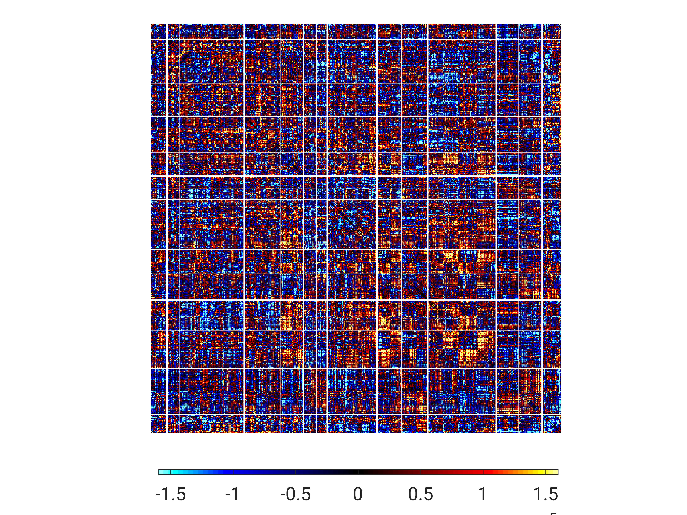
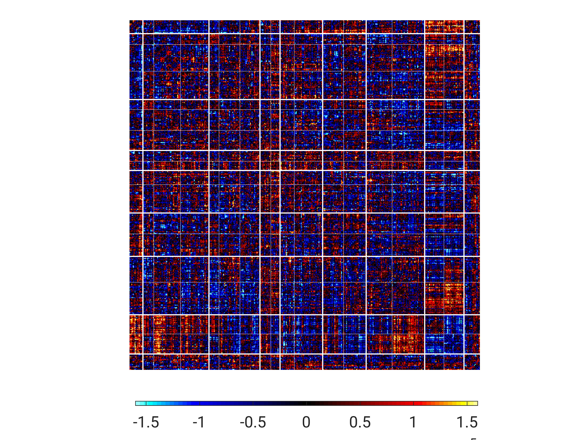

# Examples
In this folder, we provide a toy example to make sure that users outside CBIG lab can run the code in `../../Tang2020_ASDFactors` correctly.

The example code contains the following steps:
1. Step 1: Converting RSFC data to "documents":
	* Step 1A: Converting RSFC data to "documents" for latent factor estimation
	* Step 1B: Converting RSFC data to "documents" for inferring factor compositions of new participants
2. Step 2: polarLDA
	* Step 2A: Estimating model parameters (or loosely speaking, estimating latent factors)
	* Step 2B: Visualizing latent factors
	* Step 2C: Inferring factor compositions of new participants

Note that for simplicity, the input to Step 1 only includes 2 ASD participants. The output of Step 1 **will not** be used as input to Step 2. Instead, we provide another input for Step 2. See `Data` section below for more details.

----

## Reference
Siyi Tang*, Nanbo Sun*, Dorothea L. Floris, Xiuming Zhang, Adriana Di Martino, B.T. Thomas Yeo. [Reconciling Dimensional and Categorical Models of Autism Heterogeneity: a Brain Connectomics & Behavioral Study](https://doi.org/10.1016/j.biopsych.2019.11.009). Biological psychiatry, in press.

----

## Data
`input` folder contains the input data to run the toy example code. 

Note that in `input` folder, `step1_output_dx1.dat` & `step1_output_inf_dx1.dat` are not outputs from example code Step 1, but are inputs we provide for example Step 2. `step1_output_dx1.dat` is the "document" of 30 ASD participants for factor estimation, and `step1_output_inf_dx1.dat` is the "document" of 2 ASD participants for factor composition inference. 

----

## Run Example Code
On terminal, specify the output directory and call the script `$CBIG_CODE_DIR/stable_projects/disorder_subtypes/Tang2020_ASDFactors/examples/scripts/CBIG_ASDf_example_script.sh <your_output_dir>`.

This script will run the above-mentioned steps **in series**. After the steps have finished, it will call the function `scripts/CBIG_ASDf_check_example_results.m` to compare your output results with the reference results located in the `results` folder. It takes about 1 hour to run this script on terminal.

NOTE: In the example code, we directly use the copy of executable file of polarLDA in `../step2_polarLDA` which was compiled on our CBIG lab server. However, we suggest you re-compile the source code of polarLDA by the following command on terminal:
```bash
cp -aR ${CBIG_CODE_DIR}/external_projects/polarlda-c-dist <your_code_dir> # copy to your own code directory
cd <your_code_dir>/polarlda-c-dist/code
make # compile
```

----
## Check Results
The example code will create a log file in `<your_output_dir>/logs`. If the outputs in `<your_output_dir>` are exactly the same as our reference results, you will see messages in the log file with `[PASSED]`, otherwise you will see some `[FAILED]` messages.

In addition, you may visually check the estimated latent factors (only two-factor model in our example code). `<your_output_dir>/visualizeFactors/k2/r1/mean1_minsc-1.6e-05_maxsc1.6e-05.jpg` should look like:


And `<your_output_dir>/visualizeFactors/k2/r1/mean2_minsc-1.6e-05_maxsc1.6e-05.jpg` should look like:


----
## Bugs and Questions
Please contact Siyi Tang at tangsy935@gmail.com, Nanbo Sun at sun464879934@gmail.com and Thomas Yeo at yeoyeo02@gmail.com.
