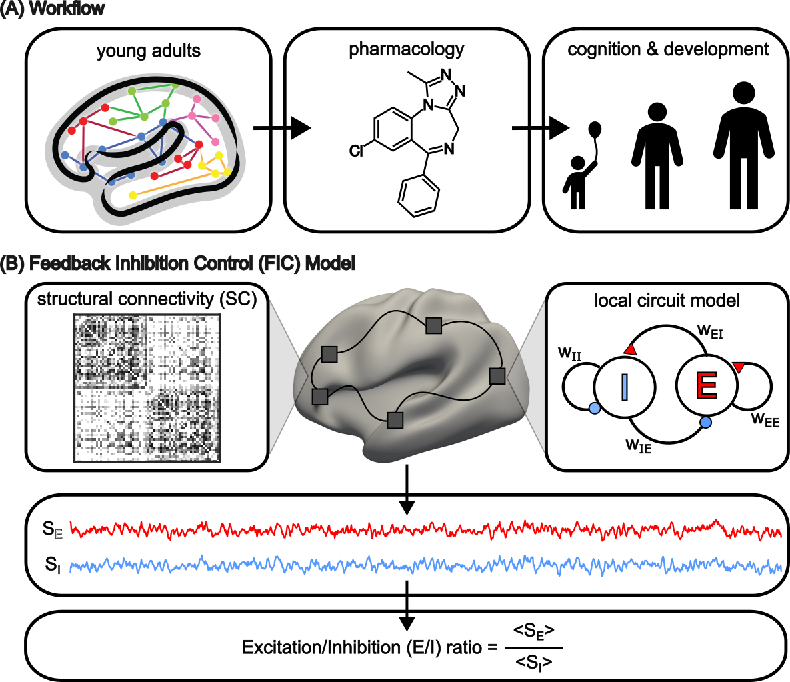

# parameteric Feedback Inhibition Control (pFIC) model

## References
Zhang, S., Larsen, B., Sydnor, V. J., Zeng, T., An, L., Yan, X., ... & Yeo, B. T. (2023). [In-vivo whole-cortex estimation of excitation-inhibition ratio indexes cortical maturation and cognitive ability in youth](https://www.biorxiv.org/content/10.1101/2023.06.22.546023v1.abstract). _bioRxiv_, 2023-06.

---

## Background
A balanced excitation-inhibition ratio (E/I ratio) is critical for healthy brain function, but challenging to measure _in-vivo_ in humans. Here we present an approach to non-invasively estimate whole-cortex E/I ratio by fitting a large-scale biophysically plausible model to resting-state functional MRI (fMRI) data. We first confirm our model generates realistic brain dynamics in the Human Connectome Project. Next, we show that the estimated E/I ratio is sensitive to the GABA-agonist benzodiazepine alprazolam during fMRI. Furthermore, drug-induced E/I changes are spatially consistent with positron emission tomography measurement of benzodiazepine receptor density. We then leverage the model to investigate the hypothesis that the E/I ratio is normatively refined during development and supports improvement in cognitive ability. We find that the E/I ratio declines heterogeneously across the cerebral cortex during youth, with the greatest reduction occurring in sensorimotor systems relative to association systems. Importantly, among children with the same chronological age, a lower E/I ratio (especially in association cortex) is linked to better cognitive performance. This result is replicated across North American (8.2 to 23.0 years old) and Asian (7.2 to 7.9 years old) cohorts, suggesting that a more mature E/I ratio indexes improved cognition during normative development. Overall, our approach opens the door to studying cortex-wide E/I ratio changes across the lifespan and in neuropsychiatric disorders.


___
## Folder structure 
* `model`: This  folder contains Python codes to run the pFIC model.
* `util`: This folder contains utility MATLAB functions and codes to generate figures in the manuscript.
* `examples`: This folder contains the example demo data, codes and reference outputs.
* `replication`: These folders contain the data, codes and reference outputs of each dataset to replicate the main analysis results.
* `figure`: This folder contains main figures shown in the manuscript.
* `unit_tests`: Unit test scripts for internal use only.
---
## Usage
### Installation guide
 Under the `replication/config` folder, run `conda env create -f CBIG_pFIC_python_env.yml` to install the Python environment. 

Installation will take around 15-20 minutes.

The reference outputs are generated using **NVIDIA RTX3090 with CUDA version 11.7**. To exactly replicate the results, make sure that you are using the same hardwares and same versions of Python packages.

----

# Code Release
## Download stand-alone repository
Since the whole Github repository is too big, we provide a stand-alone version of only this project and its dependencies. To download this stand-alone repository, visit this link: [https://github.com/ThomasYeoLab/Standalone_Zhang2024_pFIC](https://github.com/ThomasYeoLab/Standalone_Zhang2024_pFIC)

## Download whole repository
If you want to use the code from our lab's other stable projects (other than Zhang2024_pFIC), you would need to download the whole CBIG repository.

- To download the version of the code that was last tested, you can either

    - visit this link:
    [https://github.com/ThomasYeoLab/CBIG/releases/tag/v0.30.0-Zhang2024_pFIC](https://github.com/ThomasYeoLab/CBIG/releases/tag/v0.30.0-Zhang2024_pFIC)

    or

    - run the following command, if you have Git installed
 
    ```
    git checkout -b Zhang2024_pFIC v0.30.0-Zhang2024_pFIC
    ```
---
## FAQ
**Q:** Where should I start?\
**A:** A simple start would be running the example script under `examples/script/CBIG_pFIC_wrapper_example.sh`. After that, a more complete model & pipeline can be found under `model/example_full_pipline.ini`.

**Q:** What is the recommended fMRI preprocessing pipeline?\
**A:** For the purpose of estimating neural mass model parameters under the current setup, we follow the standard fMRI preprocessing steps (see the manuscript for more details). Except that, for the nuisance regression step, we prefer aCompCor or ICA-FIX to GSR as GSR tends to remove too much dynamics from the time series, which will affect the computation of functional connectivity dynamics. 

**Q:** How do I compute a subject-level or group-average functional connectivity (FC) and functional connectivity dynamics (FCD) matrix?\
**A:** You can refer to `util/HCP/CBIG_pFIC_generate_HCP_group_level_FC_FCD.m` as an example.

**Q:** What is the data format of FC and FCD fed to the pFIC model?\
**A:** FC *must* be saved as a .csv file, while FCD *must* be saved as a .mat file with a structure field named 'FCD'. You can refer to `replication/HCP/input/FC_train.csv` and `replication/HCP/input/FCD_train.mat` as an example.

**Q:** Why is the file of T1w/T2w ratio named as myelin?\
**A:** In this work, the phrase T1w/T2w ratio and myelin are used interchangeably as previous work has shown evidence that [T1w/T2w ratio could be used to index intracortical myelin content](https://pubmed.ncbi.nlm.nih.gov/21832190/).

**Q:** In the configuration file, what is the difference between pre-simulation period (`t_pre`) and simulation period (`simulation_period`)?\
**A:** Pre-simulation period (`t_pre`) is set to be long enough so that the differential equations are no longer in their transient phase. `t_pre` is usually set to be 2~3 mins. \
Simulation period (`simulation_period`) is the actual scanning duration of an fMRI run. For example, `simulation_period` is set to be 14.4 min for the HCP-YA dataset. \
Note that `t_pre` and `simulation_period` must be set in a way that, when converting them into seconds, they are **integer multiples of `TR`**, otherwise they will cause errors during downsampling.

**Q:** How do I compute the E/I ratio after running the training, validating and testing scripts of the pFIC model?\
**A:** After running the model test script (i.e., `model/CBIG_pFIC_test.py`),  a `simulation` folder will be generated under the <output_path>. In the `simulation` folder, you will find three .mat files: `S_E.mat`, `S_I.mat` and `r_E.mat`. These are the time courses of 
1)	excitatory synaptic gating variable
2) inhibitory synaptic gating variable 
3) excitatory firing rate

with a dimension (# of ROIs)-by-(# of simulations). The E/I ratio is defined as the ratio of the average of `S_E` and `S_I` across all simulations. You may also apply some filtering on `S_E` and `S_I`, for example, by the excitatory firing rate magnitude. The following is a simple MATLAB function that computes the E/I ratio while excluding simulations with an excitatory firing rate that is outside the range of 2.7-3.3Hz.
```
function EI = compute_EI()
% define a range of acceptable excitatory firing rate
rE_min = 2.7;
rE_max = 3.3;

% load the simulated time courses of SE, SI and rE
S_E = load('S_E.mat');
SE = S_E.S_E;
S_I = load('S_I.mat');
SI = S_I.S_I;
r_E = load('r_E.mat');
r_E = r_E.r_E;

% exclude the simulations with firing rates outside the defined range
anomaly = find(min(r_E) < rE_min);
anomaly = [anomaly find(max(r_E) > rE_max)];
SE(:, anomaly) = [];
SI(:, anomaly) = [];

% average SE and SI across all simulations, then take a ratio
EI = nanmean(SE, 2)./nanmean(SI, 2);
end
```
## Updates
-   Release v0.30.0 (11/3/2024): Initial release of Zhang2024_pFIC

--- 
## Bugs and questions
Please contact Shaoshi Zhang at [0zhangshaoshi0@gmail.com](mailto:0zhangshaoshi0@gmail.com) and Thomas Yeo at [yeoyeo02@gmail.com](mailto:yeoyeo02@gmail.com)