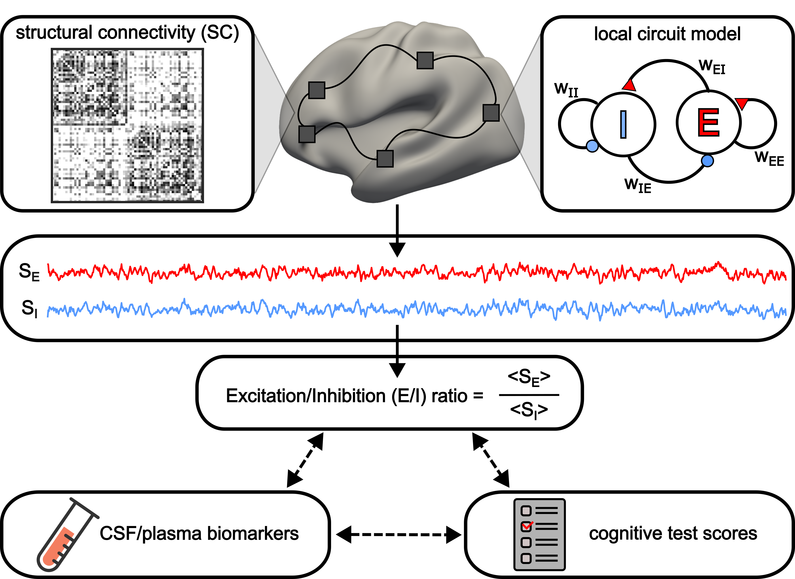

# E/I ratio and AD amyloid pathophysiology

## References

- Shaoshi Zhang, Sebastian N. Roemer-Cassiano, Joyce Ruifen Chong et al. Excitation-Inhibition Imbalance Links Amyloid Pathophysiology
  to Cognition in Non-Demented Individuals. *Under review*, 2026.

---

## Background

**INTRODUCTION:** Excitation-inhibition (E/I) imbalance has been proposed as an early circuit-level mechanism in Alzheimer's disease (AD), but its relationship to molecular pathology and cognition in humans remains unclear.

**METHODS:** We integrated biophysical modeling of resting-state fMRI with cerebrospinal fluid (CSF) and plasma biomarkers to examine whether E/I ratio links amyloid pathophysiology to memory in non-demented individuals across two cohorts from North America (N=302; CSF amyloid-β 42 [Aβ42]) and Singapore (N=240; plasma phosphorylated tau 217 [p-tau217]).

**RESULTS:** Elevated E/I ratio was associated with lower CSF Aβ42 and higher plasma p-tau217, with greater sensitivity in sensory-motor regions. In contrast, elevated E/I ratio in association cortices was more strongly related to worse memory function. Mediation analyses indicated E/I ratio partially accounted for the AD biomarker-memory relationship.

**DISCUSSION:** E/I imbalance represents an intermediate, systems-level circuit mechanism that links AD pathophysiology to cognitive impairment, offering novel insight into early neurophysiological changes along the AD continuum.



---

## Folder structure

```
Zhang2026_EIAD
├── examples                              # quick check that the code runs correctly
│   ├── script
│   │   ├── CBIG_EIAD_example.m
│   │   ├── CBIG_EIAD_check_example_results.m
│   │   ├── ADNI_df.csv
│   │   └── SA_rank_desikan.txt
│   ├── reference_output
│   │   └── reference_output.mat
│   └── README.md
├── replication                           # scripts and data to reproduce the paper
│   ├── config                            
│   │   ├── CBIG_EIAD_generate_standalone.sh
│   │   ├── CBIG_EIAD_tested_config.sh
│   │   └── CBIG_EIAD_tested_startup.m
│   ├── script
│   │   ├── CBIG_EIAD_ADNI.m              # main ADNI analyses
│   │   ├── CBIG_EIAD_MACC.m              # main MACC analyses
│   │   ├── CBIG_EIAD_run_harmonization.m # ComBat harmonization across scanners
│   │   ├── CBIG_EIAD_draw_surface_map.m  # surface visualization
│   │   ├── ADNI_df.csv                   # ADNI participant table (N=302)
│   │   ├── MACC_df.csv                   # MACC participant table (N=240)
│   │   ├── SA_rank_desikan.txt           # SA-axis rank of the 68 Desikan regions
│   │   ├── 1000subjects_clusters007_ref.mat
│   │   ├── pFIC_ADNI_example_config.ini  # pFIC model configuration
│   │   └── pFIC_MACC_example_config.ini
│   ├── reference_output
│   │   ├── ADNI.mat
│   │   └── MACC.mat
│   └── README.md
├── unit_tests                            # for CBIG lab only
│   ├── CBIG_EIAD_unit_test.m
│   └── README.md
├── readme_figure.png
└── README.md
```

Each subfolder has its own README with the details of what it contains.

---

## Usage

### Installation guide

1. Download the repository (see [Code release](#code-release) below).
2. The analysis scripts need MATLAB with the Statistics and Machine Learning
   Toolbox. No compilation or additional setup is required.
3. Two optional dependencies are only needed for specific scripts:
   `CBIG_EIAD_draw_surface_map.m` requires the CBIG repository on the MATLAB
   path, and `CBIG_EIAD_run_harmonization.m` requires `combat.m` from
   [ComBatHarmonization](https://github.com/Jfortin1/ComBatHarmonization).

### Check that the code runs

From `examples/script`, run

```matlab
CBIG_EIAD_example
```

This reproduces a reduced version of the ADNI analysis and compares the results
against the reference output. It takes under 10 seconds and prints
`Passed! Results are the same as the reference outputs.` on success. See
`examples/README.md`.

### Reproduce the results in the paper

To comply with the ADNI and MACC data-use agreements, the released
`replication/script/ADNI_df.csv` and `MACC_df.csv` contain real values only for
the subject IDs and the model-derived neural columns (the regional E/I ratios and
the underlying S_E and S_I); all demographic, biomarker, and cognitive columns
are empty. The wrappers therefore cannot be run as-is — you must first
repopulate those columns from your own ADNI / MACC download, keyed on the
released subject IDs. See the **Repopulating the tables** section of
`replication/README.md` for step-by-step instructions.

Once the tables are filled, from `replication/script` run

```matlab
CBIG_EIAD_ADNI
CBIG_EIAD_MACC
```

Results are written to `replication/output/` and can be compared against
`replication/reference_output/`. See `replication/README.md` for the analyses
performed, a description of every column in the two participant tables, and how
to run the ComBat harmonization.

---

## Code release

### Download repository

- To download the version of the code that was last tested, you can either

    - visit this link:
    [https://github.com/ThomasYeoLab/CBIG/releases/tag/v0.39.0-Zhang2026_EIAD](https://github.com/ThomasYeoLab/CBIG/releases/tag/v0.39.0-Zhang2026_EIAD)

    or

    - run the following command, if you have Git installed

    ```
    git checkout -b Zhang2026_EIAD v0.39.0-Zhang2026_EIAD
    ```

---

## Updates

-   Release v0.39.0 (14/08/2026): Initial release of Zhang2026_EIAD

---

## Bugs and questions

Please contact Shaoshi Zhang at [0zhangshaoshi0@gmail.com](mailto:0zhangshaoshi0@gmail.com) and Thomas Yeo at [yeoyeo02@gmail.com](mailto:yeoyeo02@gmail.com)
