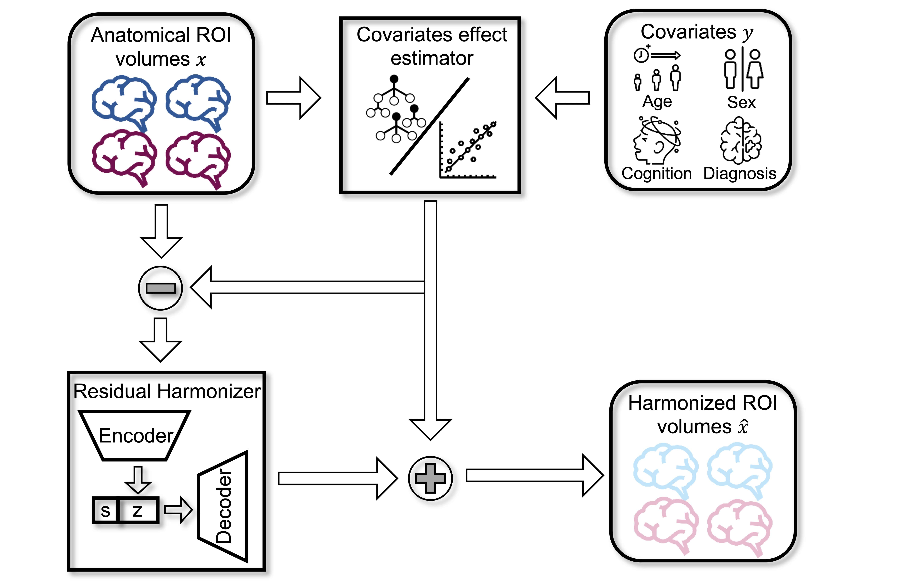

# DeepResBat: deep residual batch harmonization accounting for covariate distribution differences

## References

-   An, L., Zhang, C., Wulan, N., Zhang, S., Chen, P., Ji, F., Ng, KK., Chen, C.,Zhou, J., Yeo, B.T., 2024. [DeepResBat: deep residual batch harmonization accounting for covariate distribution differences](https://doi.org/10.1101/2024.01.18.574145), BioRxiv

---

## Background

Pooling MRI data from multiple datasets requires harmonization to reduce undesired inter-site variabilities, while preserving effects of biological variables (or covariates). The popular ComBat method uses a mixed effect regression framework to account for covariate distribution differences. There is growing interest in deep neural network (DNN) approaches, such as conditional variational autoencoders (cVAEs), but these do not explicitly address covariate differences. We propose two covariate-aware DNN-based harmonization methods: covariate VAE (coVAE) and DeepResBat. Our results show that DeepResBat and coVAE outperform ComBat, CovBat, and cVAE in removing dataset differences and enhancing biological effects, though coVAE may produce false positives.



---

## Code Release

### Download stand-alone repository

Since the whole Github repository is too big, we provide a stand-alone version of only this project and its dependencies. To download this stand-alone repository, visit this link: [https://github.com/ThomasYeoLab/Standalone_An2024_DeepResBat](https://github.com/ThomasYeoLab/Standalone_An2024_DeepResBat)

### Download whole repository

If you want to use the code from our lab's other stable projects (other than An2024_DeepResBat), you would need to download the whole CBIG repository.

-   To download the version of the code that was last tested, you can either

    -   visit this link:
        [https://github.com/ThomasYeoLab/CBIG/releases/tag/v0.33.0-An2024_DeepResBat](https://github.com/ThomasYeoLab/CBIG/releases/tag/v0.33.0-An2024_DeepResBat)

    or

    -   run the following command, if you have Git installed

    ```
    git checkout -b An2024_DeepResBat v0.33.0-An2024_DeepResBat
    ```

---

## Usage

### Environment setup

-   Our code uses Python and R, here is the setup:
    1. Install [Miniconda](https://docs.conda.io/en/latest/miniconda.html) or [Anaconda](https://www.anaconda.com/distribution/#download-section) with Python 3.x if you don't have conda
    2. Create conda environment from our `replication/config/CBIG_DeepResBat_python_env.yml` file by `conda env create -f replication/config/CBIG_DeepResBat_python_env.yml`

### Example

-   The example of our code is detailed in `examples/README.md`

### Replication

-   If you have access to ADNI, AIBL and MACC dataset, you can replicate our result following the instructions detailed in `replication/README.md`.

---

## Updates

-   Release v0.33.0 (05/08/2024): Initial release of An2024_DeepResBat project

---

## Bugs and Questions

Please contact Lijun An at anlijuncn@gmail.com and Thomas Yeo at yeoyeo02@gmail.com
