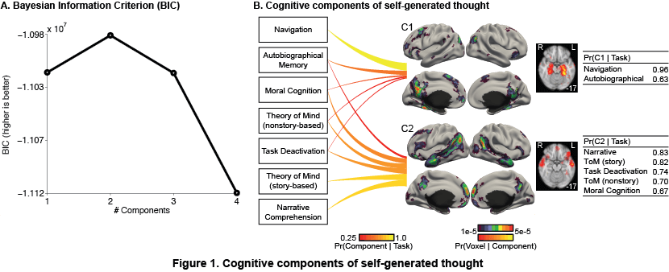
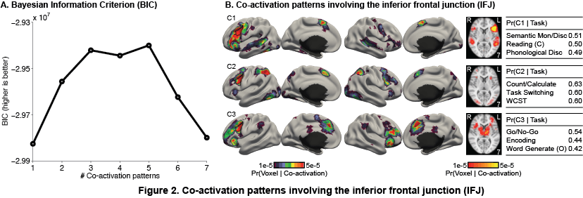

## Reference
Gia H. Ngo, Simon B. Eickhoff, Minh Nguyen, Peter T. Fox,  R. Nathan Spreng, B. T. Thomas Yeo. [Beyond Consensus: Embracing Heterogeneity in Curated Neuroimaging Meta-Analysis](https://www.biorxiv.org/content/early/2017/06/19/149567). BioRxiv preprint

Gia H. Ngo, Simon B. Eickhoff, Peter T. Fox, B. T. Thomas Yeo. [Collapsed variational Bayesian inference of the author-topic model: application to large-scale coordinate-based meta-analysis](https://ieeexplore.ieee.org/document/7552332). PRNI2016.

----

## Overview

This project provides all functions necessary to perform a coordinate-based meta-analysis using the author-topic model, such as to estimate cognitive components of a functional domain (e.g. self-generated thought) or estimate the co-activation patterns of a seed region (e.g. inferior frontal junction).

1. [SelfGeneratedThought](./SelfGeneratedThought) folder contains data and instruction to discover cognitive components of the functional domain of self-generated thought.
2. [CoactivationMappingIFJ](./CoactivationMappingIFJ) folder contains instruction to estimate the co-activation patterns of a seed region such as the inferior frontal junction (IFJ).
3. [utilities](./utilities) folder contains function to perform inference using Collapsed Variational Bayes (CVB) algorithm, compute Bayesian Information Criterion of the estimate, and visualize the estimates.
4. [config](./config) folder contains example configuration files compatible with this project.
5. [unit_tests](./unit_tests) folder contains a unit test for this project.

----

## Functional Sub-domains Discovery

Given the activation coordinates of 7 tasks engaging self-generated thought, the author-topic model was applied to discover 2 components fractionating the default mode network (Figure 1).

`SelfGeneratedThought/MNI152_ActivationCoordinates` contains the activation coordinates from 167 studies of self-generated thought used in our study, including the description of the input format required for our functions.

`SelfGeneratedThought/README.md` has the instructions for replicating our experiment to discover the cognitive components of self-generated thought.



----

## Co-activation Mapping

Given the activation coordinates of 323 experiments activating the left inferior frontal junction (IFJ), the author topic model was applied to revealed 3 task-dependent co-activation patterns of the IFJ (Figure 2).

For co-activation mapping of the IFJ, the author-topic model was applied in the same way as it was for discovering components of self-generated thought,
except that while there were 179 experiments of self-generated thought employing 7 behavioral tasks, each of the 323 experiments activating the IFJ was considered as employing its own unique task category.

`CoactivationMappingIFJ/README` describes the required input format for co-activation mapping meta-analysis, and instructions for replicating our experiment to estimate the co-activation patterns of the IFJ.

Please note that the activation coordinates used in our IFJ co-activation mapping experiment can only be made available after a data sharing agreement has been obtained with [BrainMap](http://brainmap.org).
We are happy to share the IFJ dataset with any user with the agreement.



----

## Configuration
At the time of release, this project was implemented with specific versions of other third-party softwares for computation and visualization, in particular:

* [FreeSurfer](https://surfer.nmr.mgh.harvard.edu/fswiki/DownloadAndInstall) 5.30,
* [FSL](https://fsl.fmrib.ox.ac.uk/fsl/fslwiki/FslInstallation) 5.0.8,
* [AFNI](https://afni.nimh.nih.gov/pub/dist/tgz/AFNI_ARCHIVE) 16.0.0
* Matlab R2014a

Please see [CBIG repository setup instruction](https://github.com/ThomasYeoLab/CBIG/tree/master/setup) to make your local environment compatible with CBIG repository. Please see `config` folder for example configuration files.

----

## Code Release
### Download stand-alone repository

Since the whole CBIG repository is too big, we provide a stand-alone version of only this project and its dependencies. To download the stand-alone repository, visit this link:
[https://github.com/ThomasYeoLab/Standalone_Ngo2019_AuthorTopic](https://github.com/ThomasYeoLab/Standalone_Ngo2019_AuthorTopic)


### Download whole repository

Except for this project, if you want to use the code for other stable projects from our lab as well, you need to download the whole repository.

- To download the version of the code that was last tested, you can either

  - visit this link:
  [https://github.com/ThomasYeoLab/CBIG/releases/tag/v0.9.1-Ngo2019_AuthorTopic](https://github.com/ThomasYeoLab/CBIG/releases/tag/v0.9.1-Ngo2019_AuthorTopic)

  or

  - run the following command, if you have Git installed

  ```
  git checkout -b Ngo2019_AuthorTopic v0.9.1-Ngo2019_AuthorTopic
  ```

----

## Updates

- Release v0.8.0 (21/01/2019): Initial release of Ngo2019 Author-Topic Model for Curated Meta-analysis project.
- Release v0.9.1 (21/02/2019): Added instruction for performing co-activation mapping experiment and references of the self-generated thought dataset.

----

## Bugs and Questions

Please contact Gia at ngohoanggia@gmail.com and Thomas Yeo at yeoyeo02@gmail.com.
