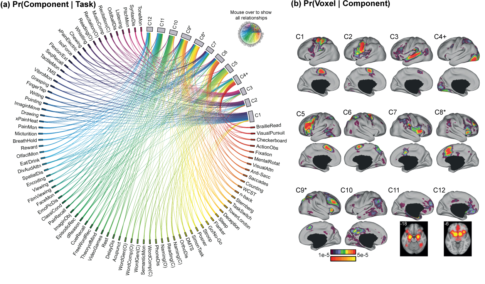

# Expectation Maximization (EM) Algorithm for Author-Topic model

This folder contains the implementation of the Expectation-Maximization (EM) algorithm to estimate parameters for the author-topic model of coordinated-based brain activation data. See (Yeo et al., Cerebral Cortex, 2015) and (Bertolero, Yeo, D'Esposito, PNAS, 2015) for details.



## Reference
- Yeo, BT Thomas, et al. "Functional specialization and flexibility in human association cortex." Cerebral Cortex, 2015.
- Bertolero, Maxwell A., BT Thomas Yeo, and Mark D'Esposito. "The modular and integrative functional architecture of the human brain." Proceedings of the National Academy of Sciences, 2015.
- Gia H. Ngo, Simon B. Eickhoff, Minh Nguyen, Gunes Sevinc, Peter T. Fox,  R. Nathan Spreng, B. T. Thomas Yeo. Beyond Consensus: Embracing Heterogeneity in Curated Neuroimaging Meta-Analysis. Neuroimage, 2019.

----

## Overview

This project provides all functions necessary to perform a coordinate-based meta-analysis with the author-topic model using EM algorithm:

1. `utilities` folder contains function to perform inference and visualization.
2. `config` folder contains example configuration files compatbile with this project.
3. `examples` folder contains an example for performing a meta-analysis on data of 7 tasks involving self-generaed thought with EM algorithm, using either a random initialization or initialization from Gibbs sampling.
4. `unit_tests` folder contains a unit test for this project.

----

## Data Release

In Yeo et al., 2015, we conducted a meta-analysis on the [BrainMap](http://brainmap.org) dataset of 17,000+ neuroimaging experiments, which requires a data sharing agreement to obtain.

In our examples, a simple meta-analysis was performed on a data of 7 tasks involving [self-generaed thought](https://github.com/ThomasYeoLab/CBIG/tree/master/stable_projects/meta-analysis/Ngo2019_AuthorTopic/SelfGeneratedThought/MNI152_ActivationCoordinates). The data was released in conjunction with a new inference algorithm ([Collapsed Variational Bayes inference](https://github.com/ThomasYeoLab/CBIG/tree/master/stable_projects/meta-analysis/Ngo2019_AuthorTopic))  (Ngo et al. 2019) for the author-topic model that is more robust to hyperparameters initializaiton in common-sized datasets (few hundreds of experiments) and does not not Gibbs sampling for initalization.

----

## Configuration
At the time of release, this project was implemented with specific versions of other third-party softwares for computation and visualization, in particular:
* [FreeSurfer](https://surfer.nmr.mgh.harvard.edu/fswiki/DownloadAndInstall) 5.30,
* [FSL](https://fsl.fmrib.ox.ac.uk/fsl/fslwiki/FslInstallation) 5.0.8,
* [Workbench](https://www.humanconnectome.org/software/connectome-workbench) 1.1.1
* Matlab R2018b

Please see [CBIG repository setup instruction](https://github.com/ThomasYeoLab/CBIG/tree/master/setup) to make your local environment compatible with CBIG repository. Please see `config` folder for example configuration files.

----

## Code Release
### Download stand-alone repository

Since the whole CBIG repository is too big, we provide a stand-alone version of only this project and its dependencies. To download the stand-alone repository, visit this link:
[https://github.com/ThomasYeoLab/Standalone_Yeo2015_AuthorTopic](https://github.com/ThomasYeoLab/Standalone_Yeo2015_AuthorTopic)


### Download whole repository

Except for this project, if you want to use the code for other stable projects from our lab as well, you need to download the whole repository.

- To download the version of the code that was last tested, you can either

  - visit this link:
  [https://github.com/ThomasYeoLab/CBIG/releases/tag/v0.12.2-Yeo2015_AuthorTopic](https://github.com/ThomasYeoLab/CBIG/releases/tag/v0.12.2-Yeo2015_AuthorTopic)

  or

  - run the following command, if you have Git installed

  ```
  git checkout -b Yeo2015_AuthorTopic v0.12.2-Yeo2015_AuthorTopic
  ```

----

## Updates
- Release v0.12.0 (01/07/2019): Initial release of Yeo 2015 Author-Topic model with EM and Gibbs Sampling Inference. 
- Release v0.12.2 (09/07/2019): Update visualization function to use HCP Workbench instead of Caret.

----

## Bugs and Questions
Please contact Gia at ngohoanggia@gmail.com and Thomas Yeo at yeoyeo02@gmail.com.
