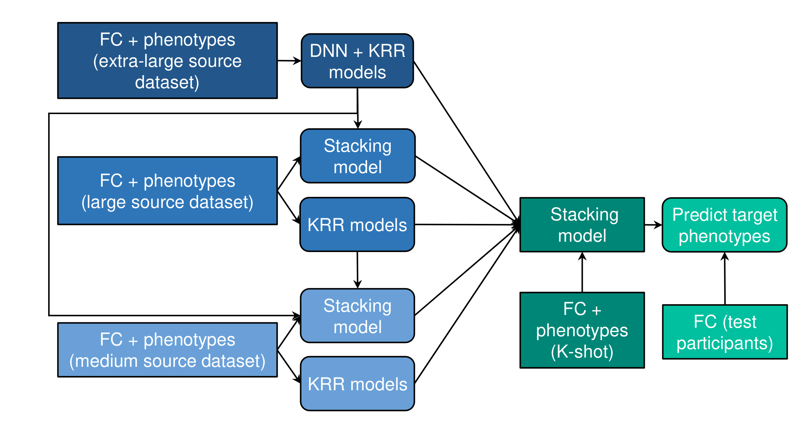

## Reference

+ Chen, P., An, L., Wulan, N., Zhang, C., Zhang, S., Ooi, L. Q. R., ... & Yeo, B. T. (2023). [**Multilayer meta-matching: translating phenotypic prediction models from multiple datasets to small data**](https://www.biorxiv.org/content/10.1101/2023.12.05.569848v1.abstract). bioRxiv, 2023-12.

----
## Background

Resting-state functional connectivity (RSFC) is widely used to predict phenotypic traits in individuals. Large sample sizes can significantly improve prediction accuracies. However, for studies of certain clinical populations or focused neuroscience inquiries, small-scale datasets often become an issue. We have previously proposed a meta-matching approach to translate prediction models from large datasets to predict new phenotypes in small datasets. We demonstrated a large improvement of in meta-matching over classical kernel ridge regression (KRR) when translating models from a single source dataset (UK Biobank) to the Human Connectome Project Young Adults (HCP-YA) dataset. In the current study, we propose two meta-matching variants (meta-matching with dataset stacking and multilayer meta-matching) to translate models from multiple source datasets across disparate sample sizes to predict new phenotypes in small target datasets. We evaluate both approaches by translating models trained from five source datasets (with sample sizes ranging from 862 participants to 36,834 participants) to predict phenotypes in the HCP-YA and HCP-Aging datasets. We find that multilayer meta-matching modestly outperforms meta-matching with dataset stacking. Both meta-matching variants perform better than the original meta-matching with stacking approach trained only on the UK Biobank.



----
## Code Release
This release contains the code to train your own meta-matching models from scratch (including meta-matching with stacking, meta-matching with dataset stacking, and multilayer meta-matching). If you need pre-trained Meta-matching models, please visit our [Meta_matching_models repo](https://github.com/ThomasYeoLab/Meta_matching_models/v2.0).

### Download stand-alone repository
Since the whole Github repository is too big, we provide a stand-alone version of only this project and its dependencies. To download this stand-alone repository, visit this link: [https://github.com/ThomasYeoLab/Standalone_Chen2024_MMM](https://github.com/ThomasYeoLab/Standalone_Chen2024_MMM)

### Download whole repository
If you want to use the code from our lab's other stable projects (other than Chen2024_MMM), you would need to download the whole CBIG repository.

- To download the version of the code that was last tested, you can either

    - visit this link:
    [https://github.com/ThomasYeoLab/CBIG/releases/tag/v0.31.0-Chen2024_MMM](https://github.com/ThomasYeoLab/CBIG/releases/tag/v0.30.1-Chen2024_MMM)

    or

    - run the following command, if you have Git installed
 
    ```
    git checkout -b Chen2024_MMM v0.31.0-Chen2024_MMM
    ```
----

## Usage
### Environment setup
- Our code uses MATLAB and Python, here are info about MATLAB and Python setup:
    - MATLAB: we tested our code in MATLAB r2018b
    - Python
        1. Install [Miniconda](https://docs.conda.io/en/latest/miniconda.html) or [Anaconda](https://www.anaconda.com/distribution/#download-section) with Python 3.x if you don't have conda
        2. Create conda environment from our `CBIG_MMM_python_env.yml` file by `conda env create -f CBIG_MMM_python_env.yml`

### Example
- The example of our code is detailed in `examples/README.md`

### Replication
- If you have access to HCP and UK Biobank dataset, you can replicate our result using the instructions detailed in `replication/README.md`.

----

## Updates
- Release v0.31.0 (11/7/24): Initial release of Chen2024_MMM project

----

## Bugs and Questions

Please contact Pansheng Chen at chenpansheng@gmail.com, Lijun An at anlijun.cn@gmail.com, Chen Zhang at chenzhangsutd@gmail.com and Thomas Yeo at yeoyeo02@gmail.com.