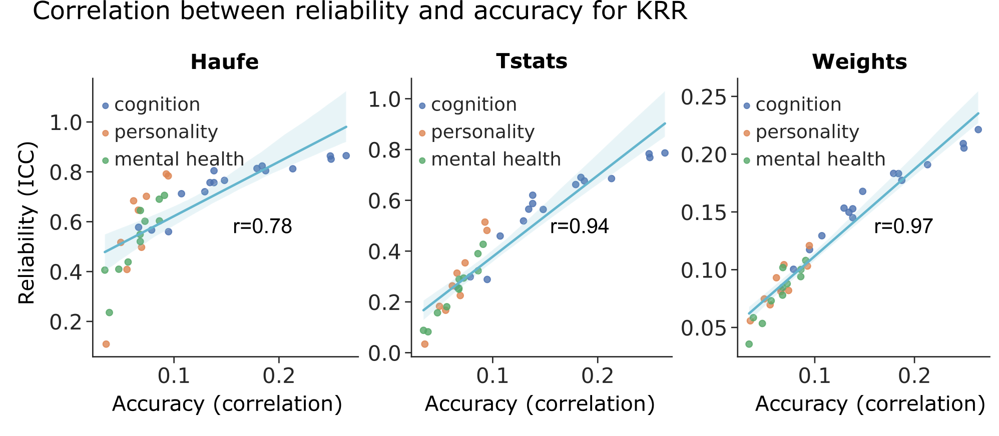

# Relationship Between Prediction Accuracy and Feature Importance Reliability: an Empirical and Theoretical Study (ICCW)
# REFERENCE
* Chen, J., Ooi, L.Q.R., Tan T.W.K., Zhang, S., Li, J., Asplund, C.L., Eickhoff, S.B., Bzdok, D., Holmes, A.J., Yeo, B.T.T. [Relationship Between Prediction Accuracy and Feature Importance Reliability: an Empirical and Theoretical Study](https://doi.org/10.1016/j.neuroimage.2023.120115). Neuroimage, 2023. 

# BACKGROUND
Predictive models are often interpreted by the computation of feature importance. We demonstrate that Haufe-transformed weights are much more reliable than original regression weights and univariate FC-behavior correlations. Furthermore, we show that feature importance is strongly correlated with prediction accuracy across phenotypes.



# CODE RELEASE
## Download stand-alone repository
Since the whole Github repository is too big, we provide a stand-alone version of only this project and its dependencies. 
To download this stand-alone repository, visit this link: [https://github.com/ThomasYeoLab/Standalone_ChenOoi2023_ICCW](https://github.com/ThomasYeoLab/Standalone_ChenOoi2023_ICCW)

## Download whole repository
Except for this project, if you want to use the code for other stable projects from out lab as well, you need to download the whole repository.

To download the version of the code that was last tested, you can either visit this link: 

[https://github.com/ThomasYeoLab/CBIG/releases/tag/v0.29.0-ChenOoi2023_ICCW](https://github.com/ThomasYeoLab/CBIG/releases/tag/v0.29.0-ChenOoi2023_ICCW)

run the following command, if you have Git installed

```
git checkout -b ChenOoi2023_ICCW v0.29.0-ChenOoi2023_ICCW
```

# USAGE
## Setup
1. Make sure you have installed: Matlab 2018b
2. Follow `$CBIG_CODE_DIR/setup/README.md` to setup the config file. Instead of using `$CBIG_CODE_DIR/setup/CBIG_sample_config.sh`, you need to use `$CBIG_CODE_DIR/stable_projects/predict_phenotypes/ChenOoi2023_ICCW/replication/config/CBIG_ICCW_tested_config.sh.`
3. To use the same data, please ensure you have access to ABCD through the NDA website in study [2057](https://dx.doi.org/10.15154/1528762).

## Replication
* `replication` this folder contains scripts to replicate all the analysis in this paper.

## Examples and unit tests
* `examples` this folder provides a toy example for running all regression codes.
* `unit_tests` this folder runs codes in `examples` and checks the reference output.

## Regression analysis
* `regression`: this folder contains the workflows for KRR, LRR, LASSO and RF. Run the KRR regression first, as it generates the fold structure which is needed by the other regressions.
* `analysis` this folder contains the scripts run additional analysis on the prediction results.

# UPDATES
Release v0.29.0 (02/05/2023): Initial release of ChenOoi2023_ICCW 

# BUGS and QUESTIONS
Please contact Jianzhong Chen at chenjianzhong1996@gmail.com, Leon Ooi at leonooiqr@gmail.com and Thomas Yeo at yeoyeo02@gmail.com.
