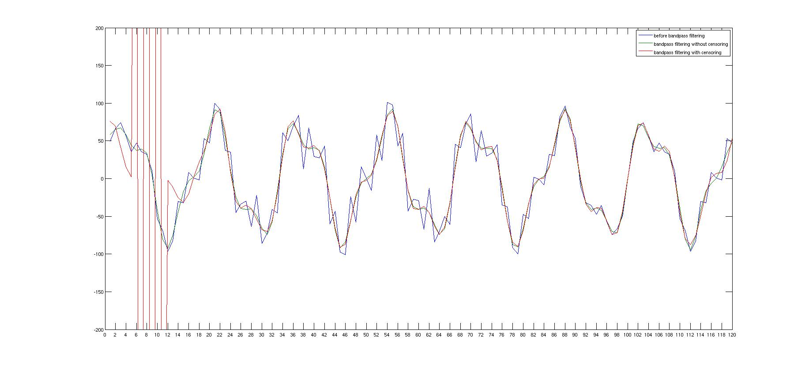
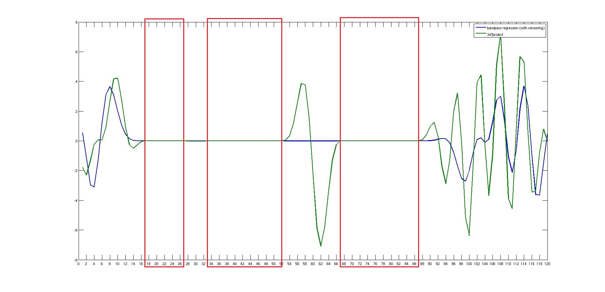
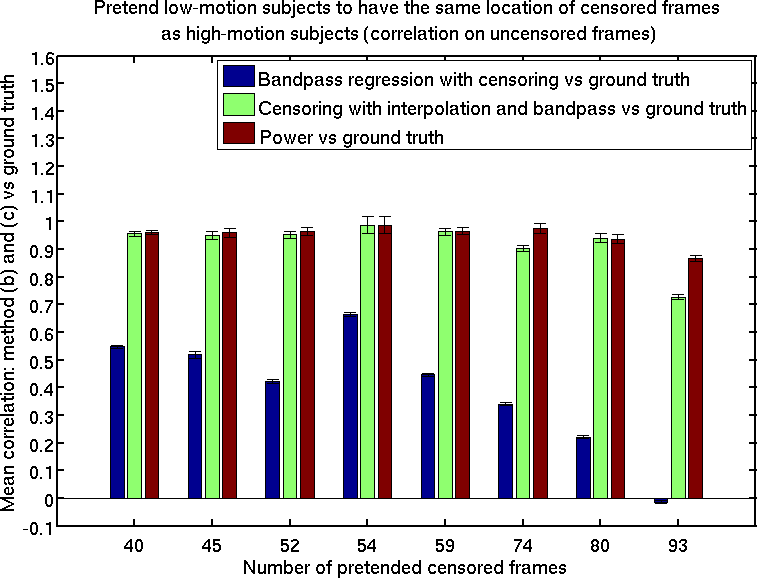
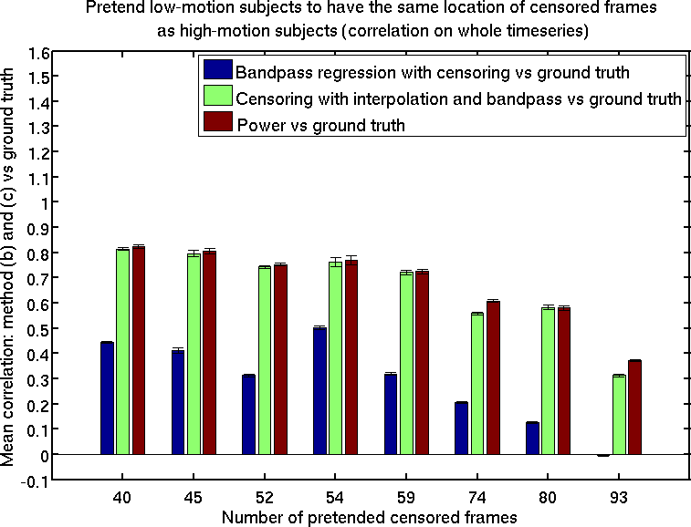

We explored several methods to do censoring and bandpass filtering together or separately. These methods include

- (1) bandpass regression with censoring

  This means that the bandpass filtering is achieved by regressing the sine & cosine regressors corresponding to the frequecies in the stopband. When the regression is performed, the regression coefficients are only computed from uncensored frames. Then the coefficients are applied to all frames.
  
  In our previous version of `CBIG_preproc_bandpass_fft.sh`, if the users pass in `-censor`, this script ignores censored frames when performing bandpass filtering using regression method. Please note that we have disabled this option as we find (1) is not optimal.

- (2) integrating a passband into the censoring interpolation method proposed by Power et al. (2014)

  This means that when we try to recover the signal of all frames after we obtained the periodogram based on uncensored frames, we only use the components whose frequecies are in the passband.
  
  In our previous version of `CBIG_preproc_censor.sh`, if the users pass in `-low_f <passband_lower_bound>` and `-high_f <passband_upper_bound>`, this script performs the interpolation only using the frequency components falling into the passband. Please note that we have disabled this option as we find (2) is not optimal.

- (3) Power et al. (2014) pipeline (first interpolate censored frames without any passband/stopband, then do bandpass filtering without any censoring). 

We did some exploration on which method is more optimal. We found that (3) Power et al. (2014) pipeline was better than (1) and (2), the details are as follows:

## bandpass regression with censoring causes spikes at censored frames, as well as the neighbouring uncensored frames.
Suppose we have a signal: `y = 70*sin(2*pi*0.02*TR*t) + 25*sin(2*pi*0.05*TR*t) + 20*sin(2*pi*0.13*TR*t) + 15*sin(2*pi*0.2*TR*t)`, where `TR = 3, t = [1:120]'`. And we assume that frames 6-11 are high-motion frames that need to be censored, and the other frames are not. The following figure shows the signal before any filtering (blue curve), the signal with normal bandpass filtering (green curve, passband = 0-0.08Hz), and the signal with bandpass regression with censoring (i.e. method (1), red curve, passband = 0.0.08Hz).

The red curve (i.e. method (1)) exhibited huge spikes at the censored frames (6-11), as well as the neighbouring uncensored frames (e.g. frames 5 and 12). We also found the same problem with real fMRI data, although figures not shown here.

There are several possible reasons that could lead to this issue:

- (1) higher number of censored frames leaded to more severe spikes;
	
- (2) for the same number of censored frames, if the censored frames were consecutive, the resulted spikes were much higher than the cases where the censored frames were evenly distributed
	
- (3) more sine & cosine regressors leaded to higher spikes.
	
We noticed that AFNI has a command `3dTproject` that supposes to achieve similar functionality as our "bandpass regression with censoring" approach. We found our timeseries were different from the results of `3dTproject`. See the following figure as an example (a voxel from a real high-motion fMRI run), where green curve corresponds to the result of `3dTproject`, and blue curve corresponds to our bandpass regression with censoring. The censored frames are labeled by the red boxes (frames 17-27, 33-52, 67-87).

We were curious why our results were different from `3dTproject` results. In theory, we think that across all the uncensored frames, the signal after bandpass filtering should be orthogonal to the stopband regressors. We confirmed that this was true for our results. However, we found it was not the case for the outputs of `3dTproject`. According to AFNI experts, the degree of freedom was too low for this subject, so we tried subjects with smaller number of censored frames, and then the results of `3dTproject` became similar to our implementation. See this email thread: https://afni.nimh.nih.gov/afni/community/board/read.php?1,152820,152820#msg-152820

## Experiment of pretending low-motion subjects have high-motion frames
The aim of this experiment was to build up some ground truth results to determine which pipeline is better. Since all of the low-motion subjects we selected did not have any censored frames, we assume the "true" timeseries after preprocessing should be the results with only normal bandpass filtering (without any interpolation or censoring). Then we pretend these subjects moved a lot at certain frames. We computed the correlation between the ground truth with each of the following pipelines (across only uncensored frames, as well as across all frames):

- (1) bandpass regression with censoring + Power's interpolation method
  
  After "bandpass regression with censoring", there were huge spikes at the censored frames. We first removed the faked censored frames and then performed Power's interpolation method to interpolate the censored frames.

- (2) integrating a passband into the censoring interpolation method proposed by Power et al. (2014)
    
- (3) Power et al. (2014) pipeline (first interpolate censoring frames without any passband/stopband, then do bandpass filtering without any censoring). 
	
For both cases (across only uncensored frames, or across all frames), we found that (1) was least correlated with the ground truth. The differences between (2) and (3) were tiny, but (3) was slightly better than (2). See the following two figures (correlation between ground truth and (1) - blue; (2) - green; (3) - brown).

## References 
Power, Jonathan D., et al. "Methods to detect, characterize, and remove motion artifact in resting state fMRI." Neuroimage 84 (2014): 320-341.
