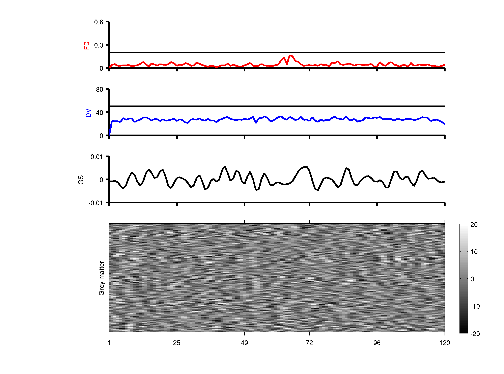

This readme includes the steps and results of a unit test for `CBIG_preproc_QC_greyplot.csh` and `CBIG_preproc_QC_greyplot.m`

Notice that some directories below works for CBIG lab only.

## Data

We use the Brain Genomics Superstruct Project (GSP) dataset. The structual MRI data were preprocessed before applying this fMRI preprocessing pipeline and stored in:
`/mnt/eql/yeo1/data/GSP_release`
This folder also contains the raw fMRI images.

A mid-motion subject `Sub0158_Ses1` is selected for this test.

## Code 

Open a shell command-line window and type the following commands:

```
${CBIG_CODE_DIR}/stable_projects/preprocessing/CBIG_fMRI_Preproc2016/CBIG_fMRI_preprocess.csh -s Sub1058_Ses1 -output_d ${your_outdir} -anat_s Sub1058_Ses1_FS -anat_d /share/users/imganalysis/yeolab/data/GSP_release -fmrinii /mnt/eql/yeo3/data/GSP2016/CBIG_preproc_global_cen_bp/GSP_single_session/scripts/fmrinii/Sub1058_Ses1.fmrinii -config ${config_file} 
```

You need to specify your own output directory `${your_outdir}`, and the absolute path to configuration file `${config_file}`. `${config_file}` contains the following steps and parameters:

```
CBIG_preproc_skip -skip 4
CBIG_preproc_fslslicetimer -slice_order ${CBIG_CODE_DIR}/stable_projects/preprocessing/CBIG_fMRI_Preproc2016/example_slice_order.txt
CBIG_preproc_fslmcflirt_outliers -FD_th 0.2 -DV_th 50 -discard-run 50 -rm-seg 5 -spline_final
CBIG_preproc_bbregister -intrasub_best
CBIG_preproc_regress -whole_brain -wm -csf -motion12_itamar -detrend_method detrend -per_run -censor -polynomial_fit 1
CBIG_preproc_censor 
CBIG_preproc_bandpass -low_f 0.009 -high_f 0.08 -detrend 
CBIG_preproc_QC_greyplot -FD_th 0.2 -DV_th 50
```

## Results

The standard output figure is 
`${CBIG_CODE_DIR}/stable_projects/preprocessing/CBIG_fMRI_Preproc2016/utilities/Sub1058_Ses1_bld002_rest_skip4_stc_mc_residc_interp_FDRMS0.2_DVARS50_bp_0.009_0.08_greyplot.png`



You need to compare your output figure with the standard output figure. Your output figure should be stored in
`${your_outdir}/Sub1058_Ses1/qc/Sub1058_Ses1_bld002_rest_skip4_stc_mc_residc_interp_FDRMS0.2_DVARS50_bp_0.009_0.08_greyplot.png`
