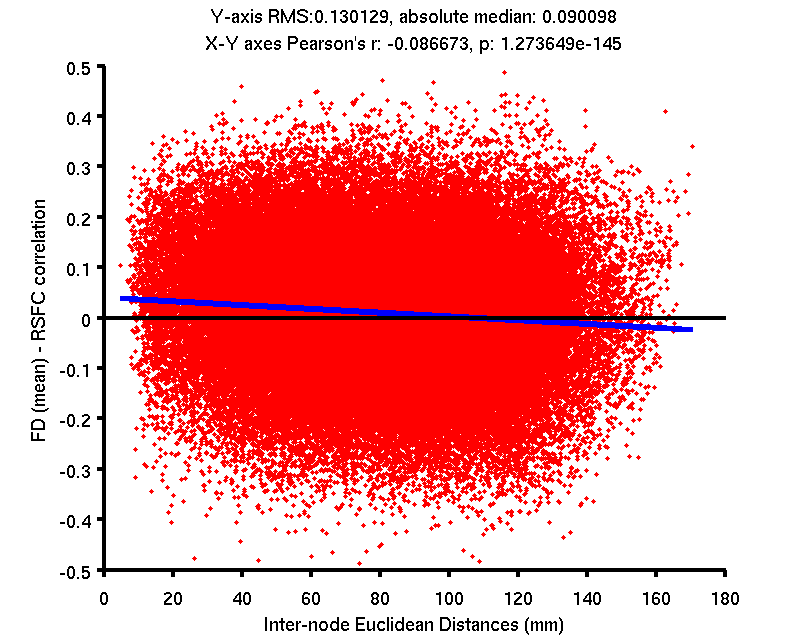

This readme includes the steps and results of a unit test for CBIG_preproc_plot_QC_RSFC_corr_vs_distance_wrapper.m

Notice that the input filenames and directories below work for CBIG lab only.

## Data

We use the Brain Genomics Superstruct Project (GSP) dataset. This dataset is preprocessed by `CBIG_fMRI_Preproc2016` scripts under the following configuration file:
`/mnt/eql/yeo3/data/GSP2016/CBIG_preproc_global_cen_bp/GSP_single_session/scripts/prepro.config`

All preprocessed data are stored in:
`/mnt/eql/yeo3/data/GSP2016/CBIG_preproc_global_cen_bp/GSP_single_session/CBIG2016_preproc_global_cen_bp`.

We choose 100 subjects to test the code. These subjects are also picked in the unit test for the whole pipeline and introduced in this readme:
`$CBIG_CODE_DIR/stable_projects/preprocessing/CBIG_fMRI_Preproc2016/unit_test_clustering_100_subjects_readme.md`
The subject list is stored here:
`/mnt/eql/yeo3/data/GSP2016/CBIG_preproc_global_cen_bp/GSP_single_session/clustering/scripts/GSP_80_low_motion+20_w_censor.txt`

## Code

Open a Matlab command window and type the following commands:

```
addpath([getenv('CBIG_CODE_DIR') '/stable_projects/preprocessing/CBIG_fMRI_Preproc2016/utilities']);
CBIG_preproc_plot_QC_RSFC_corr_vs_distance_wrapper( '/mnt/eql/yeo3/data/GSP2016/CBIG_preproc_global_cen_bp/GSP_single_session/CBIG2016_preproc_global_cen_bp', ...
    '/mnt/eql/yeo3/data/GSP2016/CBIG_preproc_global_cen_bp/GSP_single_session/clustering/scripts/GSP_80_low_motion+20_w_censor.txt', ...
    'FD_mean', '_rest_skip4_stc_mc_residc_interp_FDRMS0.2_DVARS50_bp_0.009_0.08_fs6_sm6_all2all', ...
    [getenv('CBIG_CODE_DIR') '/stable_projects/preprocessing/CBIG_fMRI_Preproc2016/utilities/unit_test_plot_QC_RSFC_vs_distance_GSP100sub'] );
rmpath([getenv('CBIG_CODE_DIR') '/stable_projects/preprocessing/CBIG_fMRI_Preproc2016/utilities']);
```

## Results

The output figure is:
`$CBIG_CODE_DIR/stable_projects/preprocessing/CBIG_fMRI_Preproc2016/utilities/unit_test_plot_QC_RSFC_vs_distance_GSP100sub.png`.


