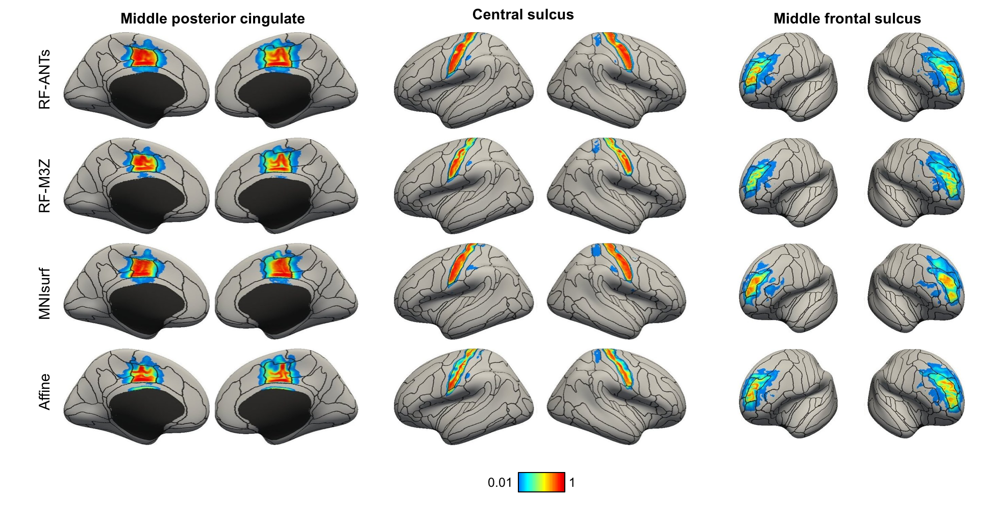

## Reference

Wu J, Ngo GH, Greve DN, Li J, He T, Fischl B, Eickhoff SB, Yeo BTT. [**Accurate nonlinear mapping between MNI volumetric and FreeSurfer surface coordinate systems**](http://people.csail.mit.edu/ythomas/publications/2018VolSurfMapping-HBM.pdf), *Human Brain Mapping* 39:3793–3808, 2018.

----

## Background

The results of most neuroimaging studies are reported in volumetric (e.g., MNI152) or surface (e.g., fsaverage) coordinate systems. Accurate mappings between volumetric and surface coordinate systems can facilitate many applications, such as projecting fMRI group analyses from MNI152/Colin27 to fsaverage for visualization, or projecting resting-state fMRI parcellations from fsaverage to MNI152/Colin27 for volumetric analysis of new data. 

In this project, we evaluated three approaches for mapping data between MNI152/Colin27 and fsaverage coordinate systems. Two of the approaches (MNIsurf/Colinsurf and Affine) are currently widely used. A third approach (registration fusion) was previously proposed, but not widely adopted. Two implementations of the registration fusion (RF) approach were considered, with one implementation utilizing the Advanced Normalization Tools (ANTs). We found that RF-ANTs performed the best in general. 

The visualisation of three anatomical regions (represented as probabilistic maps) projected from MNI152 to fsaverage is shown below. The black boundaries show the "ground truth" parcellation. 



----

## Stand-alone Usage

There are 3 stand-alone folders: `bin/standalone_scripts_for_MNI_fsaverage_projection` for MNI152-to-fsavearge mapping, `bin/standalone_scripts_for_Colin_fsaverage_projection` for Colin27-to-fsaverage mapping, and `bin/standalone_scripts_for_MNI_fsaverage_coordinates_conversion` for conversion between MNI152 voxels and fsaverage vertices.

To use the stand-alone codes without the trouble of downloading our entire repository, download the corresponding zip file, i.e. `bin/standalone_scripts_for_MNI_fsaverage_projection.zip`, `bin/standalone_scripts_for_Colin_fsaverage_projection.zip`, or `bin/standalone_scripts_for_MNI_fsaverage_coordinates_conversion.zip`. Unzip the file; then follow the REAME.md in the stand-alone scripts folder.

Note that FreeSurfer and Matlab need to be installed before the stand-alone scripts can be run.

----

## Data Release

The folder `bin` contains data files necessary for this project, as well as the final mappings released.

- `bin/GSP_subjectid.csv` is a file listing all 1490 GSP subject IDs used in this project

- `bin/liberal_cortex_masks_FS5.3` folder: contains the liberal cortical masks of MNI152 and Colin27, which are used in fsaverage-to-volume atlas projections

- `bin/final_warps_FS5.3` folder: contains the MNI152-fsaverage and Colin27-fsaverage mappings generated in this project, for both RF-M3Z and RF-ANTs approaches, using 1490 GSP subjects. These mappings can be used by calling scripts from `bin/scripts_final_proj_FS5.3`

----

## Code Release

- `registration_fusion` folder: contains codes for running RF approaches (RF-M3Z and RF-ANTs) from scratch. Specifically, `registration_fusion/scripts_vol2surf` contains codes for obtaining volume-atlas-to-fsaverage mapping, while `registration_fusion/scripts_surf2vol` contains codes for obtaining fsaverage-to-volume-atlas mapping. See README.md in the respective folders for instructions on implementation.

- `bin/scripts_final_proj_FS5.3` folder: contains codes for  using final warps from RF-approaches (RF-M3Z and RF-ANTs) directly. Refer to README.md in the folder for instructions on implementation.

- `freesurfer_baseline` folder:  contains codes for running Affine or MNIsurf/Colinsurf approach. Refer to README.md in the folder for instruction on implementation.

Note that this project uses generic functions from other folders, which may be updated over time. To download the version of the code that was last tested, you can either

- visit this link: https://github.com/ThomasYeoLab/CBIG/releases/tag/v0.11.1-Wu2017_RegistrationFusion

or

- run the following command, if you have Git installed
```
git checkout -b Wu2017_RegistrationFusion v0.11.1-Wu2017_RegistrationFusion
```

----

## Updates

- Release v0.5.0 (15/04/2018): Initial release of Wu2017 Registration Fusion project.
- Release v0.6.4 (13/08/2018): Added stand-alone scripts for Colin27-to-fsaverage projections; added example.
- Release v0.6.5 (17/08/2018): Updated publication details
- Release v0.9.3 (20/03/2019): 
  1. Fix typos in `CBIG_RF_projectVol2fsaverage_single.m` that set wrong file names for default warps
  2. Rename subfolder `example` to `examples` to pass CBIG pre-push hooks
  3. Fix typos in `examples/README.md` that set wrong file names in freeview visualization command
- Release v0.10.3 (26/05/2019): Added stand-alone scripts for conversion between MNI152 coordinates and fsaverage vertices
- Release v0.11.1 (18/06/2019): Added information for stand-alone scripts in relevant README files

----

## Bugs and Questions

Please contact Jianxiao Wu at vesaveronica@gmail.com and Thomas Yeo at yeoyeo02@gmail.com.
