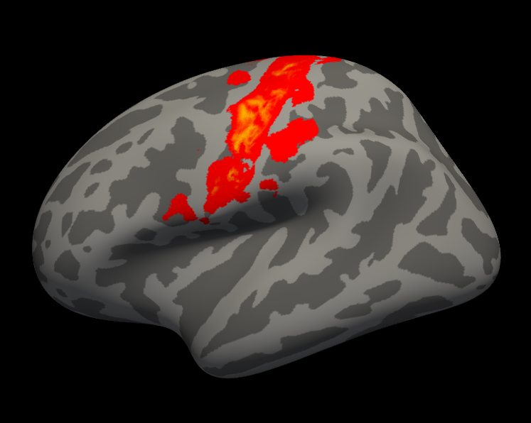
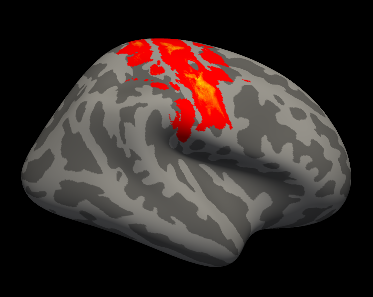
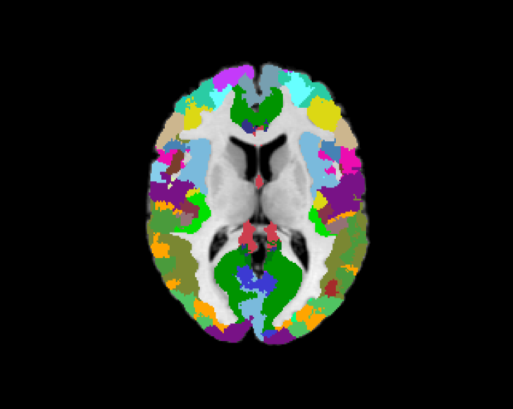
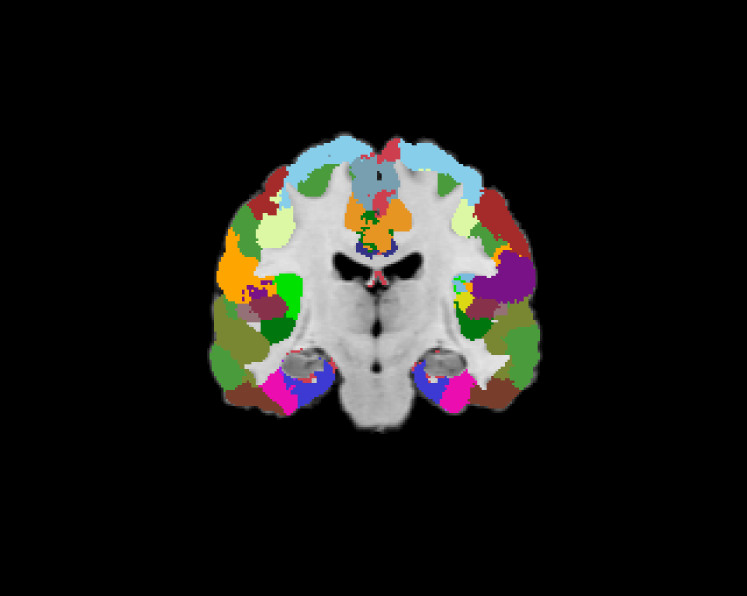
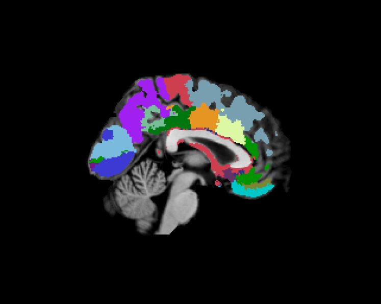

This README includes the instruction on how to run an example for Wu2017_RegistrationFusion.

----

## Reference

Wu J, Ngo GH, Greve DN, Li J, He T, Fischl B, Eickhoff SB, Yeo BTT. [**Accurate nonlinear mapping between MNI volumetric and FreeSurfer surface coordinate systems**](http://people.csail.mit.edu/ythomas/publications/2018VolSurfMapping-HBM.pdf), *Human Brain Mapping* 39:3793–3808, 2018.

----

## Install

**Set up your enviroment**

The configuration scripts `CBIG_gwMRF_tested_config.sh` and `CBIG_gwMRF_tested_startup.m` can be found under `<your-cbig-repo-direcotry>/stable_projects/brain_parcellation/Schaefer2018_LocalGlobal/config` folder. 

Please follow the instructions in `<your-cbig-repo-direcotry>/setup/README.md` to have your local environment compatible with CBIG repository. 

---

## Example Data

The example script uses one subject from the CoRR-HNU dataset. The preprocessed (by `recon-all`) data are in the folder:
```
$CBIG_CODE_DIR/data/example_data/CoRR_HNU/subj01_FS/subj01_sess1_FS
```

For more information on the CoRR_HNU dataset, you may refer to this paper by Xi-Nian Zuo et al.: [An open science resource for establishing reliability and reproducibility in functional connectomics](https://www.nature.com/articles/sdata201449.pdf).

Other data used include the ANTs registration warps between the subject and Colin27 space, the sample input (central sulcus probabilistic map) in Colin27 space and in fsaverage space. 

The ANTs registration warps are in the folder:
```
$CBIG_CODE_DIR/data/example_data/RegistrationFusion_example_data
```

The sample input data are in the folder:
```
$CBIG_CODE_DIR/data/example_data/RegistrationFusion_example_data/CoRR_HNU/subj01
```

----

## Code

There are two example scripts, `CBIG_RF_example_vol2surf.sh` and `CBIG_RF_example_surf2vol.sh`, with usage shown below.

- MNI152-to-fsaverage example

To run the example, call `CBIG_RF_example_vol2surf.sh`, using the `-o` option to specify where the results should be put.

This example should take about 3 minutes to run.

- fsaverage-to-MNI152 example

Note that this example should be run in FreeSurfer5.3 environment.

To run the example, call `CBIG_RF_example_surf2vol.sh`, using the `-o` option to specify where the results should be put.

This example should take about 7 minutes to run.

---

## Example results

You can check the projection results by comparing them with example results in `example_results` folder. This includes `example_results/lh.projected_central_sulc.nii.gz` and `example_results/rh.projected_central_sulc.nii.gz` for Colin27-to-fsaverage results, as well as `example_results/projected_surface_parcel.nii.gz` for fsaverage-to-Colin27 results.

To compare results exactly, you can call the `CBIG_RF_exmaple_compare.m` in Matlab with the following command. The script prints "The two volumes are identical" if your results are exactly the same as the example results.
```
CBIG_RF_example_compare(path_to_your_result, path_to_example_result);
```

You can also load the projection results in freeview for visual inspection.

- For Colin27-to-fsavearge results, use the following commands:

left hemisphere: 
```freeview -f $FREESURFER_HOME/subjects/fsaverage/surf/lh.inflated:overlay="path_to_output_dir/projected_vol2fsaverage/lh.prob_map_central_sulc.1Sub_RF_ANTs_Colin27_orig_to_fsaverage.nii.gz":overlay_threshold=0.01,0.5,1```

right hemisphere: 
```freeview -f $FREESURFER_HOME/subjects/fsaverage/surf/rh.inflated:overlay="path_to_output_dir/projected_vol2fsaverage/rh.prob_map_central_sulc.1Sub_RF_ANTs_Colin27_orig_to_fsaverage.nii.gz":overlay_threshold=0.01,0.5,1 -cam azimuth 180```

Compare your results with the example results:

 

- For fsaverage-to-Colin27 results, use the following command:

```freeview $CBIG_CODE_DIR/data/templates/volume/SPM_Colin27_FS4.5.0/mri/norm.mgz "path_to_output_dir/projected_fsaverage2vol/surface_parcel.1Sub_fsaverage_to_SPM_Colin27_FS4.5.0_RF_ANTs.nii.gz":colormap=lut```

Compare your results with the example results:

  


