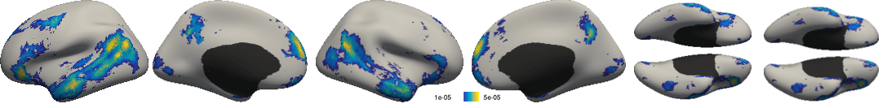
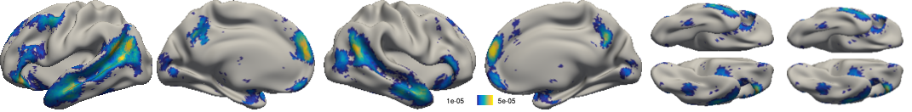

# Visualize Surface Data as Annotation

The functions in this folder can visualize data on fs_LR surface space with a better color scheme than what the command line arguments from FreeView allow. For more information on the fs_LR average surface, please refer to [Glasser and Van Essen, 2012](https://www.ncbi.nlm.nih.gov/pubmed/21832190), [Van Essen et al., 2012](https://www.ncbi.nlm.nih.gov/pubmed/22047963), [Guide to mapping data between FreeSurfer and HCP](https://wiki.humanconnectome.org/download/attachments/63078513/Resampling-FreeSurfer-HCP.pdf?version=1&modificationDate=1472225460934&api=v2).

Here is the procedure:
- The surface data on both hemispheres are discretized into discrete bins of values.
- The discretized data are mapped to an annotation map with each label corresponds to a bin of value. The discretized bins of values correpond to discrete values in a colorscale. Thus, the colortable of the annotation map corresponds to the colorscale.
- The resulting annotation maps are automatically opened in FreeView and have their views captured.


# Examples

A sample data in MNI space is provided in `./sample` folder.
```
% Load sample data in volume
x = MRIread('sample/sample_vol.nii.gz');
```

## Visualize surface data in fsaverage surface space

```
surface_template = 'fsaverage';

% Project data in the volume to fsaverage surface
[lh_data, rh_data] = CBIG_ProjectMNI2fsaverage(x, surface_template);

% Use fsaverage aparc.annot as the reference annotation
abs_path_to_lh_ref_annot = fullfile(getenv('FREESURFER_HOME'), 'subjects', surface_template, 'label', 'lh.aparc.annot')
abs_path_to_rh_ref_annot = fullfile(getenv('FREESURFER_HOME'), 'subjects', surface_template, 'label', 'rh.aparc.annot')

% The medial wall in fsaverage aparc.annot is labeled as 0. Vertices with this label in the visualization is painted black
ref_medialwall_label = 0;

% Absolute path to the output directory (change this to your desired directory)
abs_path_to_output_dir = '/data/users/ngohgia/visualization';

% Label used in all output files
label = 'component';

% Use Matlab 'parula' for the visualization
colorscheme = 'parula';

% Number of discrete values the original data is converted to
discretization_res = 28;

% Minimum and maximum threshold of the visualized data
min_thresh = 1e-5;
max_thresh = 5e-5;

% Visualize the data
CBIG_DrawSurfaceDataAsAnnotation(lh_data, rh_data, ...
    abs_path_to_lh_ref_annot, abs_path_to_rh_ref_annot, ref_medialwall_label, ...
    surface_template, abs_path_to_output_dir, label, ...
    colorscheme, discretization_res, min_thresh, max_thresh)
```
Various views of the brains and compiled images of the views are saved under `/data/users/ngohgia/tmp/visualization`, here is one example image:



## [Extra] Overlay the visualized data with another annotation
The annotation files converted from the input surface data are stored in the `tmp` subdirectory of the output directory. In the previous example, the annotation files are stored as `lh.component.annot` and `rh.component.annot`.

The visualized data can then be overlaided with another annotation file using the `CBIG_CombineSurfaceAnnotations.m` function.

For example, the annotation from the previous example can be overlaid with the parcels' outlines from the FreeSurfer aparc.annot. The parcel outlines was saved as an annotation file in fsaverage surface space.

```
% [Continued from the previous example]
% Annotation files saved in the previous example 
underlay_lh_annot_file = fullfile(abs_path_to_output_dir, 'tmp', ['lh.' label '.annot']);
underlay_rh_annot_file = fullfile(abs_path_to_output_dir, 'tmp', ['rh.' label '.annot']);

% Overlaying annotation files
script_dir = fullfile(getenv('CBIG_CODE_DIR'), 'utilities', 'matlab', 'figure_utilities', 'draw_surface_data_as_annotation');
overlay_lh_annot_file = fullfile(script_dir, 'fsaverage_parcel_outlines', 'lh.aparc_annot.outline.annot');
overlay_rh_annot_file = fullfile(script_dir, 'fsaverage_parcel_outlines', 'rh.aparc_annot.outline.annot');

% Output annotation files
combined_lh_annot_file = fullfile(abs_path_to_output_dir, 'tmp', ['lh.' label '.combined.annot']);
combined_rh_annot_file = fullfile(abs_path_to_output_dir, 'tmp', ['rh.' label '.combined.annot']);

% Combine the annotation files

% This is the label assigned to the medial wall in underlay_lh_annot_file and underlay_rh_annot_file.
% The medial wall's label was assigned in CBIG_AnnotateSingleHemiMedialWall in the previous example.
% We want to the medial wall not to be overwritten
ref_medialwall_label = 50 + 50 * 2^8 + 50 *2^16;

CBIG_CombineSurfaceAnnotations(underlay_lh_annot_file, overlay_lh_annot_file, combined_lh_annot_file, ref_medialwall_label);
CBIG_CombineSurfaceAnnotations(underlay_rh_annot_file, overlay_rh_annot_file, combined_rh_annot_file, ref_medialwall_label);

% Visualize the combined annotation
CBIG_VisualizeSurfaceAnnotationInFreeview(combined_lh_annot_file, combined_rh_annot_file, ...
                                          surface_template, [label '_with_parcel_outline'], abs_path_to_output_dir);
```

Here is one example image:


* **Visualize data on fs_LR_32k surface**
Note that in the following example, the reference annotations are the fsaverage aparc.annot that have been projected to fs_LR_32k surface space. If you have a reference annotations created in fs_LR_32k , you should use those annotations instead.
```
% [Continued from the previous example]

surface_template = 'fs_LR_32k';

% Project data in fsaverage surface space from the previous example to fs_LR_32k surface space
[fslr32k_lh_data, fslr32k_rh_data, fslr164k_lh_data, fslr_164k_rh_data] = CBIG_project_from_fsaverage_to_fslr(lh_data, rh_data, abs_path_to_output_dir, 'METRIC_AVERAGE_TILE');

% Use the fsaverage aparc.annot that has been projected to fs_LR_32k as the reference annotation
abs_path_to_lh_ref_annot = fullfile(getenv('CBIG_CODE_DIR'), 'data', 'templates', 'surface', surface_template, 'label', 'lh.aparc.annot');
abs_path_to_rh_ref_annot = fullfile(getenv('CBIG_CODE_DIR'), 'data', 'templates', 'surface', surface_template, 'label', 'rh.aparc.annot');

% The medial wall in the reference annotation is also labeled as 0. Vertices with this label in the visualization is painted black
ref_medialwall_label = 0;

% Label used in all output files
label = 'component_fs_LR_32k';

% We reuse the color scheme, number of discrete values and thresholds in the previous examples
CBIG_DrawSurfaceDataAsAnnotation(fslr32k_lh_data, fslr32k_rh_data, ...
    abs_path_to_lh_ref_annot, abs_path_to_rh_ref_annot, ref_medialwall_label, ...
    surface_template, abs_path_to_output_dir, label, ...
    colorscheme, discretization_res, min_thresh, max_thresh)
```

Here is one example ouptut image:



