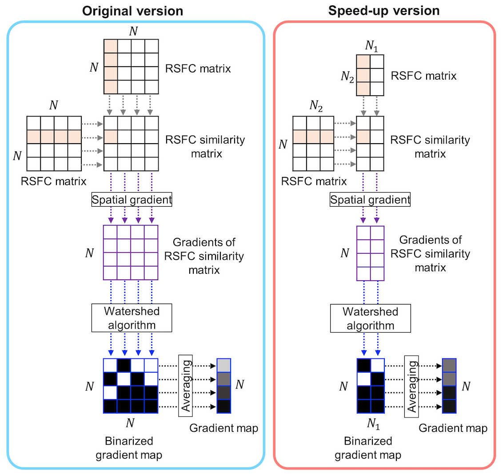

# Speed-up version of generating the RSFC gradient map

References
==========
+ Kong et al. Individual-Specific Areal-Level Parcellations Improve Functional Connectivity Prediction of Behavior. Under review.

+ Laumann et al. (2015). Functional System and Areal Organization of a Highly Sampled Individual Human Brain. Neuron 87, 657–670

+ Gordon et al. (2016). Generation and Evaluation of a Cortical Area Parcellation from Resting-State Correlations. Cerebral Cortex 26, 288–303.

+ Margulies et al. (2016). Situating the default-mode network along a principal gradient of macroscale cortical organization. Proc. Natl. Acad. Sci. U.S.A. 113, 12574–12579.
----

Background
====

In the original version (Laumann et al., 2015; Gordon et al., 2016) of generating the RSFC gradient map, the N×N RSFC matrix was first computed. By computing the first order spatial gradient for each column of the RSFC similarity matrix, we obtained the gradients of the RSFC similarity matrix, where high gradient values indicated rapid changes in RSFC, and low gradient values indicated gentle changes in RSFC. After that, the watershed algorithm was applied to each column of the gradient matrix to generate one binarized gradient map for each vertex. The N binarized gradient maps were then averaged to obtain a single gradient map, where high values indicate high probability of a rapid change in RSFC patterns occurring at that location. Because this original version involved N×N matrices, it was computationally very expensive to compute. 

Therefore, we implemented a faster and less memory-intensive version by subsampling the functional connectivity matrices. Figure below illustrates the speed-up version for generating the gradient map for each subject. Instead of computing the N×N RSFC matrix to generate the RSFC similarity matrix, we randomly selected N1 and N2 vertices from N vertices to compute the subsampled N×N2 and N2×N1 RSFC matrices. We correlated each row of the N×N2 RSFC matrix and each column of the N2×N1 RSFC matrix to obtain the subsampled N×N1 RSFC similarity matrix. We then computed the spatial gradients of the subsampled RSFC similarity matrix and utilized the watershed algorithm to obtain N1 binarized gradient maps. The N1 binarized gradient maps were then averaged to obtain a single gradient map. Furthermore, to reduce the memory usage, we split the N×N1 RSFC similarity matrix into multiple small blocks (without doing any subsampling), where each block of the RSFC similarity matrix was generated sequentially. 



----

Code Release
====

The scripts utilized in this study include two purposes:

**1: generate the RSFC gradient map**

- `CBIG_SPGrad_RSFC_gradients.m`


**2: estimate diffusion embedding matrices of the RSFC gradient map**
   
- `CBIG_SPGrad_generate_gradient_matrix.m`
- `CBIG_SPGrad_diffusion_embedding.sh`
- `CBIG_SPGrad_upsample_embed_matrix.m`

**Examples**

We provide detailed examples on how to generate RSFC gradient maps and apply diffusion embedding algorithm (Margulies et al., 2016) on it in **`examples`** folder. **We highly recommended the users to go through the example tutorial first**.

----

Usage
====

Our code will work for fMRI surface data on `fsaverage6` surface space (nifti format), or on `fs_LR_32k` surface space (cifti format, .dtseries.nii file with 64k vertices). The code should also be applicable for data in `fsaverage5/6/7`, contact us if there is any bug.

### 1: generate the RSFC gradient map

----

To generate the RSFC gradient map, we assume the input fMRI lists and censor lists are already generated.

The fMRI lists for each subject, each line is the full path to the nifti/cifti file which corresponds to each run.

- **`<output_dir>/data_list/fMRI_list`**
    + `<output_dir>/data_list/fMRI_list/lh_sub?.txt`
    + `<output_dir>/data_list/fMRI_list/rh_sub?.txt`

    for data in `fsaverage6`  or

    + `<output_dir>/data_list/fMRI_list/sub?.txt`

    for data in `fs_LR_32k`.
  
The censor lists for each subject, each line is the full path to the censor file which corresponds to each run. The censor file should be a text file contains a single binary number column with the length equals to the number of time points, the outliers are indicated by 0s.

- **`<output_dir>/data_list/censor_list`**
    + `<output_dir>/data_list/censor_list/sub?.txt`

Start Matlab, in Matlab command window, the user needs to specify the following inputs:

**Input: (string)**

+ `fMRI_files1`: the text file containing left hemisphere surface data list for `fsaverage6`, or the text file containing surface data list for `fs_LR_32k`.

+ `fMRI_files2`: the text file containing right hemisphere surface data list for fsaverage, or `'NONE'` for `fs_LR_32k`.

+ `censor_files`: the text file containing outlier files.

+ `mesh`: resolution of surface mesh, e.g. `'fsaverage6'`, `'fs_LR_32k'`.

+ `medial_mask`: `#num_vertices x 1` binary vector or `'NONE'` for medial mask.

+ `sub_FC, sub_verts`: the downsampling parameter. In the figure above, `N2 = #vertices/<sub_FC>`, `N1 = #vertices/<sub_verts>`. Higher value indicates stronger subsampling. For `fsaverage6`, we suggest user set: `sub_FC = '100'; sub_verts = '200'`. For `fs_LR_32k`, we suggest user set: `sub_FC = '10'; sub_verts = '200'`.

+ `output_dir`: output directory to save the results.

Example usage:

```
lh_fMRI_files = '/data_list/fMRI_list/lh_sub1.txt';
rh_fMRI_files = '/data_list/fMRI_list/rh_sub1.txt';
censor_files = '/data_list/censor_list/sub1.txt';
lh_ind_surf = 'NONE';
rh_ind_surf = 'NONE';
sub_FC = '100';
sub_verts = '200';
medial_mask = 'NONE';
out_dir = '/Kong2020_ArealMSHBM/examples/generate_gradients/sub1';
CBIG_SPGrad_RSFC_gradients(lh_fMRI_files, rh_fMRI_files, censor_files, lh_ind_surf, rh_ind_surf, 'fsaverage6', medial_mask, sub_FC, sub_verts, out_dir);
```

**Output**

+ `<output_dir>/gradients_edge_density.dtseries.nii`

----

### 2: estimate diffusion embedding matrices of the RSFC gradient map

To generate the diffusion embedding matrix, we apply the diffusion embedding algorithm on the RSFC gradient map. To speed things up, we downsample the RSFC gradient map and upsample the diffusion embedding matrices back to the original resolution. 

We assume the RSFC gradient map is generated already and stored under:

+ `<output_dir>/gradients_edge_density.dtseries.nii`

#### 2.1: generate the geodesic gradient distance matrices 

In Matlab command window, the user needs to specify the following inputs:

**Input: (string)**

+ `mesh`: resolution of surface mesh, e.g. `'fsaverage6'`, `'fs_LR_32k'`.

+ `medial_mask`: `#num_vertices x 1` binary vector or `'NONE'` for medial mask.

+ `downsample`: the downsampling parameter to downsample the RSFC gradient map. Set downsample to be `'0'` to not perform downsampling on the gradient map. Set downsample to be a positive number, the gradient map will be downsampled to `#vertices/(2*<downsample>)`. For `fsaverage6`, we suggest user set: `downsample = '3.2'`. For `fs_LR_32k`, we suggest user set: `downsample = '3.2'`.

+ `output_dir`: output directory to save the results.


Example usage:

```
CBIG_SPGrad_generate_gradient_matrix('fsaverage6', 'NONE', '3.2', out_dir);
```

**Output**

The estimated gradient geodesic distance matrix will be saved as:
+ `<output_dir>/lh_gradient_distance_matrix.npy`
+ `<output_dir>/rh_gradient_distance_matrix.npy`

#### 2.2: apply diffusion emdedding algorithm on gradient distance matrices 

We assume the gradient geodesic distance matrices are generated already and stored under:
+ `<output_dir>/lh_gradient_distance_matrix.npy`
+ `<output_dir>/rh_gradient_distance_matrix.npy`

In Matlab command window, the user needs to specify the following inputs:

**Input: (string)**

+ `num_component`: number of components.

+ `output_dir`: output directory to save the results.


Example usage:

```
CBIG_CODE_DIR = getenv('CBIG_CODE_DIR');
num_component = '100';
cmd = ['sh ' CBIG_CODE_DIR '/utilities/matlab/speedup_gradients/CBIG_SPGrad_diffusion_embedding.sh ' output_dir ' ' num_component];
system(cmd); 
```

**Output**

The difffusion embeding results will be saved in output directory: 
+ `<output_dir>/lh_emb_<num_component>_distance_matrix.mat`
+ `<output_dir>/rh_emb_<num_component>_distance_matrix.mat`

#### 2.3: upsample the downsampled diffusion emdedding matrices

the user needs to perform this step if the RSFC gradient map is downsampled. If `<downsample>` in 2.1 is set as `'0'`, the user can skip this step. We assume the downsampled diffusion embeding results are saved in output directory: 

+ `<output_dir>/lh_emb_<num_component>_distance_matrix.mat`
+ `<output_dir>/rh_emb_<num_component>_distance_matrix.mat`

In Matlab command window, the user needs to specify the following inputs:

**Input: (string)**

+ `mesh`: resolution of surface mesh, e.g. `'fsaverage6'`, `'fs_LR_32k'`.

+ `medial_mask`: `#num_vertices x 1` binary vector or `'NONE'` for medial mask.

+ `num_component`: number of components.

+ `output_dir`: output directory to save the results.


Example usage:

```
CBIG_SPGrad_upsample_embed_matrix('fsaverage6', 'NONE', 100, out_dir)
```

**Output**

The upsampled difffusion embeding results will overwrite the downsampled version in output directory: 
+ `<output_dir>/lh_emb_<num_component>_distance_matrix.mat`
+ `<output_dir>/rh_emb_<num_component>_distance_matrix.mat`
